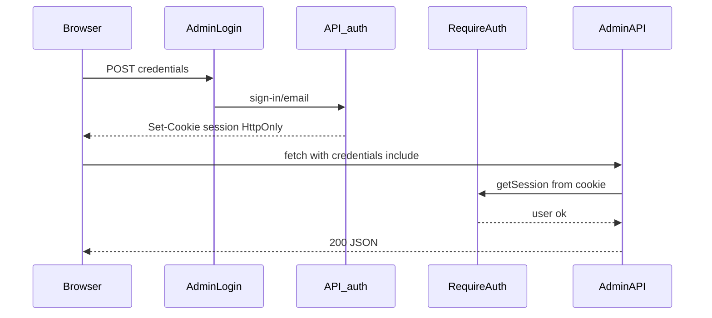

# Техническая основа курсовой работы

## Тема: «Разработка структуры программного обеспечения музейного стенда»

**Проект:** веб-платформа / интерактивный музейный стенд для музея ГрГУ (Гродненского государственного университета имени Янки Купалы).

**Репозиторий:** monorepo `museum` — full-stack TypeScript-приложение.

**Дата анализа:** 26 мая 2026 г.

**Последнее обновление документа:** 26 мая 2026 г. (актуализировано после внедрения Better Auth, защиты API и админ-панели, ScreenSaver).

**Источник анализа:** исходный код репозитория, конфигурационные файлы (`package.json`, `turbo.json`, `.env.example`, `schema.prisma`, миграции, README).

---

# 1. Введение

## 1.1. Актуальность темы

Современные музеи и образовательные учреждения всё чаще переходят от статичных экспозиций к интерактивным цифровым стендам. Посетитель ожидает не только текста на стенде, но и:

- удобной навигации по разделам;
- мультимедиа (фото, видео, PDF-документы);
- быстрого поиска информации о людях, событиях, экспонатах;
- возможности обновлять контент без перепрошивки отдельного ПО.

Университетский музей ГрГУ — это не классический «зал с витринами», а **информационно-просветительская система**, рассказывающая об истории университета, ректорах, спортивных достижениях, студенческой жизни, памяти о войне и многом другом. Для такой задачи нужна **гибкая программная платформа**, а не набор разрозненных HTML-страниц.

Разработка **структуры программного обеспечения** (архитектуры, модулей, базы данных, API, интерфейса) — ключевая инженерная задача, без которой невозможно ни сопровождать систему, ни масштабировать её на новые разделы музея.

## 1.2. Зачем нужен музейный стенд

Музейный стенд в контексте данного проекта — это **сенсорный экран или киоск** (или обычный браузер на выставочном компьютере), через который посетитель:

1. Выбирает раздел музея на главном экране.
2. Переходит по иерархическому меню к подразделам.
3. Читает CMS-страницы с богатым контентом (текст, фото, видео, вкладки).
4. Просматривает каталоги людей (ректоры, преподаватели, спортсмены).
5. Работает с фото- и видеогалереями.
6. Взаимодействует с архивными PDF-документами (например, «Книга памяти»).

Для сотрудников музея стенд — это ещё и **инструмент управления контентом** через защищённую админ-панель (`/admin`, вход через `/admin/login`).

## 1.3. Проблемы традиционных музейных систем

| Подход | Проблема |
|--------|----------|
| Бумажные каталоги и стенды | Сложно обновлять, нет мультимедиа, нет поиска |
| Статичный сайт на HTML | Каждое изменение требует правки кода |
| PowerPoint / PDF на экране | Нет навигации, нет структуры, плохой UX на тач-экране |
| Закрытые проприетарные CMS | Дорого, сложно дорабатывать под специфику вуза |
| Разрозненные Excel + папки с фото | Нет единой модели данных, риск потери связей |

Проект `museum` решает эти проблемы через **единую веб-платформу** с реляционной БД, REST API и блочной CMS.

## 1.4. Цели проекта

1. Создать интерактивный музейный стенд для ГрГУ с современным интерфейсом.
2. Обеспечить централизованное хранение контента (страницы, люди, медиа, меню).
3. Дать сотрудникам музея инструменты редактирования без участия программиста.
4. Построить расширяемую архитектуру (monorepo, модульный backend, переиспользуемые UI-паттерны).
5. Обеспечить **безопасную админку** с аутентификацией (Better Auth, session cookies, закрытая регистрация).

## 1.5. Задачи проекта

| № | Задача | Статус в проекте |
|---|--------|------------------|
| 1 | Разработать frontend на React | ✅ Реализовано (`apps/web`) |
| 2 | Разработать backend API | ✅ Реализовано (`apps/server`) |
| 3 | Спроектировать БД PostgreSQL | ✅ Реализовано (Prisma schema) |
| 4 | CMS для страниц (блочная модель) | ✅ Реализовано (JSONB-документы) |
| 5 | Управление людьми и таксономией | ✅ Реализовано |
| 6 | Медиа-менеджер и галереи | ✅ Реализовано (локальное хранилище) |
| 7 | Динамическое меню разделов | ✅ Реализовано |
| 8 | Админ-панель | ✅ Реализовано (`/admin`, защищён `ProtectedRoute`) |
| 9 | Авторизация администраторов | ✅ Better Auth (email/password, session cookies, `disableSignUp`) |
| 10 | ScreenSaver (режим ожидания киоска) | ✅ Подключён к idle-таймеру в `App.tsx` |
| 11 | Контейнеризация / CDN | ❌ Не реализовано (рекомендация) |

## 1.6. Объект и предмет исследования

- **Объект исследования:** процесс проектирования и разработки программного обеспечения интерактивного музейного стенда в образовательном учреждении.
- **Предмет исследования:** архитектура, структура модулей, технологический стек, модель данных и механизмы взаимодействия компонентов системы `museum`.

## 1.7. Практическая значимость

Результат может быть использован:

- как **рабочий музейный стенд** в здании ГрГУ;
- как **учебный пример** full-stack разработки на TypeScript;
- как **база** для дипломной работы по темам: CMS, цифровые музеи, UX тач-интерфейсов;
- как **открытая платформа**, которую можно адаптировать для других факультетов или вузов.

---

# 2. Общая информация о проекте

## 2.1. Что представляет собой система

Система `museum` — это **full-stack TypeScript monorepo**, состоящий из:

| Компонент | Пакет | Назначение |
|-----------|-------|------------|
| Frontend | `@museum/web` | SPA на React + Vite, интерфейс стенда и админки |
| Backend | `@museum/server` | REST API на Express + PostgreSQL + Prisma |
| Shared types | `@museum/document` | Общие типы CMS-документов (блоки страниц) |

В production-сборке backend **раздаёт статику** собранного frontend (`apps/web/dist`) и **медиафайлы** из `apps/web/public`.

## 2.2. Для кого предназначена

| Аудитория | Сценарий использования |
|-----------|------------------------|
| Посетители музея / студенты / гости | Просмотр разделов, галерей, биографий |
| Сотрудники музея / редакторы | Заполнение контента через `/admin` после входа |
| Администраторы системы | Учётная запись из seed (`npm run db:seed-admin`); публичная регистрация отключена |
| Разработчики | Сопровождение, расширение CMS, новые разделы |

## 2.3. Какие задачи решает

1. **Навигация** — главное меню и вложенные меню секций из БД.
2. **Контент** — страницы с блочной CMS (hero, текст, галереи, вкладки, видео и др.).
3. **Персоналии** — ректоры, преподаватели, спортсмены с ролями, тегами, категориями.
4. **Мультимedia** — загрузка файлов, фото/видео галереи, PDF-книги.
5. **Версионирование** — история публикаций CMS-страниц.
6. **Миграция legacy-данных** — скрипт `migrate-legacy-data.ts`.

## 2.4. Основные возможности

### Публичная часть (стенд)

- Главный экран с кнопками разделов (`Home.tsx`, меню секции `home`).
- Динамические CMS-страницы по URL (`PathResolverPage` → `CmsDynamicPage`).
- Специализированные страницы: ректоры, память (ВОВ/Афганистан), фото/видео галереи.
- PDF-flipbook для архивных документов (`MemoryWarPage.tsx`, `pdfjs-dist`, `react-pageflip`).
- Touch UX: свайп «назад», idle-таймер (5 мин) → **ScreenSaver**, полноэкранный layout.

### Админ-панель (`/admin`, `/admin/login`)

- Вход по email/паролю (`AdminLogin.tsx`, Better Auth).
- Доступ к `/admin` только при активной сессии (`ProtectedRoute`, `useSession`).
- Выход из системы (кнопка «Выйти» в `AdminPanel.tsx`).
- Меню разделов (`MenuPanel`).
- CMS-страницы с визуальным редактором блоков (`PagesPanel`, `DocumentEditor`).
- Управление людьми (`PeoplePanel`).
- Справочники ролей/тегов/категорий (`TaxonomyPanel`).
- Файловый менеджер медиа (`FilesPanel`).

## 2.5. Краткое описание архитектуры

```
┌─────────────────────────────────────────────────────────────┐
│                    Браузер (киоск / ПК)                      │
│  React SPA — публичный стенд + /admin/login + /admin         │
└──────────────┬────────────────────────────┬─────────────────┘
               │ fetch /api (public GET)     │ credentials:include
               │ static media                │ + /api/auth/*
┌──────────────▼────────────────────────────▼─────────────────┐
│              Express Server (@museum/server)                 │
│  CORS (credentials) → Helmet → /api/auth (Better Auth)      │
│  → JSON → Routes [public | requireAuth] → Services          │
│  Static: web/dist + web/public                               │
└──────────────┬─────────────────────────────┬────────────────┘
               │ Prisma + pg adapter          │ fs (multer upload)
┌──────────────▼──────────────┐   ┌──────────▼─────────────────┐
│      PostgreSQL              │   │ apps/web/public/           │
│  user, session, pages, ...   │   │ images/ videos/ files/     │
└──────────────────────────────┘   └────────────────────────────┘
```

**Тип приложения:** SPA (Single Page Application), **не SSR**. Сервер отдаёт `index.html` и JSON API; рендеринг полностью на клиенте.

---

# 3. Анализ архитектуры проекта

## 3.1. Frontend (`apps/web`)

### Стек

- **React 19** — UI-библиотека.
- **Vite 8** — сборщик и dev-сервер.
- **React Router DOM 7** — клиентский роутинг.
- **Tailwind CSS 4** — utility-first стилизация (`@tailwindcss/vite`).
- **Framer Motion** — анимации переходов и элементов.
- **@dnd-kit** — drag-and-drop в редакторе CMS-блоков.
- **pdfjs-dist + react-pageflip** — интерактивные PDF-книги.
- **lucide-react** — иконки (в admin UI).
- **better-auth (react)** — клиент аутентификации (`auth-client.ts`, `useSession`).

### Структура frontend-слоёв

| Слой | Папка | Ответственность |
|------|-------|-----------------|
| Auth | `lib/auth-client.ts`, `components/auth/` | Сессия, `ProtectedRoute` |
| Entry | `main.tsx`, `App.tsx` | Bootstrap, idle → ScreenSaver, swipe |
| Routes | `app/routes.tsx` | Декларация маршрутов |
| Pages | `pages/` | Экраны стенда и админки |
| Layouts | `layouts/MainLayout.tsx` | Общий каркас страницы |
| Patterns | `components/patterns/` | Переиспользуемые UI-паттерны |
| CMS | `components/cms/` | Рендеринг блочного контента |
| Admin | `components/features/admin/` | Панели управления |
| Design system | `components/design-system/` | Button, Modal, States, TabsBar |
| API clients | `api/`, `shared/api/client.ts` | Typed fetch (`credentials: 'include'`, редирект на login при 401) |
| Hooks | `hooks/` | Загрузка данных (people, pages, menu) |
| Lib | `lib/` | Утилиты (URL медиа, роли, CMS registry) |

### Особенности UX стенда

Файл `App.tsx` реализует поведение **информационного киоска**:

- **Idle timeout 5 минут** — при бездействии на публичных маршрутах показывается `ScreenSaver.tsx` (не на `/admin` и `/admin/login`).
- **Swipe right → navigate(-1)** — жест «назад» для тач-экранов.

## 3.2. Backend (`apps/server`)

### Стек

- **Express 5** — HTTP-фреймворк.
- **Prisma 7** — ORM с `@prisma/adapter-pg`.
- **pg (node-postgres)** — пул соединений PostgreSQL.
- **multer** — загрузка файлов (memory storage).
- **cors** — настройка cross-origin.
- **env-var + dotenv** — типизированная конфигурация.
- **http-status-codes** — стандартные HTTP-коды.
- **better-auth** + **@better-auth/prisma-adapter** — аутентификация, сессии.
- **helmet** — HTTP security headers.
- **express-rate-limit** — лимит запросов на `/api/auth`.

### Архитектурный паттерн backend

Применяется **слоистая архитектура (Layered Architecture)**:

```
Router → Controller → Service → Prisma/Filesystem
```

| Слой | Примеры файлов | Задача |
|------|----------------|--------|
| Routes | `routes/pages.router.ts` | HTTP endpoints, DI сервисов |
| Controllers | `controllers/pages.controller.ts` | Парсинг req/res, коды ответов |
| Services | `services/pages.service.ts` | Бизнес-логика, транзакции |
| Domain | `domain/document.ts` | Доменные типы CMS |
| DB | `db/prisma.ts` | Prisma client + pg pool |
| Lib | `lib/media-storage.ts` | Файловая система медиа |
| Shared | `shared/errors.ts`, `shared/api-messages.ts` | Ошибки, сообщения |
| Auth | `auth/auth.ts` | Конфигурация Better Auth |
| Middleware | `require-auth.ts`, `error-handler.ts` | Сессия, ошибки |

### Modules

Папка `modules/` — точки re-export роутеров:

- `modules/pages/index.ts`
- `modules/people/index.ts`
- `modules/menu/index.ts`

## 3.3. API

Базовый префикс: **`/api`**. Аутентификация: **`/api/auth/*`** (Better Auth).

### Модель доступа к API

| Категория | Требование | Примеры |
|-----------|------------|---------|
| **Public** | Без сессии | `GET /pages/public/:slug`, `GET /pages/by-path`, `GET /people`, `GET /people/:id`, `GET /media/gallery/*`, `GET /menu/:section` |
| **Protected** | `requireAuth` + session cookie | Все mutations, черновики CMS, media browse/upload, `GET /menu`, `GET /menu/:section?includeInactive=true`, taxonomy |

Без валидной сессии защищённые endpoints возвращают **401** с телом `{ "error": "Требуется авторизация" }`.

### Endpoints — Auth (`/api/auth`)

Обрабатываются Better Auth (`toNodeHandler` в `create-app.ts`):

| Endpoint | Назначение |
|----------|------------|
| `POST /sign-in/email` | Вход администратора |
| `POST /sign-out` | Выход |
| `GET /get-session` | Проверка сессии (клиент) |
| `POST /sign-up/email` | **Отключён** (`disableSignUp: true`) |

Rate limit: 20 запросов/мин на IP для `/api/auth`.

### Endpoints — Pages (`/api/pages`)

| Метод | Путь | Доступ | Назначение |
|-------|------|--------|------------|
| GET | `/public/:slug` | Public | Опубликованная страница |
| GET | `/by-path?path=` | Public | Страница по URL (только published) |
| GET | `/` | Auth | Список страниц |
| GET | `/by-id/:id` | Auth | Draft + published |
| POST | `/` | Auth | Создать страницу |
| PUT | `/by-id/:id` | Auth | Обновить метаданные |
| DELETE | `/by-id/:id` | Auth | Soft delete |
| GET | `/:slug/draft` | Auth | Черновик |
| PATCH | `/:slug/draft` | Auth | Autosave (optimistic locking) |
| POST | `/:slug/publish` | Auth | Публикация |
| GET | `/:slug/versions` | Auth | Список версий |
| GET | `/:slug/versions/:versionId` | Auth | Детали версии |
| POST | `/:slug/versions/:versionId/restore` | Auth | Восстановление версии |

### Endpoints — People (`/api/people`)

| Метод | Путь | Доступ | Назначение |
|-------|------|--------|------------|
| GET | `/` | Public | Список (фильтры: q, role, tag, category) |
| GET | `/:id` | Public | Карточка человека |
| GET | `/taxonomy` | Auth | Роли, теги, категории |
| POST/PUT/DELETE | `/taxonomy/*` | Auth | CRUD справочников |
| POST | `/` | Auth | Создать |
| PUT | `/:id` | Auth | Обновить |
| DELETE | `/:id` | Auth | Soft delete |
| PATCH | `/reorder` | Auth | Изменить порядок |

### Endpoints — Media (`/api/media`)

| Метод | Путь | Доступ | Назначение |
|-------|------|--------|------------|
| GET | `/gallery/photos`, `/gallery/videos` | Public | Публичные галереи |
| GET | `/roots`, `/browse`, `/search` | Auth | Файловый менеджер |
| POST | `/upload`, `/upload-url`, `/assets/link` | Auth | Загрузка файлов / регистрация URL / привязка asset |
| POST | `/mkdir`, `/rename`, `/move` | Auth | Файловые операции |
| DELETE | `/item` | Auth | Удаление |
| PATCH | `/assets/:id`, gallery reorder | Auth | Метаданные, сортировка |

Лимиты upload (multer): до **50 MB** на файл, до **20** файлов за запрос.

### Endpoints — Menu (`/api/menu`)

| Метод | Путь | Доступ | Назначение |
|-------|------|--------|------------|
| GET | `/:section` | Public* | Пункты секции (*`includeInactive=true` требует Auth) |
| GET | `/` | Auth | Все пункты меню (admin) |
| POST | `/` | Auth | Создать пункт |
| PUT | `/:id` | Auth | Обновить |
| DELETE | `/:id` | Auth | Удалить |

### Формат ошибок

```json
{ "error": "Текст сообщения" }
```

Реализовано в `error-handler.ts` через класс `HttpError`.

## 3.4. База данных

- **СУБД:** PostgreSQL.
- **Подключение:** через `DATABASE_URL` или набор `DB_HOST`, `DB_PORT`, `DB_USER`, `DB_PASSWORD`, `DB_NAME`.
- **ORM:** Prisma (не Drizzle — см. раздел 4).
- **Миграции:** `apps/server/prisma/migrations/`.
- **Ключевая миграция:** `20260524120000_canonical_schema` — каноническая схema, удаление legacy-таблиц.

## 3.5. ORM — Prisma

Файл схемы: `apps/server/prisma/schema.prisma`.

Особенности:

- Prisma Client генерируется в `apps/server/src/generated/prisma/`.
- Используется **driver adapter** `@prisma/adapter-pg` + `Pool` из `pg`.
- JSON-поля (`draft_document`, `published_document`) хранят CMS-документы типа `PageDocument`.
- Soft delete через поле `deleted_at` (pages, people, media_assets).

## 3.6. Файловое хранилище

> **Важно:** MinIO и S3 в проекте **не используются**.

Медиа хранится **локально** в файловой системе:

```
apps/web/public/
├── images/     → URL /images/...
├── videos/     → URL /videos/...
├── files/      → URL /files/...
├── book_vov.pdf
├── favicon.svg
└── icons.svg
```

Логика путей — `apps/server/src/lib/media-storage.ts`, `apps/server/src/lib/paths.ts`.

**Безопасность путей:** функция `resolveInsideRoot()` предотвращает path traversal (выход за пределы корня).

**Связь FS ↔ БД:** при browse/upload создаётся/обновляется запись `media_assets` с метаданными в JSON (`metadata`).

## 3.7. Авторизация и аутентификация

### Реализованный стек

| Аспект | Реализация |
|--------|------------|
| Библиотека | **Better Auth** 1.6 (`better-auth`, `@better-auth/prisma-adapter`) |
| Хранение сессий | PostgreSQL: таблицы `user`, `session`, `account`, `verification` |
| Метод входа | Email + password (`emailAndPassword.enabled`) |
| Публичная регистрация | **Отключена** (`disableSignUp: true`) |
| Первый пользователь | Скрипт `npm run db:seed-admin` (env: `ADMIN_EMAIL`, `ADMIN_PASSWORD`) |
| Минимальная длина пароля | 12 символов |
| Cookie | HttpOnly, SameSite=Lax, Secure в production |
| API middleware | `requireAuth` в `app/middleware/require-auth.ts` |
| Frontend guard | `ProtectedRoute` + `AdminLogin.tsx` |

Конфигурация: [`apps/server/src/auth/auth.ts`](apps/server/src/auth/auth.ts).

Комментарий в Prisma schema сохранён намеренно — поля таблиц соответствуют контракту Better Auth:

```prisma
// BETTER AUTH TABLES — не менять названия полей (требует Better Auth)
```

### Поток аутентификации



### Defense in depth

1. **Frontend:** без сессии `/admin` → redirect `/admin/login` (`ProtectedRoute`).
2. **Backend:** даже при обходе UI все admin/mutation endpoints требуют cookie сессии.
3. **Sign-up закрыт:** endpoint регистрации возвращает ошибку `EMAIL_PASSWORD_SIGN_UP_DISABLED`.
4. **Rate limiting** на `/api/auth` против brute-force.

### Рекомендации на будущее

- RBAC (роли editor/moderator/admin) — сейчас один тип учётной записи.
- Привязка `updated_by` / `created_by` в CMS к `user.id` при сохранении.
- Опционально: 2FA, сброс пароля по email (нужен SMTP).

## 3.8. Роутинг

### Frontend (React Router)

Файл `apps/web/src/app/routes.tsx`:

| Маршрут | Компонент | Тип |
|---------|-----------|-----|
| `/` | `Home` | Главное меню |
| `/admin/login` | `AdminLogin` | Вход (публичный URL, но без сессии) |
| `/admin` | `ProtectedRoute` → `AdminPanel` | Админка (только с сессией) |
| `/history/rectors` | `Rectors` | Специализированная |
| `/history/rectors/:id` | `RectorDetails` | Детальная |
| `/history/memory/vov`, `/afgan` | Memory pages | Специализированная |
| `/gallery`, `/video-gallery` | Галереи | Специализированная |
| `*` | `PathResolverPage` | Catch-all: меню или CMS |

**PathResolverPage** — ключевой механизм масштабируемости:

1. Берёт pathname → ключ секции меню.
2. Если в меню есть дочерние пункты → `SectionMenuPage`.
3. Иначе → `CmsDynamicPage` (загрузка CMS по slug).

Многие маршруты **закомментированы** — контент может обслуживаться через CMS + меню без жёстких React-страниц.

### Backend

Express routers монтируются в `registerRoutes()` (`routes/index.ts`).

Production (`create-app.ts` + `app/bootstrap.ts`):

1. **`createApp()`:** CORS, Helmet, rate-limit и Better Auth на `/api/auth`, `express.json()`, API routes, static `apps/web/public` (медиа `/images`, `/videos`, `/files`).
2. **`bootstrap()`:** `assertProductionSecrets()`, подключение Prisma, static `apps/web/dist`, `GET /` → `index.html`.

**Ограничение:** fallback SPA сейчас только для корня `/`; прямой заход на глубокий URL (например `/history/rectors`) в production без dev-сервера Vite может вернуть 404 — для киоска обычно достаточно старта с `/`.

## 3.9. Monorepo (Turborepo)

Корневой `package.json`:

```json
"workspaces": ["apps/*", "packages/*"]
```

`turbo.json` задаёт pipeline:

| Task | Особенность |
|------|-------------|
| `dev` | persistent, no cache |
| `build` | server depends on web build |
| `type-check` | depends on ^build |
| `lint` | per package |

Команды:

```bash
npm run dev      # параллельно Vite + Express
npm run build    # web → server
npm run db:migrate
```

## 3.10. Взаимодействие между сервисами

```
@museum/document  ←── shared types ──→  @museum/web
       ↑                                      │
       └──────── shared types ────────────────┤
                                              │
@museum/server ←──── REST /api ──────────────┘
       │
       ├── Prisma → PostgreSQL
       └── fs → apps/web/public
```

Пакет `@museum/document` — **единственный shared-модуль**. Он компилируется в `dist/` и импортируется обоими apps.

## 3.11. Клиент-серверное взаимодействие

### Development

- Frontend: `http://localhost:5173` (Vite).
- Backend: `http://localhost:3000` (PORT из `.env`).
- Vite proxy: `/api` → backend (`vite.config.ts`).

### Production

- Один сервер на PORT.
- Frontend build в `apps/web/dist`.
- API на том же origin → **нет CORS-проблем** для SPA.
- `VITE_API_BASE_URL` по умолчанию `/api`.

### Загрузка данных

Типичный поток (CMS-страница):

1. `usePageByPath(path)` hook.
2. `fetchPublicPageByPath()` → `GET /api/pages/by-path?path=...`.
3. `PagesService.getPublishedBySlug()` → Prisma query.
4. `BlockRenderer` рендерит `document.blocks`.

Для людей: `usePeople` → `GET /api/people?role=rector`.

## 3.12. SSR / SPA

| Технология | Используется? |
|------------|---------------|
| SPA (React + Vite) | ✅ Да |
| SSR (Next.js, Remix) | ❌ Нет |
| ISR / SSG | ❌ Нет |

**Почему SPA подходит для стенда:** приложение работает локально на киоске, SEO не критично, нужен богатый client-side UX (анимации, flipbook, drag-and-drop admin).

## 3.13. Безопасность (текущая реализация)

| Механизм | Реализация |
|----------|------------|
| Аутентификация admin | Better Auth, session cookies, `disableSignUp` |
| Авторизация API | `requireAuth` на protected routers |
| CORS | Whitelist `CORS_ORIGIN` + `credentials: true` |
| Path traversal (media) | `resolveInsideRoot()` |
| Input validation | Частичная (type checks в controllers) |
| Rate limiting | `express-rate-limit` на `/api/auth` (20/min) |
| Helmet | HTTP security headers |
| Upload limits | multer: 50 MB/file, 20 files |
| CSRF | SameSite=Lax на session cookie; для SPA same-origin риск снижен |
| Production secrets | `assertProductionSecrets()` — запрет dev-secret в production |

---

# 4. Используемые технологии

## 4.1. Сводная таблица

| Технология | Где используется | Зачем нужна | Преимущества |
|------------|------------------|-------------|--------------|
| **TypeScript ~6.0** | Весь monorepo | Статическая типизация, меньше ошибок | Единый язык frontend/backend |
| **React 19** | `apps/web` | UI стенда и админки | Компонентная модель, экосистема |
| **Vite 8** | `apps/web` | Dev server, сборка SPA | Быстрый HMR, ESM-native |
| **React Router 7** | `apps/web` | Клиентский роутинг | Гибкая навигация, catch-all routes |
| **Tailwind CSS 4** | `apps/web` | Стилизация | Быстрая вёрстка, адаптивность |
| **Framer Motion 12** | `apps/web` | Анимации | Плавный UX для стенда |
| **Express 5** | `apps/server` | HTTP API | Простота, middleware |
| **PostgreSQL** | Backend + Prisma | Реляционное хранение | JSONB, надёжность, связи |
| **Prisma 7** | `apps/server` | ORM, миграции | Type-safe queries, schema-first |
| **pg + @prisma/adapter-pg** | `db/prisma.ts` | Пул соединений | Production-ready DB access |
| **multer** | `media.router.ts` | Upload файлов | Стандарт для Express |
| **Turborepo 2** | Корень | Monorepo orchestration | Кэш сборки, parallel dev |
| **@museum/document** | web + server | Shared CMS types | DRY для документов |
| **@dnd-kit** | Document editor | Drag-and-drop блоков | Accessible DnD |
| **pdfjs-dist** | MemoryWarPage | Рендер PDF | Клиентский flipbook |
| **react-pageflip** | MemoryWarPage | Эффект перелистывания | Имитация книги |
| **lucide-react** | Admin UI | Иконки | Лёгкие SVG-иконки |
| **eslint + prettier** | Корень | Качество кода | Единый стиль |
| **tsx** | server dev/scripts | TS execution | Watch mode для backend |
| **dotenv + env-var** | server | Конфигурация | Типизированные env |
| **http-status-codes** | server | HTTP constants | Читаемость |
| **Better Auth** | server + web | Аутентификация, сессии | Готовая auth-схема, Prisma adapter |
| **@better-auth/prisma-adapter** | server | Связь auth ↔ БД | Совместимость с schema |
| **helmet** | server | Security headers | Защита HTTP-заголовков |
| **express-rate-limit** | server | Лимит /api/auth | Anti brute-force |

## 4.2. Технологии из задания — фактический статус

| Технология | В проекте? | Комментарий |
|------------|------------|-------------|
| **Next.js** | ❌ Нет | Используется Vite + React SPA |
| **Drizzle** | ❌ Нет | Используется Prisma; в migration.sql есть упоминание «target Drizzle schema» — legacy планирование |
| **Better Auth** | ✅ Да | Server + client, `disableSignUp`, seed-admin |
| **MinIO** | ❌ Нет | Локальная FS в `apps/web/public/` |
| **Docker** | ❌ Нет | Нет Dockerfile / compose |
| **Cloudflare** | ❌ Нет | Не интегрирован |
| **Redux Toolkit** | ❌ Нет | Удалён из зависимостей (не использовался) |

---

# 5. Структура проекта

## 5.1. Дерево проекта (основные директории)

```
museum/
├── .env.example              # Шаблон переменных окружения
├── .nvmrc                    # Node 20
├── package.json              # Root workspace scripts
├── turbo.json                # Turborepo pipeline
├── tsconfig.json             # Base TS config
├── eslint.config.js
├── README.md
├── coursework-analysis.md    # Этот документ
│
├── apps/
│   ├── web/                  # Frontend SPA
│   │   ├── index.html
│   │   ├── vite.config.ts
│   │   ├── public/           # Статика + uploads
│   │   │   ├── images/
│   │   │   ├── videos/
│   │   │   ├── files/
│   │   │   └── book_vov.pdf
│   │   └── src/
│   │       ├── main.tsx
│   │       ├── App.tsx
│   │       ├── app/routes.tsx
│   │       ├── api/          # API clients
│   │       ├── pages/        # Route pages
│   │       ├── layouts/
│   │       ├── components/   # UI, CMS, admin, patterns
│   │       ├── hooks/
│   │       ├── lib/          # auth-client, cms-block-registry
│   │       ├── components/auth/  # ProtectedRoute
│   │       ├── pages/AdminLogin.tsx
│   │       ├── shared/
│   │       └── types/
│   │
│   └── server/               # Backend API
│       ├── prisma/
│       │   ├── schema.prisma
│       │   └── migrations/
│       ├── scripts/
│       │   ├── migrate-legacy-data.ts
│       │   ├── verify-paths.ts
│       │   └── seed-admin.ts       # первый администратор
│       └── src/
│           ├── index.ts
│           ├── env.ts
│           ├── auth/         # Better Auth config
│           ├── app/          # createApp, bootstrap, middleware
│           ├── routes/
│           ├── controllers/
│           ├── services/
│           ├── modules/
│           ├── domain/
│           ├── db/
│           ├── lib/
│           ├── shared/
│           ├── types/
│           └── generated/prisma/
│
└── packages/
    └── document/             # Shared CMS types
        └── src/index.ts
```

## 5.2. Назначение директорий

### `apps/web/src/pages/`

Экраны, привязанные к маршрутам. Подпапки отражают тематику музея:

- `history/` — история, ректоры, память.
- `sport/` — спортивные разделы.
- `studentlife/` — студенческая жизнь.

### `apps/web/src/components/features/admin/`

Изолированная **админ-зона**:

- `pages/` — CMS editor.
- `people/` — CRUD персон.
- `menu/` — редактор меню.
- `taxonomy/` — справочники.
- `files/` — медиа-менеджер.

### `apps/server/src/services/`

**Бизнес-логика** — самый важный слой для понимания предметной области:

- `pages.service.ts` — CMS, версии, publish.
- `people.service.ts` — персоналии, таксономия.
- `media.service.ts` — assets, галереи.
- `menu.service.ts` — навигация.

### `packages/document/`

Минимальный shared-пакет. Экспортирует:

```typescript
type BlockNode = { id, type, schemaVersion, payload, children }
type PageDocument = { blocks: BlockNode[] }
```

Функции: `isPageDocument`, `walkBlocks`, `findBlockById`.

## 5.3. Зачем нужны packages/apps

| Подход | Обоснование |
|--------|-------------|
| `apps/*` | Разделение deployable units (web UI vs API server) |
| `packages/*` | Общий код без дублирования типов CMS |

Это классический **monorepo pattern**: один репозиторий — несколько приложений — общие библиотеки.

## 5.4. Архитектурный подход

- **Frontend:** Feature-Sliced / component-driven (pages → patterns → design-system).
- **Backend:** Layered + modular routers.
- **CMS:** Block-based document model (аналог Notion/Editor.js, но свой формат).
- **Data:** Relational DB + JSONB для гибкого контента.

## 5.5. Разделение ответственности

| Компонент | Отвечает за | Не отвечает за |
|-----------|-------------|----------------|
| React pages | UX конкретного раздела | Хранение данных |
| API clients | HTTP, типы DTO | Бизнес-правила |
| Controllers | HTTP adapter | SQL |
| Services | Бизнес-логика | HTTP headers |
| Prisma | Persistence | UI |
| public/ | Binary media | Метаданные (частично в БД) |

---

# 6. База данных

## 6.1. Общая ER-модель (текстовое описание)

```
User ──< Session
User ──< Account
User ──< Page (updated_by)
User ──< PageVersion (created_by)

Page ──< PageVersion
PageRedirect (from_slug → to_slug)

Person ──< PersonRole >── Role
Person ──< PersonTag >── Tag
Person ──< PersonCategory >── Category
Person ──< PersonMedia >── MediaAsset
Person ──< PersonDocument >── MediaAsset

MediaFolder ──< MediaFolder (tree)
MediaFolder ──< MediaAsset

MenuItem ──< MenuItem (tree)
```

## 6.2. Таблицы аутентификации (Better Auth compatible)

### `user`

| Поле | Тип | PK/FK | Назначение |
|------|-----|-------|------------|
| id | TEXT | PK | UUID пользователя |
| name | TEXT | | Имя |
| email | TEXT | UNIQUE | Email |
| email_verified | BOOLEAN | | Подтверждение email |
| image | TEXT | | Аватар |
| created_at | TIMESTAMP | | |
| updated_at | TIMESTAMP | | |

**Зачем:** хранение учётных записей редакторов/админов (используется Better Auth).

### `session`

| Поле | Тип | PK/FK | Назначение |
|------|-----|-------|------------|
| id | TEXT | PK | ID сессии |
| token | TEXT | UNIQUE | Session token |
| user_id | TEXT | FK → user | Владелец |
| expires_at | TIMESTAMP | | Срок действия |
| ip_address | TEXT | | Аудит |
| user_agent | TEXT | | Аудит |

**Индекс:** UNIQUE на `token`.

### `account`

OAuth/password provider data (Better Auth). FK `user_id` → `user`, ON DELETE CASCADE.

### `verification`

Токены верификации email/reset password.

## 6.3. Таблицы CMS — Pages

### `pages`

| Поле | Тип | Ограничения | Назначение |
|------|-----|-------------|------------|
| id | SERIAL | PK | |
| slug | TEXT | UNIQUE | URL-путь (`history/about`) |
| title | TEXT | | Заголовок |
| theme_key | TEXT | DEFAULT 'default' | Тема оформления |
| sidebar_enabled | BOOLEAN | DEFAULT false | Боковое меню |
| draft_document | JSONB | DEFAULT `{"blocks":[]}` | Черновик CMS |
| published_document | JSONB | NULL | Опубликованный контент |
| document_version | INT | DEFAULT 1 | Optimistic locking |
| deleted_at | TIMESTAMP | NULL | Soft delete |
| updated_by | TEXT | FK → user, SET NULL | Кто редактировал |
| created_at, updated_at | TIMESTAMP | | |

**Простыми словами:** каждая CMS-страница — это JSON-документ с массивом блоков. Черновик и публикация разделены.

### `page_versions`

История публикаций. При `publish` создаётся snapshot документа.

| Поле | Тип | FK |
|------|-----|-----|
| id | SERIAL PK | |
| page_id | INT | → pages, CASCADE |
| document | JSONB | Snapshot |
| created_by | TEXT | → user, SET NULL |
| created_at | TIMESTAMP | |

### `page_redirects`

| from_slug | UNIQUE | Старый URL |
| to_slug | | Новый URL |

При смене slug автоматически создаётся redirect (`PagesService.updatePageMeta`).

## 6.4. Таблицы People

### `people`

| Поле | Назначение |
|------|------------|
| last_name, first_name, patronymic | ФИО |
| subtitle | Подзаголовок (должность) |
| year_from, year_to | Период (годы ректорства и т.д.) |
| short_description, full_description | Тексты |
| img | Путь к фото |
| sort_order | Порядок в списках |
| deleted_at | Soft delete |

### `roles`, `tags`, `categories`

Справочники таксономии. Связи M:N через junction tables:

- `person_roles (person_id, role_id)` — **composite PK**
- `person_tags (person_id, tag_id)`
- `person_categories (person_id, category_id)`

**Предзаполненные роли** (migration):

| slug | label |
|------|-------|
| rector | Ректоры |
| teacher-vov | Купаловцы помнят — ВОВ |
| teacher-afgan | Купалovцы помнят — Афганистан |
| olympic-coach | Зал славы — тренеры |
| olympic-student | Зал славы — студенты |
| trainer | Тренеры |

> **Важно:** это **контентные роли** (тип персоналии), а не роли доступа к системе.

## 6.5. Таблицы Media

### `media_folders`

Древовидная структура папок (self-reference `parent_id`). **Примечание:** основной media browse использует FS, таблица folders — задел на будущее.

### `media_assets`

| Поле | Назначение |
|------|------------|
| src | URL (`/images/photo.jpg`) |
| mime_type | MIME |
| title, alt | Подписи |
| width, height | Размеры (optional) |
| folder_id | FK → media_folders |
| metadata | JSONB — gallery flags, year, tags, position |
| deleted_at | Soft delete |

**metadata JSON** хранит:

- `showInPhotoGallery`, `showInVideoGallery`
- `year`, `annotation` (фото)
- `description`, `tags`, `duration`, `is_external` (видео)
- `position` — порядок в галерее
- `root`, `relPath` — связь с FS

### `person_media`, `person_documents`

Связь людей с медиа. Documents — PDF/файлы с title.

## 6.6. Таблицы Menu

### `menu_items`

| Поле | Назначение |
|------|------------|
| section | Ключ секции (`home`, `history`, `sport/...`) |
| parent_id | FK self — вложенность |
| position | Порядок |
| label | Текст кнопки |
| path | URL (UNIQUE) |
| is_active | Видимость |

## 6.7. Индексы (из migration.sql)

| Таблица | Индекс | Тип |
|---------|--------|-----|
| user | email | UNIQUE |
| session | token | UNIQUE |
| pages | slug | UNIQUE |
| page_redirects | from_slug | UNIQUE |
| roles, tags, categories | slug | UNIQUE |
| menu_items | path | UNIQUE |

## 6.8. Хранение музейных данных — концепция

| Тип контента | Где хранится |
|--------------|--------------|
| Текстовые страницы | PostgreSQL JSONB (`pages`) |
| Биографии | PostgreSQL (`people` + relations) |
| Фото/видео/PDF (binary) | Filesystem `public/` |
| Метаданные медиа | PostgreSQL (`media_assets.metadata`) |
| Навигация | PostgreSQL (`menu_items`) |
| Архивные PDF для flipbook | `public/book_vov.pdf` + IndexedDB cache |

---

# 7. Пользовательские роли

## 7.1. Роли доступа к системе (auth roles)

| Роль | Статус | Права |
|------|--------|-------|
| **Посетитель (visitor)** | ✅ | Публичный стенд: меню, CMS (published), люди, галереи |
| **Аутентифицированный администратор** | ✅ | Полный доступ к `/admin` и protected API после входа |
| Редактор / модератор (разделение) | ❌ Рекомендация | Отдельные права (publish-only, без delete) — не реализовано |

**Текущая модель:** один тип учётной записи с полными правами на контент. Создание новых пользователей — только через seed-скрипт (публичный sign-up отключён). Знание URL `/admin` **не даёт** доступа без email/пароля и валидной session cookie.

### Создание первого администратора

```bash
# .env: ADMIN_EMAIL, ADMIN_PASSWORD (мин. 12 символов)
npm run db:seed-admin
```

Скрипт [`apps/server/scripts/seed-admin.ts`](apps/server/scripts/seed-admin.ts) создаёт запись в `user` + `account` (provider `credential`, пароль через `hashPassword` из Better Auth). Повторный запуск идемпотентен.

## 7.2. Контентные роли (`roles` table)

Используются для **классификации персоналий**, не для auth:

| slug | Публичная страница |
|------|-------------------|
| `rector` | `/history/rectors` |
| `teacher-vov` | `/history/memory/vov` |
| `teacher-afgan` | `/history/memory/afgan` |
| `olympic-coach`, `olympic-student` | Sport hall of fame |
| `trainer` | Trainers page |

Константы на frontend: `apps/web/src/lib/people-roles.ts`.

## 7.3. Система аутентификации

**Better Auth** на backend ([`auth/auth.ts`](apps/server/src/auth/auth.ts), re-export в `auth/index.ts`) и клиенте ([`auth-client.ts`](apps/web/src/lib/auth-client.ts)):

| Этап | Компонент |
|------|-----------|
| Вход | `AdminLogin` → `signIn.email()` → `POST /api/auth/sign-in/email` |
| Сессия | HttpOnly cookie, проверка через `auth.api.getSession()` |
| Выход | `signOut()` в админке → инвалидация сессии |
| API-запросы | `fetch(..., { credentials: 'include' })` в `apiRequest` и upload |

`BETTER_AUTH_URL` по умолчанию строится из `HOST` + `PORT` (см. `env.ts`).

## 7.4. Система авторизации

```
HTTP Request
    → CORS + Helmet
    → [если /api/auth/*] Better Auth handler
    → [если protected route] requireAuth
           → getSession(fromNodeHeaders)
           → нет session → 401 Unauthorized
           → есть session → req.user, req.session → controller
```

Роутеры разделены на **public** и **admin** под-router с `adminRouter.use(requireAuth)` в файлах `pages.router.ts`, `media.router.ts`, `people.router.ts`, `menu.router.ts`.

## 7.5. Защита маршрутов

| Маршрут | Frontend guard | Backend guard |
|---------|----------------|---------------|
| `/`, `/gallery`, CMS pages | Public | Public GET |
| `/admin/login` | Public (форма входа) | N/A |
| `/admin` | `ProtectedRoute` (useSession) | Protected API |
| POST/PUT/PATCH/DELETE API | N/A | `requireAuth` → 401 |
| Прямой curl без cookie | N/A | 401 на admin endpoints |

---

# 8. Работа музейного стенда

## 8.1. Сценарий посетителя

```
[Idle / Home screen]
       │
       ▼
[Выбор раздела] ← menu section "home"
       │
       ├──► [Подменю секции] ← menu_items by section
       │         │
       │         ▼
       │    [CMS страница] ← pages.published_document
       │
       ├──► [Ректоры] ← people WHERE role=rector
       │         │
       │         ▼
       │    [Карточка ректора]
       │
       ├──► [Память ВОВ] ← tabs: PDF book + teachers list
       │
       └──► [Фото/видео галерея] ← media_assets metadata
```

## 8.2. Просмотр экспонатов / контента

### CMS-страницы

1. URL `/some/path` → `PathResolverPage`.
2. Если нет submenu → `CmsDynamicPage`.
3. API возвращает `PageDocument`.
4. `BlockRenderer` отображает блоки.

**Типы блоков** (21 тип, `cms-block-registry.ts`):

- Структура: `tabs` → `tab` children.
- Текст/медиа: `hero`, `heading`, `richText`, `textImage`, `alternating`, `quote`, `callout`, `list`, `twoColumns`.
- Галереи: `mediaStrip`, `imageGallery`, `video`, `embed`.
- Секции: `stats`, `features`, `accordion`, `timeline`, `buttonRow`.
- Прочее: `divider`.

### Персоналии

- Список: timeline UI (Rectors) или EntityListDetail (Memory pages).
- Детали: `RectorDetails.tsx` — полное описание, медиа, файлы.

## 8.3. Поиск

| Область | Реализация |
|---------|------------|
| Люди | `GET /api/people?q=` — поиск по ФИО, subtitle, descriptions (case insensitive) |
| Медиа (admin) | `GET /api/media/search?q=` — по имени файла |
| Публичный полнотекстовый поиск | ❌ Не реализован |

## 8.4. Категории

- **Menu sections** — навигационные категории.
- **Role/Tag/Category** — классификация людей.
- **Year groups** — группировка фото в PhotoGallery.

## 8.5. Мультимедиа

| Тип | Компонент | Источник |
|-----|-----------|----------|
| Изображения | TextImagePanel, MediaStrip, imageGallery | `/images/...` |
| Видео | video block, VideoGallery | `/videos/...` или YouTube external |
| PDF | MemoryWarPage flipbook | `/book_vov.pdf` |
| Внешние embed | embed block | iframe URL |

## 8.6. Загрузка изображений

**Admin flow:**

1. FilesPanel / ImagePathInput / MediaBrowserModal.
2. `POST /api/media/upload` (multipart).
3. `MediaStorageService` сохраняет в `public/{root}/`.
4. `MediaService.upsertFromStorage` создаёт `media_assets`.

Поддерживаются также `POST /api/media/upload-url` и `POST /api/media/assets/link` для регистрации внешних URL и привязки asset.

## 8.7. Работа админки

1. Открыть **`/admin`** → редирект на **`/admin/login`** (если нет сессии).
2. Ввести email и пароль (учётная запись из `db:seed-admin`).
3. После успешного входа — **`/admin`** с боковым меню разделов.
4. Кнопка **«Выйти»** — завершение сессии и возврат на login.

| Раздел | Функции |
|--------|---------|
| Меню | CRUD пунктов, position, is_active |
| CMS страницы | Create page, block editor, autosave, publish, versions |
| Люди | CRUD, drag reorder, roles/tags |
| Справочники | CRUD roles, tags, categories |
| Медиа | File manager: browse, upload, mkdir, rename, gallery flags |

### CMS Editor

- Drag-and-drop блоков (`@dnd-kit`).
- Autosave с **optimistic locking** (`documentVersion`).
- Publish → snapshot в `page_versions`.
- Restore version → обновление draft.

## 8.8. Управление контентом — publish workflow

```
[Draft document] ──autosave──► draft_document (JSONB)
       │
       │ publish()
       ▼
published_document (JSONB) + page_versions row
       │
       │ public API
       ▼
[Стенд показывает published]
```

---

# 9. UI/UX и дизайн системы

## 9.1. Структура интерфейса

| Зона | Описание |
|------|----------|
| Fullscreen canvas | `w-screen h-screen` — режим киоска |
| Navbar | MainLayout: кнопка «Назад» + заголовок |
| Content area | Scrollable main |
| Admin sidebar | 264px, секции admin |

## 9.2. Навигация

- **Home:** крупные кнопки-разделы (320×144px).
- **Back:** navbar + swipe right + browser history.
- **Section menus:** grid кнопок (`SectionMenuPage`).
- **Tabs:** TabsBar для CMS tabs blocks и Memory pages.

## 9.3. Адаптивность

- Layout ориентирован на **large touch screens** (стенд).
- Rectors page: desktop timeline (`hidden md:block`) — mobile layout ограничен.
- Tailwind responsive utilities используются точечно.

## 9.4. Пользовательский опыт

| Приём | Где |
|-------|-----|
| Animated blobs background | Home, MainLayout |
| Framer Motion transitions | Page transitions, cards, gallery |
| Sepia/vintage photo filter | PhotoGallery |
| ScreenSaver после 5 мин idle | `App.tsx` (не в админке) |
| Flipbook PDF | MemoryWarPage |
| Loading/Error/Empty states | `States.tsx` |
| Toast notifications | AdminToastContext |
| Active scale on buttons | Touch feedback |

## 9.5. Design system

Компоненты в `components/design-system/`:

- `Button` — variants: primary, secondary.
- `BaseModal` — lightbox, dialogs.
- `Card` / `SurfaceCard`.
- `States` — LoadingState, ErrorState, EmptyState.
- `TabsBar` — tab navigation.

**Цветовая палитра:** blue-50…blue-900 (университетская), stone/amber для «архивной» галереи.

## 9.6. Современные подходы

- Glassmorphism (`backdrop-blur`, `bg-white/80`).
- Micro-interactions (`active:scale-95`, hover shadows).
- Component-driven architecture.
- Block-based CMS (тренд headless CMS).

---

# 10. Безопасность системы

## 10.1. Защита API

| Угроза | Текущая защита | Рекомендация |
|--------|----------------|--------------|
| Несанкционированные mutations | ✅ `requireAuth` на protected routers | RBAC по ролям |
| Утечка черновиков CMS | ✅ draft endpoints только с сессией | — |
| SQL injection | ✅ Prisma parameterized | Продолжать ORM |
| Path traversal (files) | ✅ `resolveInsideRoot()` | Audit новых endpoints |
| Oversized uploads | ✅ multer limits (50 MB, 20 files) | Настройка под музей |
| Brute-force login | ✅ rate-limit на `/api/auth` | CAPTCHA при необходимости |
| DoS (общий) | ⚠️ Частично | Global rate limit |

## 10.2. Защита базы данных

- Credentials через env (не в git).
- Pool error handler в `prisma.ts`.
- FK constraints с CASCADE/SET NULL.
- Soft delete вместо hard delete для контента.
- Пароли хранятся в `account.password` (хеш scrypt через Better Auth), не в открытом виде.

## 10.3. Сессии и cookies

**Реализовано:** session-based auth через Better Auth.

| Параметр | Значение |
|----------|----------|
| Хранение токена | HttpOnly cookie (не localStorage) |
| SameSite | `lax` |
| Secure | `true` в `NODE_ENV=production` |
| Sign-up | Отключён (`disableSignUp: true`) |

Это снижает риск XSS-кражи токена по сравнению с JWT в `localStorage`.

## 10.4. CORS

```typescript
app.use(cors({ origin: env.CORS_ORIGIN, credentials: true }));
```

`credentials: true` обязателен для передачи session cookie между Vite (5173) и API (PORT) в dev.

## 10.5. CSRF

Session cookies с `SameSite=Lax` снижают риск cross-site POST. Для SPA на том же origin в production дополнительные CSRF-токены часто не требуются. При разделении доменов frontend/API — рассмотреть double-submit cookie.

## 10.6. Валидация данных

- Controllers проверяют типы полей (`typeof body.title === 'string'`).
- Services: business validation (slug required, documentVersion stale).
- `validate-path-segment.ts` — сегменты путей медиа.
- Пароль: min 12 символов (Better Auth).
- **Нет** Zod/Yup на всех endpoints — рекомендация.

## 10.7. Хранение файлов

- Локальная FS, пути валидируются через `resolveInsideRoot()`.
- External URLs помечаются `is_external: true`.
- Delete: soft delete в БД + optional unlink local file.
- Upload только для аутентифицированных пользователей.

## 10.8. Защита от несанкционированного доступа

Реализована **многоуровневая модель**:

1. UI: `ProtectedRoute` блокирует рендер админки.
2. API: `requireAuth` на всех чувствительных маршрутах.
3. Регистрация: публичный sign-up отключён.
4. Первая учётная запись: только через `db:seed-admin`.

**Остаётся рекомендацией:** RBAC, аудит-лог действий, 2FA, Docker secrets в production.

---

# 11. Productionительность и оптимизация

## 11.1. Кеширование

| Уровень | Реализация |
|---------|------------|
| Turbo build cache | ✅ `.turbo/cache` |
| PDF pages | ✅ IndexedDB (`pdf-cache.ts`) |
| API response cache | ❌ |
| HTTP Cache-Control | ⚠️ Default static |
| Redis | ❌ |

## 11.2. SSR / ISR

Не применимо — SPA. Альтернатива: **prefetch** menu/pages on home load (не реализовано).

## 11.3. Lazy loading

- `loading="lazy"` на img в PhotoGallery.
- React lazy() для routes — **не используется** (все routes static import).
- **Рекомендация:** `React.lazy` для admin panels.

## 11.4. Оптимизация изображений

- Нет sharp/imgproxy pipeline.
- Placeholder on error (placehold.co).
- **Рекомендация:** WebP conversion on upload, responsive srcset.

## 11.5. Оптимизация запросов

- Prisma `select` / `include` — targeted queries в PagesService.listPages.
- People list — full include (может быть тяжёлым при большом catalog).
- Media browse — upsert per file (N+1 при больших каталогах).

## 11.6. Оптимизация базы данных

- UNIQUE indexes на slug/path.
- JSONB для CMS — гибкость без JOIN hell.
- **Рекомендация:** GIN index на `draft_document` если нужен search.

## 11.7. CDN

Не используется. Static served from Express.

## 11.8. Cloudflare

Не интегрирован. **Рекомендация для production:** Cloudflare CDN перед static assets + DDoS protection.

---

# 12. Возможности масштабирования

## 12.1. Расширение функционала

| Направление | Как встроить в архитектуру |
|-------------|---------------------------|
| Новый раздел музея | menu_items + CMS page OR new React page |
| Новый тип блока | `cms-block-registry.ts` + CmsBlockViews + editor |
| Новый тип персоналии | role в `roles` + page with usePeopleByRole |
| Новая галерея | metadata flags в media_assets |

## 12.2. Микросервисный подход

**Сейчас:** modular monolith (один Express app).

**При росте:**

```
API Gateway
├── Content Service (pages, menu)
├── Media Service (upload, S3)
├── People Service
└── Auth Service (Better Auth)
```

Shared `@museum/document` остаётся контрактом.

## 12.3. Контейнеризация

**Рекомендуемый Docker Compose:**

```yaml
services:
  postgres:
    image: postgres:16
  server:
    build: ./apps/server
    depends_on: [postgres]
  # nginx optional for TLS
```

**Сейчас:** manual Node + PostgreSQL setup.

## 12.4. Горизонтальное масштабирование

| Компонент | Стратегия |
|-----------|-----------|
| Express API | Multiple instances + load balancer |
| PostgreSQL | Read replicas |
| Media files | S3/MinIO вместо local FS |
| Sessions | Redis store for Better Auth |

## 12.5. Разделение сервисов

Monorepo уже подготовлен: новый `apps/media-worker` для transcoding, `apps/search` для Elasticsearch — без переписывания web.

---

# 13. Преимущества разработанной системы

## 13.1. Сравнение с обычными музейными стендами

| Критерий | Типовой стенд (Flash/PPT) | Система `museum` |
|----------|---------------------------|------------------|
| Обновление контента | Нужен программист | Admin CMS |
| Структура | Фиксированная | Меню + CMS + таксономия |
| Мультимедиа | Ограничено | Фото, видео, PDF, embed |
| Версионирование | Нет | page_versions |
| Масштабирование | Сложно | Monorepo, modular API |
| Touch UX | Часто слабый | Swipe, fullscreen, ScreenSaver, animations |
| Безопасность админки | Часто слабая | Better Auth, закрытый API, нет публичного sign-up |

## 13.2. Сравнение с бумажными каталогами

- Мгновенный поиск людей (`?q=`).
- Интерактивные галереи с lightbox.
- Flipbook для архивных документов.
- Zero print cost при обновлениях.

## 13.3. Сравнение с простыми сайтами

- Оптимизация под **киоск** (fullscreen, idle, swipe).
- Offline-capable PDF cache.
- Dedicated admin, не смешан с public site CMS plugins.
- Предметная модель (people roles, museum menu sections).

---

# 14. Недостатки и возможные улучшения

## 14.1. Текущие недостатки

| № | Недостаток | Критичность |
|---|------------|-------------|
| 1 | Нет RBAC (все админы с полными правами) | 🟡 Средняя |
| 2 | Нет Docker/deployment automation | 🟡 Ops |
| 3 | Local FS storage — не масштабируется | 🟡 При росте медиа |
| 4 | Нет глобального поиска для посетителя | 🟡 UX |
| 5 | Мало route-level code splitting | 🟢 Performance |
| 6 | Нет automated tests | 🟡 Quality |
| 7 | Нет Zod-валидации на всех API | 🟡 Quality |
| 8 | `updated_by` в CMS не заполняется из сессии | 🟢 Улучшение |
| 9 | SPA fallback в production только для `/` | 🟡 Deep links |

## 14.2. Рекомендуемые улучшения

### AI-функции

- Семантический поиск по CMS и биографиям (embeddings + pgvector).
- Авто-генерация аннотаций к фото.
- Chatbot «спроси музей» на базе контента.

### Поиск

- Elasticsearch/Meilisearch index.
- Единая search bar на Home.

### Рекомендации

- «Похожие персоналии» по tags/categories.
- «Следующий раздел» based on navigation history.

### Мультиязычность

- i18n (react-i18next).
- `locale` field на pages/people.
- BY/RU/EN для туристов.

### Аналитика

- Track page views, popular sections.
- Plausible/Umami self-hosted.

### Мобильное приложение

- PWA manifest + service worker.
- Или React Native wrapper для тех же API.

### Оффлайн-режим

- Service Worker cache для SPA + critical media.
- Особенно важно при нестабильной сети в музее.

### QR-системы

- QR на экспонатах → deep link `/history/rectors/5`.
- QR generator в admin.

### Интерактивные панели

- Kiosk mode browser (Chrome `--kiosk`) — ScreenSaver уже реализован в ПО.
- Physical button integration via WebSocket.

---

# 15. Заключение

В рамках проекта `museum` для музея ГрГУ разработана **современная full-stack веб-платформа**, реализующая функции интерактивного музейного стенда. Система построена как **TypeScript monorepo** с разделением на клиентское SPA-приложение (`@museum/web`), серверное REST API (`@museum/server`) и общий пакет типов CMS-документов (`@museum/document`).

Архитектурно проект следует принципам **слоистого backend**, **component-driven frontend** и **block-based CMS** с хранением контента в PostgreSQL (JSONB). Предметная область музея отражена в модели данных: страницы, персоналии с таксономией, медиа-активы, иерархическое меню, фото/видео галереи, версионирование публикаций.

Платформа решает практические задачи музея: предоставляет посетителям удобный touch-интерфейс для изучения истории университета, а сотрудникам — админ-панель для управления контентом без изменения программного кода. Реализованы специализированные UX-паттерны (timeline ректоров, vintage фотогалерея, PDF flipbook), ориентированные на музейный контекст.

Реализованы **аутентификация и авторизация** на базе Better Auth: закрытая регистрация, защита админ-панели и API, session cookies. Киосковый режим дополнен **ScreenSaver** при бездействии. Следующие приоритеты развития — **production-инфраструктура** (Docker, object storage, CDN), **RBAC** и автоматизированное тестирование. Проект демонстрирует целостную и расширяемую **структуру программного обеспечения**, пригодную для описания в курсовой работе.

---

# 16. Дополнительно

## 16.1. Анализ package.json (корень)

```json
{
  "name": "museum",
  "workspaces": ["apps/*", "packages/*"],
  "scripts": {
    "dev": "turbo dev",
    "build": "turbo build",
    "start": "npm run start -w @museum/server",
    "db:migrate": "...",
    "db:generate": "...",
    "db:seed-admin": "...",
    "verify-paths": "..."
  },
  "engines": { "node": ">=20" },
  "packageManager": "npm@10.9.2"
}
```

## 16.2. Анализ turbo.json

- `@museum/server#build` depends on `@museum/web#build` — **frontend собирается первым**, затем server.
- `dev` — persistent tasks для watch mode.
- Outputs: `dist/**` для caching.

## 16.3. Анализ .env.example

| Переменная | Назначение |
|------------|------------|
| NODE_ENV | development/production/test |
| HOST, PORT | Server bind (default 3000) |
| CORS_ORIGIN | Comma-separated origins |
| DATABASE_URL / DB_* | PostgreSQL |
| LOG_LEVEL, LOG_PRETTY | Logging |
| BETTER_AUTH_SECRET | Секрет подписи сессий (обязателен в production) |
| BETTER_AUTH_URL | Base URL auth (default: `http://HOST:PORT`) |
| ADMIN_EMAIL, ADMIN_PASSWORD, ADMIN_NAME | Только для `db:seed-admin` |
| VITE_API_BASE_URL | Базовый URL REST API (по умолчанию `/api`, см. `shared/api/client.ts`) |
| VITE_BETTER_AUTH_URL | Базовый URL Better Auth на клиенте (опционально; по умолчанию same-origin, в dev — через Vite proxy `/api`) |

## 16.4. Docker

**В репозитории отсутствуют** `Dockerfile`, `docker-compose.yml`. Deployment — native Node.js.

## 16.5. Prisma schema — полный список моделей

1. User, Session, Account, Verification
2. Page, PageVersion, PageRedirect
3. Person, Role, PersonRole, Tag, PersonTag, Category, PersonCategory
4. MediaFolder, MediaAsset, PersonMedia, PersonDocument
5. MenuItem

## 16.6. API routes — файлы

- `apps/server/src/routes/index.ts` — registry
- `apps/server/src/routes/pages.router.ts`
- `apps/server/src/routes/people.router.ts`
- `apps/server/src/routes/media.router.ts`
- `apps/server/src/routes/menu.router.ts`

## 16.7. Middleware

- `apps/server/src/app/middleware/error-handler.ts` — централизованные ошибки API.
- `apps/server/src/app/middleware/require-auth.ts` — проверка сессии Better Auth.
- `create-app.ts` — порядок: CORS → Helmet → rate-limit `/api/auth` → Better Auth handler → `express.json()` → routes.

## 16.8. UML — компонентная диаграмма (текст)

```
┌────────────────┐     ┌────────────────┐     ┌─────────────────┐
│   WebBrowser   │────►│   Vite/React   │────►│   API Client    │
└────────────────┘     └────────────────┘     └────────┬────────┘
                                                        │
                       ┌────────────────┐               │
                       │ BlockRenderer  │◄──────────────┤
                       │ AdminPanels    │               │
                       └────────────────┘               │
                                                        ▼
                       ┌────────────────────────────────────────┐
                       │            Express Server               │
                       │  ┌──────────┐  ┌──────────┐  ┌───────┐ │
                       │  │ PagesCtrl│  │PeopleCtrl│  │Media  │ │
                       │  └────┬─────┘  └────┬─────┘  └───┬───┘ │
                       │       └─────────────┼────────────┘     │
                       │                     ▼                   │
                       │              ┌─────────────┐            │
                       │              │  Services   │            │
                       │              └──────┬──────┘            │
                       └─────────────────────┼───────────────────┘
                                             │
                              ┌──────────────┼──────────────┐
                              ▼              ▼              ▼
                        ┌──────────┐  ┌──────────┐  ┌──────────┐
                        │ PostgreSQL│  │ Prisma   │  │ public/  │
                        └──────────┘  └──────────┘  └──────────┘
```

## 16.9. UML — sequence: публикация CMS-страницы

```
Admin UI → PATCH /pages/:slug/draft → PagesService.autosaveDraft
                                              │
                                              ▼
                                        UPDATE pages SET draft_document, document_version++

Admin UI → POST /pages/:slug/publish → PagesService.publish
                                              │
                                              ├─ UPDATE published_document
                                              └─ INSERT page_versions

Visitor → GET /pages/by-path → PagesService.getPublishedBySlug
                                              │
                                              ▼
                                        BlockRenderer → DOM
```

## 16.10. Frontend API modules

| Файл | Домен |
|------|-------|
| `api/pages.ts` | CMS |
| `api/people.ts` | Персоналии |
| `api/media.ts` | File manager |
| `api/gallery.ts` | Public galleries |
| `api/menu.ts` | Navigation |
| `api/files.ts`, `api/images.ts` | Legacy helpers |

## 16.11. Scripts

| Script | Файл | Назначение |
|--------|------|------------|
| migrate-legacy | `scripts/migrate-legacy-data.ts` | Импорт старых данных |
| seed-admin | `scripts/seed-admin.ts` | Первый администратор (идемпотентно) |
| verify-paths | `scripts/verify-paths.ts` | Проверка путей медиа |

---

# Итоговый раздел

## 1. Общий вывод по архитектуре проекта

Проект `museum` представляет собой **зрелый modular monolith** с чётким разделением frontend/backend/shared packages. Архитектура адекватна задаче музейного стенда: SPA обеспечивает интерактивность, Express API — централизованный доступ к данным, PostgreSQL — надёжное хранение структурированного контента и гибких CMS-документов JSONB, локальное файловое хранилище — простой старт для медиа.

Ключевой архитектурный актив — **блочная CMS** с версионированием и **динамическая маршрутизация** (`PathResolverPage`), позволяющая добавлять разделы музея без изменения кода routes. Shared package `@museum/document` обеспечивает контракт между editor, renderer и backend.

Система сознательно **не использует** Next.js, Drizzle, MinIO, Docker, Cloudflare — выбран более простой и прозрачный стек (Vite + Express + Prisma + local FS), что упрощает разработку и сопровождение в академическом контексте.

## 2. Сильные стороны проекта

1. **Полноценный TypeScript monorepo** с Turborepo и shared types.
2. **Предметно-ориентированная модель данных** (people roles, menu sections, gallery metadata).
3. **Богатая CMS** — 21 тип блоков, tabs, versioning, publish workflow.
4. **Качественный UX стенда** — animations, touch gestures, flipbook, vintage gallery.
5. **Слоистый backend** — testable services, centralized errors.
6. **Soft delete** и page redirects — аккуратное управление контентом.
7. **Безопасность admin** — Better Auth, `requireAuth`, defense in depth (UI + API).
8. **ScreenSaver** для режима киоска.
9. **Документированный README** и env example.

## 3. Слабые стороны проекта

1. **Нет RBAC** — один уровень прав у всех админов.
2. **Нет containerization и CI/CD** в репозитории.
3. **Local filesystem storage** — ограничение для multi-instance deployment.
4. **Отсутствие automated tests**.
5. **Partial input validation** без schema library (Zod).
6. **N+1 patterns** в media browse при больших каталогах.
7. **Создание пользователей** только через seed (нет UI управления учётками).

## 4. План дальнейшего развития системы

### Фаза 1 — Production-ready (1–2 месяца)

- [x] Better Auth (login, session, middleware) — **выполнено**
- [x] Защита `/admin` и protected API — **выполнено**
- [x] Helmet, rate limiting на auth, upload limits — **выполнено**
- [x] ScreenSaver + idle timer — **выполнено**
- [ ] SPA fallback для всех client routes в production (`index.html` catch-all)
- [ ] Dockerfile + docker-compose (app + postgres)
- [ ] RBAC (editor / admin)
- [ ] Заполнение `updated_by` из сессии при CMS-операциях

### Фаза 2 — Ops и performance (2–3 месяца)

- [ ] Миграция медиа на MinIO/S3.
- [ ] CDN (Cloudflare) для static assets.
- [ ] React.lazy для admin routes.
- [ ] Image optimization pipeline (WebP on upload).
- [ ] CI: lint, type-check, test on PR.

### Фаза 3 — Функциональное расширение (3–6 месяцев)

- [ ] Глобальный поиск (Meilisearch).
- [ ] i18n (RU/BY/EN).
- [ ] QR deep links generator в admin.
- [ ] PWA offline mode.
- [ ] Analytics dashboard.

### Фаза 4 — Intelligent museum (6+ месяцев)

- [ ] AI semantic search (pgvector).
- [ ] Recommendation engine.
- [ ] Mobile companion app.
- [ ] Interactive kiosk hardware integration.

---

*Документ сгенерирован и актуализирован по исходному коду репозитория `museum` (включая внедрение Better Auth, защиту API/админки и ScreenSaver). Технологии указаны по факту их наличия или отсутствия. Пункты, помеченные как «рекомендация», описывают возможное развитие, а не текущую реализацию.*
