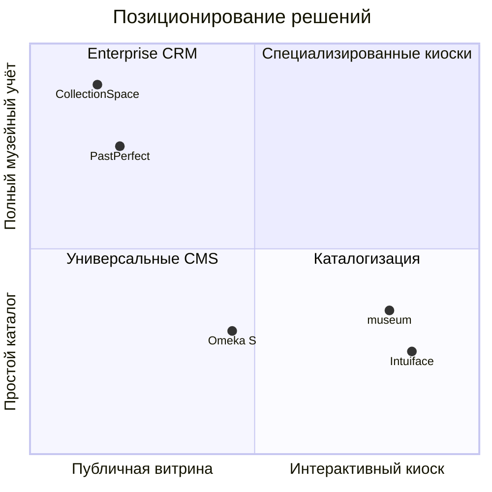

# Анализ аналогов

## Интерактивный музейный стенд ГрГУ

**Объект разработки:** программный комплекс `museum`  
**Версия документа:** 1.0  
**Назначение:** аналитическая глава курсовой работы — обоснование актуальности и конкурентных преимуществ разрабатываемой системы

---

## 1. Введение

Проектирование информационной системы для университетского музея требует понимания того, какие классы программных продуктов уже применяются в музейной сфере и в чём они уступают или превосходят задачи конкретного заказчика. На рынке представлены решения различного масштаба: от универсальных платформ веб-публикации коллекций до специализированных систем учёта музейных предметов и конструкторов интерактивных киосков.

Разрабатываемая система `museum` относится к **гибридному типу**: она совмещает функции **интерактивного цифрового стенда** (сенсорный киоск в здании ГрГУ), **headless CMS** (управление блочным контентом экспозиций) и **каталога персоналий и медиаколлекций** (ректоры, преподаватели, фото- и видеоархив). Такое сочетание не полностью покрывается ни одним из типовых продуктов «из коробки», что обосновывает необходимость собственной разработки.

### 1.1. Цель анализа

Цель настоящего раздела — выявить существующие аналоги, сопоставить их функциональные возможности с требованиями проекта и показать, **почему для музея ГрГУ целесообразна специализированная система**, а не готовое коммерческое или open source решение без адаптации.

### 1.2. Критерии сравнения

Для сопоставления аналогов с разрабатываемой системой выделены следующие критерии, отражающие специфику университетского музейного стенда:

| Критерий | Содержание |
|----------|------------|
| **К-01. Режим киоска** | Поддержка сенсорного взаимодействия, полноэкранного режима, сброса сеанса, крупных элементов управления |
| **К-02. CMS экспозиций** | Создание и редактирование страниц контент-редакторами без программиста; публикация на стенд |
| **К-03. Каталог персоналий** | Биографии, роли, классификация, связанные медиа и документы |
| **К-04. Мультимедийные коллекции** | Фото- и видеогалереи, архивные PDF, встраивание внешних видео |
| **К-05. Динамическая навигация** | Изменение структуры меню без пересборки приложения |
| **К-06. Специализированные сценарии** | Хронология ректоров, flipbook-книги, тематические разделы памяти |
| **К-07. Самостоятельное администрирование** | Веб-панель для сотрудников музея, черновики, версионирование |
| **К-08. Стоимость и развёртывание** | Лицензирование, необходимость облака, возможность локальной установки |
| **К-09. Адаптация под заказчика** | Степень соответствия контенту и брендингу конкретного учреждения |
| **К-10. Музейный учёт коллекций** | Инвентаризация, фонды, экспедиции, стандарты описания предметов (CDWA, LIDO и др.) |

Оценка по каждому критерию: **+** — полно или в основном реализовано, **±** — частично, **−** — отсутствует или требует существенной доработки.

---

## 2. Обзор классов аналогов

Существующие решения можно условно разделить на четыре класса:

1. **Системы управления коллекциями (Collection Management Systems, CMS-museum)** — учёт музейных предметов, фондов, движения экспонатов.
2. **Платформы цифровой публикации** — вывод коллекций и материалов в веб-формате для широкой аудитории.
3. **Конструкторы интерактивных стендов и киосков** — создание touch-интерфейсов без глубокого программирования.
4. **Универсальные CMS** — WordPress, Drupal и аналоги с музейными модулями.

Разрабатываемая система `museum` ближе всего к пересечению классов 2 и 3 с элементами каталога персоналий, но **не претендует на замену полноценной системы музейного учёта** (критерий К-10).

---

## 3. Описание аналогов

### 3.1. Omeka S

**Тип:** open source платформа цифровой публикации для музеев, архивов и библиотек  
**Разработчик:** Corporation for Digital Scholarship (США)  
**Лицензия:** GNU GPLv3  
**Сайт:** [omeka.org/s](https://omeka.org/s/)

#### Назначение и возможности

Omeka S — модульная веб-платформа для создания **онлайн-коллекций и цифровых выставок**. Система ориентирована на описание ресурсов (items), их группировку в наборы (item sets), привязку медиафайлов и формирование тематических сайтов (sites) с навигацией по страницам.

Основной функционал:

- каталогизация объектов с настраиваемыми свойствами (vocabulary, Dublin Core, расширяемые поля);
- загрузка и связывание медиафайлов с записями;
- создание публичных и приватных сайтов-выставок;
- модульная архитектура (REST API, расширения);
- роли пользователей (Global Admin, Site Admin, Editor, Author);
- поддержка OAI-PMH для обмена метаданными.

Omeka S широко используется в университетских музеях и архивах для **веб-каталогов и виртуальных экспозиций**, преимущественно в формате браузерного сайта, а не сенсорного киоска.

#### Преимущества

- бесплатная open source лицензия, отсутствие абонентской платы;
- зрелая предметная модель «ресурс — медиа — коллекция — сайт»;
- стандарты метаданных и модульность;
- активное сообщество, документация на английском языке;
- REST API для интеграций.

#### Недостатки

- **не предназначена для режима киоска**: нет ScreenSaver, жестов «назад», оптимизации под постоянно включённый сенсорный экран;
- интерфейс публичного сайта — универсальный, а не заточенный под музейный стенд ГрГУ;
- блочный редактор страниц ограничен по сравнению с headless CMS с 22 типами блоков;
- нет встроенных сценариев «хронология ректоров», PDF-flipbook, каталога преподавателей по ролям;
- настройка и сопровождение требуют компетенций системного администратора;
- интерфейс и документация не локализованы для белорусского контекста.

---

### 3.2. PastPerfect Museum Software

**Тип:** коммерческая система учёта музейных коллекций  
**Разработчик:** PastPerfect Software, Inc. (США)  
**Лицензия:** проприетарная, разовая или подписная (PastPerfect Online)  
**Сайт:** [museumsoftware.com](https://museumsoftware.com/)

#### Назначение и возможности

PastPerfect — одно из наиболее распространённых в мире **настольных решений для каталогизации музейных фондов**. Система ориентирована на регистрацию, описание и учёт музейных предметов, а не на интерактивную экспозицию для посетителей.

Основной функционал:

- каталог объектов, фотографий, архивных материалов, членов, доноров;
- инвентарные номера, места хранения, состояние, страховая стоимость;
- отчёты, этикетки, экспорт данных;
- модуль PastPerfect Online — веб-доступ к каталогу (ограниченная публичная витрина);
- поддержка множества стандартных полей музейного описания.

PastPerfect применяется там, где приоритетом является **фондовый учёт**, а не создание immersive-интерфейса стенда.

#### Преимущества

- глубокая функциональность музейного каталога (критерий К-10);
- отработанные сценарии инвентаризации и отчётности;
- большая пользовательская база среди небольших и средних музеев;
- минимальные требования к IT-инфраструктуре в desktop-варианте.

#### Недостатки

- **не является интерактивным стендом**: публичный интерфейс вторичен, не рассчитан на киоск;
- проприетарная лицензия и стоимость (для белорусского университета — валютные расходы, поддержка);
- desktop-ориентированность; веб-модуль функционально уступает полноценной CMS;
- отсутствие блочного редактора экспозиций, динамического меню, специализированных экранов;
- кастомизация под брендинг и UX ГрГУ ограничена;
- интеграция с современным SPA-стеком (React) практически не предусмотрена.

---

### 3.3. Intuiface

**Тип:** платформа создания интерактивных мультимедийных приложений для сенсорных экранов  
**Разработчик:** Intuiface (ранее Intuilab, Франция)  
**Лицензия:** проприетарная, подписка (Composer, Player, Enterprise)  
**Сайт:** [intuiface.com](https://www.intuiface.com/)

#### Назначение и возможности

Intuiface — **конструктор интерактивных experience-приложений** для музеев, выставок, ритейла и корпоративных стендов. Продукт закрывает потребность в touch-интерфейсах без написания кода: визуальный редактор, привязка данных, анимации, жесты, офлайн-режим.

Основной функционал:

- drag-and-drop редактор интерактивных сцен;
- поддержка сенсорных экранов, жестов, RFID, IoT-интеграций;
- привязка к внешним источникам данных (Excel, REST API, CMS);
- воспроизведение видео, 3D, карт, PDF;
- развёртывание на Windows, Android, iPad, BrightSign;
- аналитика взаимодействия посетителей (в enterprise-версиях).

Intuiface часто выбирают музеи, которым нужен **именно киоск**, а не веб-каталог.

#### Преимущества

- **лучший среди аналогов охват критерия К-01** (режим киоска): жесты, полноэкран, hardware-интеграции;
- быстрое прототипирование интерактивных сцен без разработки с нуля;
- профессиональные анимации и переходы;
- поддержка привязки к REST API — теоретическая возможность связки с backend.

#### Недостатки

- **нет встроенной CMS и каталога персоналий**: контент и данные нужно проектировать отдельно или подключать извне;
- подписная модель лицензирования; для постоянной эксплуатации киоска требуется Player license на каждое устройство;
- зависимость от проприетарной платформы и облачных сервисов Intuiface;
- сложность сопровождения при смене контента без обученного оператора Composer;
- headless CMS, версионирование страниц, draft/publish — не входят в продукт;
- для глубокой кастомизации (flipbook PDF, timeline ректоров, ролевая модель персон) всё равно потребуется программная разработка backend.

---

### 3.4. CollectionSpace

**Тип:** open source система управления коллекциями для музеев  
**Разработчик:** Lyrasis (США), community-driven  
**Лицензия:** ECL 2.0 (Educational Community License)  
**Сайт:** [collectionspace.org](https://collectionspace.org/)

#### Назначение и возможности

CollectionSpace — **enterprise-класса CRM для музеев**, ориентированная на учёт коллекций, процедуры acquisition/deaccession, loans, exhibitions, authority files. Используется крупными и средними музеями (в том числе университетскими) для фондового учёта.

Основной функционал:

- описание объектов коллекции по профессиональным стандартам;
- управление выставками, займами, местами хранения;
- справочники (authority lists), медиа, права доступа;
- REST API, возможность интеграции с публичными витринами;
- ролевая модель, аудит изменений.

CollectionSpace решает задачу **музейного back-office**, а не front-office интерактивного стенда.

#### Преимущества

- бесплатная open source лицензия;
- соответствие профессиональным практикам музейного учёта (критерий К-10 — высокий уровень);
- масштабируемость для крупных коллекций;
- API для построения кастомных публичных интерфейсов.

#### Недостатки

- **высокая сложность внедрения**: требуется Java-стек, настройка, обучение персонала;
- публичный UI не входит в поставку — нужна отдельная разработка витрины;
- избыточен для цифрового стенда университетского музея без полноценного фондового учёта;
- нет киоск-режима, ScreenSaver, сенсорной навигации;
- срок и стоимость внедрения несопоставимы с задачей курсового/вузовского проекта.

---

## 4. Сравнительный анализ

### 4.1. Сводная таблица

| Критерий | Omeka S | PastPerfect | Intuiface | CollectionSpace | **museum (ГрГУ)** |
|----------|:-------:|:-----------:|:---------:|:---------------:|:-----------------:|
| К-01. Режим киоска | − | − | + | − | **+** |
| К-02. CMS экспозиций | ± | − | ± | − | **+** |
| К-03. Каталог персоналий | ± | ± | − | ± | **+** |
| К-04. Мультимедийные коллекции | + | ± | + | ± | **+** |
| К-05. Динамическая навигация | ± | − | ± | − | **+** |
| К-06. Специализированные сценарии | − | − | ± | − | **+** |
| К-07. Самостоятельное администрирование | + | ± | − | ± | **+** |
| К-08. Локальное развёртывание без подписки | + | ± | − | + | **+** |
| К-09. Адаптация под ГрГУ | − | − | ± | − | **+** |
| К-10. Музейный учёт коллекций | ± | + | − | + | **−** |

**Пояснения к оценке `museum`:**

- **К-10 (−):** система не реализует полноценный фондовый учёт (инвентарные книги, движение предметов, стандарты CDWA/LIDO). Для цифрового стенда университетского музея это осознанное ограничение scope.
- **К-01 (+):** ScreenSaver после 5 минут бездействия, свайп «назад», кнопки 320×144 px, полноэкранный режим.
- **К-06 (+):** timeline ректоров, flipbook PDF «Купаловцы помнят», ролевая фильтрация преподавателей — реализованы как first-class экраны; блок `peopleCatalog` — для CMS-страниц с картотекой людей.

### 4.2. Сопоставление по классам задач

Диаграмма показывает, что разрабатываемая система занимает нишу **«интерактивный киоск + контент-ориентированная CMS»**, не конкурируя напрямую с PastPerfect и CollectionSpace в области фондового учёта, но превосходя их и Omeka S в киоск-UX и предметной специализации под ГрГУ.

### 4.3. Функциональное сопоставление

| Функция | Omeka S | PastPerfect | Intuiface | CollectionSpace | museum |
|---------|---------|-------------|-----------|-----------------|--------|
| Сенсорная навигация, ScreenSaver | — | — | ✓ | — | ✓ |
| Блочный CMS (22 типа блоков) | частично | — | через интеграцию | — | ✓ |
| Черновик / публикация / версии | частично | — | — | ✓ (audit) | ✓ |
| Меню из БД без redeploy | — | — | — | — | ✓ |
| Каталог людей с ролями | через поля | Members | — | Authority | ✓ |
| Фото- / видеогалереи | ✓ | ✓ | ✓ | ✓ | ✓ |
| PDF flipbook | — | — | виджет | — | ✓ |
| Timeline ректоров | — | — | вручную | — | ✓ |
| REST API | ✓ | ограничен | ✓ | ✓ | ✓ |
| Open source / без абонплаты | ✓ | — | — | ✓ | ✓ |

---

## 5. Анализ применимости аналогов к задаче проекта

Задача проекта — **интерактивный стенд университетского музея ГрГУ** с возможностью самостоятельного обновления контента сотрудниками. Рассмотрим, насколько каждый аналог закрывает эту задачу без существенной доработки.

**Omeka S** могла бы стать основой для **онлайн-каталога** или веб-витрины, но потребовала бы: разработки kiosk-оболочки; кастомных тем и компонентов для timeline, flipbook и разделов памяти; доработки UX под сенсорный экран. Итог — гибрид «Omeka + custom frontend», где значительная часть ценности всё равно создаётся разработкой.

**PastPerfect** закрывает другую потребность (фондовый учёт). Для стенда пришлось бы строить **отдельный frontend**, а данные PastPerfect не моделируют CMS-страницы и блочные экспозиции. Дублирование данных и лицензионные издержки делают решение нецелесообразным.

**Intuiface** закрывает **визуальную интерактивность киоска**, но не предоставляет CMS, каталог персоналий и версионирование контента. Потребовался бы backend уровня `museum` плюс подписка Intuiface — архитектурно более тяжёлое и дорогое решение при меньшем контроле над кодовой базой.

**CollectionSpace** оправдан для музея с большим фондом и штатом регистраторов. Для цифрового стенда ГрГУ внедрение CollectionSpace **несопоставимо по трудозатратам** с получаемой пользой; публичный интерфейс всё равно разрабатывался бы с нуля.

**Вывод:** ни один из рассмотренных аналогов не покрывает **полный перечень требований** проекта в едином продукте. Наиболее близки по отдельным аспектам Omeka S (веб-публикация) и Intuiface (киоск), однако их комбинация не даёт преимуществ перед целостной разработкой `museum`.

---

## 6. Преимущества разрабатываемой системы

На основании сравнительного анализа можно сформулировать конкурентные преимущества программного комплекса `museum` для музея ГрГУ.

### 6.1. Целостность архитектуры «стенд + админка + API»

Разрабатываемая система объединяет в **едином monorepo** (TypeScript, React, Express, PostgreSQL):

- публичный SPA-стенд для посетителей;
- административную панель с блочным редактором;
- REST API и единую модель данных.

Аналоги либо решают одну из сторон (каталог **или** киоск **или** учёт), либо требуют стыковки нескольких продуктов. Это снижает стоимость сопровождения и исключает рассинхронизацию данных между системами.

### 6.2. Специализация под предметную область ГрГУ

Система содержит **предметно-ориентированные экраны**, отсутствующие в универсальных продуктах:

- хронология ректоров с переходом к детальной карточке;
- раздел «Купаловцы помнят» с вкладками и PDF-flipbook;
- единый каталог персоналий с ролями (`rector`, `teacher-vov`, `teacher-afgan`, спортивные роли);
- фото- и видеогалереи с фильтрацией по тегам.

Такая специализация обеспечивает **качество пользовательского опыта** на стенде, недостижимое при использовании generic-шаблонов Omeka или ручной вёрстки в Intuiface.

### 6.3. Headless CMS с контролируемой публикацией

Модель `draft_document` / `published_document` с версионированием (`page_versions`) позволяет сотрудникам музея:

- готовить материалы в черновике без отображения на стенде;
- публиковать одним действием;
- восстанавливать предыдущие версии.

22 типа блочного контента (`BlockRenderer`) покрывают типовые экспозиционные форматы (текст, hero, галерея, видео, вкладки, хронология, картотека людей) без привлечения разработчика при каждом изменении текста или изображения.

### 6.4. Режим эксплуатации киоска

В отличие от Omeka S, PastPerfect и CollectionSpace, система `museum` изначально проектировалась под **сенсорный экран**:

- ScreenSaver с возвратом на главную после 5 минут бездействия;
- жест свайпа «назад» и навигационная кнопка;
- крупные touch-targets на главном экране;
- отключение ScreenSaver в админ-зоне.

Intuiface предоставляет аналогичные возможности, но как платформу без встроенного контент-менеджмента и без привязки к доменной модели университетского музея.

### 6.5. Динамическая навигация без пересборки

Структура меню (`menu_items`) загружается из PostgreSQL. Администратор может добавить раздел, изменить порядок или отключить пункт — **без redeploy frontend**. У рассмотренных аналогов либо статическая навигация темы (Omeka), либо ручное редактирование сцен (Intuiface).

### 6.6. Экономическая и технологическая самостоятельность

- **Open stack:** React, Express, PostgreSQL, Prisma — без проприетарных runtime и абонентских лицензий на Player/Composer.
- **Self-hosted:** развёртывание на инфраструктуре университета; медиафайлы — локально в `apps/web/public/`.
- **Полный контроль исходного кода:** возможность доработки под новые разделы (спорт, студенческая жизнь) в рамках той же кодовой базы.

### 6.7. Осознанные ограничения (честное сравнение)

Для объективности следует указать области, где аналоги **превосходят** разрабатываемую систему:

| Область | Лидирующий аналог | Комментарий |
|---------|-------------------|-------------|
| Фондовый учёт, инвентаризация | PastPerfect, CollectionSpace | В scope проекта не входит |
| Стандарты метаданных (LIDO, Dublin Core) | Omeka S, CollectionSpace | Не реализованы в `museum` |
| No-code редактор киоск-сцен | Intuiface | Требуется разработчик для новых типов экранов |
| Глобальный поиск по контенту стенда | Omeka S (модули поиска) | В текущей версии не реализован |
| Мультитенантность / SaaS для нескольких музеев | Omeka S | Система — single-tenant для ГрГУ |

Признание этих ограничений не снижает ценности проекта: **целевая задача — цифровой стенд конкретного университетского музея**, а не замена enterprise CRM или универсальной museum SaaS-платформы.

---

## 7. Выводы

1. Рынок музейных информационных систем представлен продуктами **различного назначения**: фондовый учёт (PastPerfect, CollectionSpace), веб-публикация (Omeka S), интерактивные киоски (Intuiface). Прямого аналога, совмещающего киоск-UX, headless CMS, каталог персоналий и медиагалереи для университетского музея, **не выявлено**.

2. Применение готового решения «как есть» потребовало бы либо **жертвовать режимом киоска и предметной специализацией** (Omeka S, PastPerfect, CollectionSpace), либо **строить отдельный backend и CMS** поверх платформы киосков (Intuiface), либо **нести лицензионные и интеграционные издержки** без полного покрытия требований.

3. Разрабатываемая система `museum` **оправдана** как специализированное решение для ГрГУ: она объединяет функции стенда и админ-панели, реализует предметные сценарии (ректоры, память, галереи), поддерживает самостоятельное редактирование контента и эксплуатируется на открытом технологическом стеке без абонентской платы.

4. Сравнительный анализ подтверждает **актуальность и практическую значимость** курсового проекта: разработка не дублирует существующие CRM-системы, а заполняет прикладную нишу **цифрового интерактивного стенда университетского музея** с интегрированным управлением контентом.

---

*Документ подготовлен в рамках курсового проектирования программного комплекса `museum`. Описание аналогов основано на официальной документации продуктов и сопоставлении с функциональными требованиями разрабатываемой системы.*
