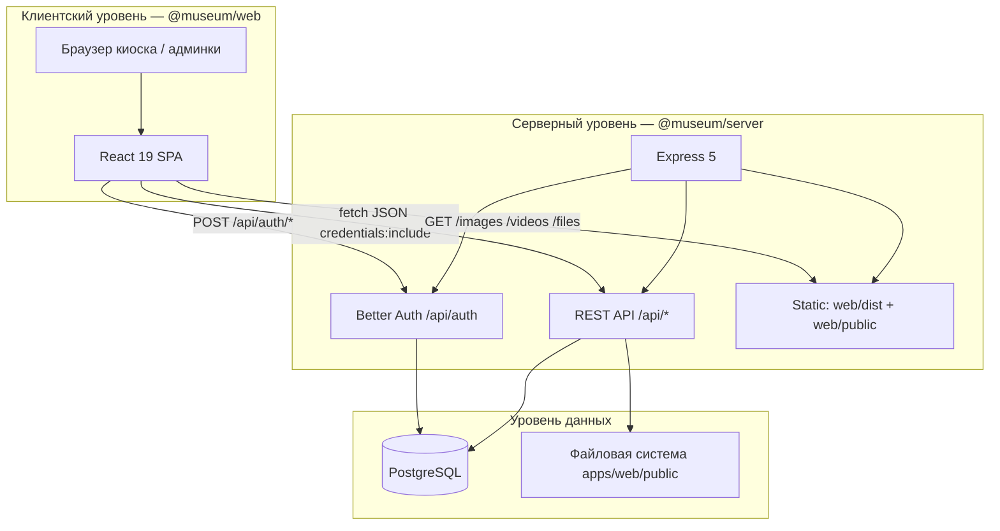
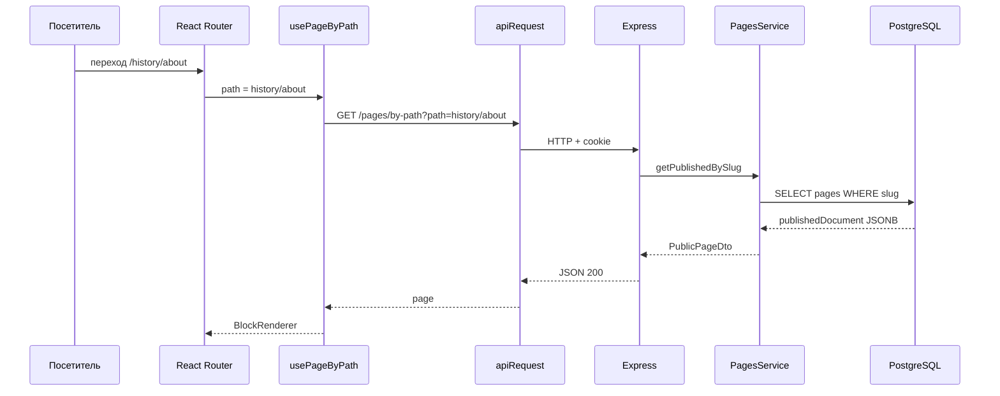
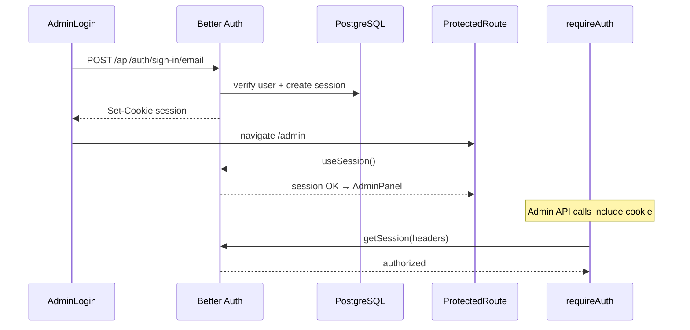
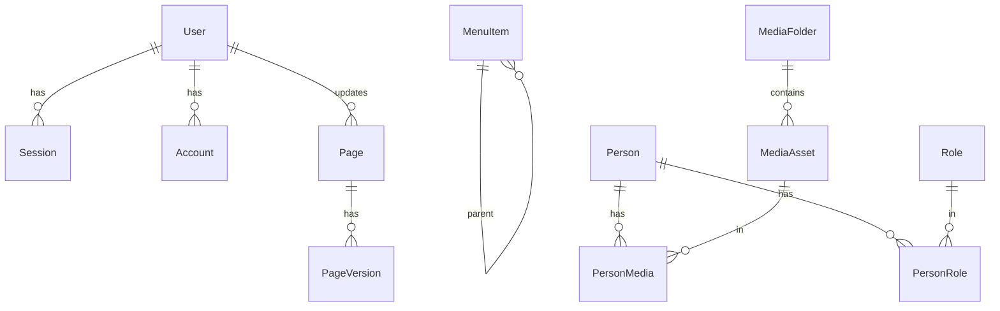

# Архитектурные решения

## Раздел проектирования программной системы

**Объект проектирования:** программный комплекс `museum` — интерактивный музейный стенд ГрГУ  
**Версия документа:** 1.0  
**Основание:** исходный код репозитория, схема БД (`schema.prisma`), конфигурация monorepo

---

## 1. Общая архитектура системы

### 1.1. Архитектурная модель

Система реализована как **двухуровневое full-stack приложение** с разделением на клиентскую и серверную части, объединёнными в monorepo TypeScript. Клиент — SPA (Single Page Application); сервер — REST API на Express с раздачей статики и медиафайлов.



### 1.2. Компоненты системы

| Компонент | Пакет | Назначение |
|-----------|-------|------------|
| Клиентское приложение | `@museum/web` | UI киоска, админ-панель, CMS-редактор |
| Сервер API | `@museum/server` | REST API, аутентификация, раздача статики |
| Общие типы CMS | `@museum/document` | Контракт `PageDocument`, `BlockNode` |

### 1.3. Режимы эксплуатации

**Development.** Turborepo запускает параллельно Vite dev server (`:5173`) и Express (`PORT` из `.env`, по умолчанию 3000). Vite проксирует `/api` на Express (`vite.config.ts`).

**Production.** После `npm run build` Express:

1. обрабатывает запросы к `/api/*` и `/api/auth/*`;
2. раздаёт медиа из `apps/web/public/` (`/images`, `/videos`, `/files`);
3. раздаёт собранный SPA из `apps/web/dist/` (`bootstrap.ts`).

Пути к каталогам вычисляются от **корня monorepo** (`lib/paths.ts`), а не от `process.cwd()` — это гарантирует корректную работу независимо от директории запуска.

### 1.4. Потоки данных

| Поток | Описание |
|-------|----------|
| **Навигация стенда** | React Router → hook (`useMenuSection`, `usePageByPath`) → REST → PostgreSQL |
| **CMS-контент** | `publishedDocument` (JSONB) → API → `BlockRenderer` |
| **Медиа** | Файлы в `apps/web/public/` + метаданные в `media_assets` |
| **Администрирование** | Admin UI → authenticated REST → services → Prisma → PostgreSQL |

---

## 2. Взаимодействие frontend и backend

### 2.1. Протокол и транспорт

Взаимодействие осуществляется по **HTTP/HTTPS** через REST API с телом запросов в формате **JSON**. Бинарные данные (загрузка файлов) передаются через `multipart/form-data` (multer на сервере).

Базовый URL API на клиенте: `VITE_API_BASE_URL` или `/api` по умолчанию (`shared/api/client.ts`).

### 2.2. HTTP-клиент

Единая обёртка `apiRequest<T>()` (`apps/web/src/shared/api/client.ts`):

- префикс `/api`;
- `credentials: 'include'` — передача session cookie Better Auth;
- заголовок `Content-Type: application/json`;
- парсинг ошибок `{ error: string }` в `ApiError`;
- редирект на `/admin/login` при HTTP 401 на admin-маршрутах.

Доменные функции вынесены в модули `apps/web/src/api/`:

| Модуль | Префикс API |
|--------|-------------|
| `pages.ts` | `/pages` |
| `menu.ts` | `/menu` |
| `people.ts` | `/people` |
| `media.ts`, `gallery.ts` | `/media` |

### 2.3. Загрузка данных на клиенте

Паттерн **custom hooks + fetch** (без Redux, TanStack Query):

```typescript
// usePageByPath — типичный паттерн
useEffect(() => {
  let cancelled = false;
  fetchPublicPageByPath(path)
    .then(data => { if (!cancelled) setPage(data); })
    .finally(() => { if (!cancelled) setLoading(false); });
  return () => { cancelled = true; };
}, [path]);
```

Hooks: `useMenuSection`, `usePageByPath`, `usePeople`, `usePeopleByRole`, `usePerson`, `useSession` (Better Auth).

### 2.4. Схема запроса типичного сценария



### 2.5. Разделение публичного и admin API

На сервере каждый router разделён на **публичные GET-маршруты** (без auth) и **admin sub-router** с `requireAuth`. Клиент использует одни и те же endpoints; защита — на сервере.

---

## 3. Используемый архитектурный стиль

### 3.1. Основной стиль: многослойная архитектура (Layered Architecture)

Backend `@museum/server` организован в слои:

```
HTTP Request
    ↓
Middleware (cors, helmet, rateLimit, requireAuth, errorHandler)
    ↓
Router (routes/*.router.ts)
    ↓
Controller (controllers/*.controller.ts) — парсинг req, HTTP-ответ
    ↓
Service (services/*.service.ts) — бизнес-логика, транзакции
    ↓
Prisma Client — доступ к PostgreSQL
```

Контроллеры не обращаются к БД напрямую; сервисы не знают о Express `Request`/`Response`.

### 3.2. Frontend: компонентная архитектура + паттерн «headless CMS»

Клиент следует **Component-Based Architecture** React с выделением слоёв:

| Слой | Каталог | Ответственность |
|------|---------|-----------------|
| Pages | `pages/` | Связка маршрута, данных и layout |
| Layouts | `layouts/` | `MainLayout` — каркас киоска |
| Patterns | `components/patterns/` | `SectionMenuPage`, `CmsPageContent`, `EntityListDetail` |
| CMS | `components/cms/` | `BlockRenderer`, `CmsBlockViews` |
| Features | `components/features/` | Admin, Memory — предметные модули |
| Design System | `components/design-system/` | Button, Card, States, Modal |
| API / Hooks | `api/`, `hooks/` | Доступ к backend |

**Headless CMS:** контент хранится в PostgreSQL как JSONB-документ; frontend **рендерит** блоки через `BlockRenderer`, admin **редактирует** через `DocumentEditor` — презентация отделена от хранения.

### 3.3. Дополнительные паттерны

| Паттерн | Реализация в проекте |
|---------|---------------------|
| **SPA** | Один `index.html`, client-side routing |
| **Repository (частично)** | Prisma Client инкапсулирует SQL |
| **DTO** | `PageSummaryDto`, `PersonDto`, `PublicPageDto` в services |
| **Optimistic locking** | `documentVersion` при сохранении CMS-черновика |
| **Soft delete** | `deletedAt` у `Page`, `Person`, `MediaAsset` |
| **Catch-all routing** | `PathResolverPage` + динамическое меню из БД |

---

## 4. Организация монорепозитория

### 4.1. Структура каталогов

```
museum/                          # корень monorepo
├── apps/
│   ├── web/                     # @museum/web — frontend SPA
│   │   ├── src/
│   │   └── public/              # images/, videos/, files/
│   └── server/                  # @museum/server — backend API
│       ├── src/
│       ├── prisma/              # schema.prisma, migrations/
│       └── scripts/             # seed-admin, migrate-legacy
├── packages/
│   └── document/                # @museum/document — shared types
├── docs/                        # проектная документация
├── turbo.json                   # Turborepo tasks
├── package.json                 # npm workspaces root
└── .env                         # конфигурация (корень)
```

### 4.2. npm workspaces

Корневой `package.json` объявляет workspaces: `apps/*`, `packages/*`. Зависимость `@museum/document` подключается как `"@museum/document": "*"` в web и server.

### 4.3. Turborepo

| Задача | Поведение |
|--------|-----------|
| `dev` | Параллельный запуск Vite + tsx watch, `cache: false`, `persistent: true` |
| `build` | `@museum/server#build` зависит от `@museum/web#build` |
| `type-check` | Зависит от `^build` shared-пакетов |
| `lint` | ESLint в каждом пакете |

### 4.4. Shared-пакет `@museum/document`

Единый контракт CMS-документа:

```typescript
// packages/document/src/index.ts
export type BlockNode = { id, type, schemaVersion, payload, children };
export type PageDocument = { blocks: BlockNode[] };
export function isPageDocument(value): value is PageDocument;
export function walkBlocks(...);
```

Импортируется:

- на **server** — `domain/document.ts` (re-export + `parsePageDocument`);
- на **web** — `DocumentEditor`, `BlockRenderer`, `document-tree.ts`.

Изменение структуры блока требует согласованного обновления registry, view и editor — TypeScript фиксирует расхождения на этапе компиляции.

---

## 5. Структура модулей

### 5.1. Backend-модули (доменные)

Каждый домен имеет triplet **router → controller → service**:

| Домен | Router | Controller | Service | Таблицы БД |
|-------|--------|------------|---------|------------|
| Страницы CMS | `pages.router.ts` | `PagesController` | `PagesService` | `pages`, `page_versions`, `page_redirects` |
| Меню | `menu.router.ts` | `MenuController` | `MenuService` | `menu_items` |
| Персоналии | `people.router.ts` | `PeopleController` | `PeopleService` | `people`, `roles`, `tags`, `categories` + связи |
| Медиа | `media.router.ts` | `MediaController` | `MediaService`, `MediaStorageService` | `media_assets`, `media_folders` |

Регистрация в `routes/index.ts`:

```typescript
app.use('/api/people', peopleRouter);
app.use('/api/media', mediaRouter);
app.use('/api/pages', pagesRouter);
app.use('/api/menu', menuRouter);
```

Каталог `modules/` (`pages/index.ts`, `menu/index.ts`, `people/index.ts`) re-export routers — точка расширения для будущей модульной инкапсуляции.

### 5.2. Cross-cutting модули backend

| Каталог | Содержимое |
|---------|------------|
| `app/` | `create-app.ts`, `bootstrap.ts`, middleware |
| `auth/` | Better Auth config |
| `db/` | Prisma Client + pg Pool |
| `domain/` | Доменные утилиты CMS (`parsePageDocument`) |
| `lib/` | `paths.ts`, `media-storage.ts` |
| `shared/` | `errors.ts` (`HttpError`), `api-messages.ts` |

### 5.3. Frontend-модули

**Маршрутизация** (`app/routes.tsx`):

| Тип маршрута | Примеры | Компонент |
|--------------|---------|-----------|
| Фиксированные | `/`, `/gallery`, `/history/rectors` | Dedicated page |
| Параметрические | `/history/rectors/:id` | `RectorDetails` |
| Admin | `/admin/login`, `/admin` | `AdminLogin`, `ProtectedRoute` → `AdminPanel` |
| Catch-all | `*` | `PathResolverPage` |

**Admin shell** (`AdminPanel.tsx`) — sidebar + panel router без смены URL:

| Section ID | Panel |
|------------|-------|
| `menu-cms` | `MenuPanel` |
| `pages-cms` | `PagesPanel` + `DocumentEditor` |
| `people` | `PeoplePanel` |
| `taxonomy` | `TaxonomyPanel` |
| `media` | `FilesPanel` → `FileManager` |

**CMS pipeline:**

```
PagesPanel → DocumentEditor → BlockEditor (per type)
                           → BlockRenderer (preview)
CmsDynamicPage → CmsPageContent → BlockRenderer (public)
```

---

## 6. Организация API

### 6.1. Принципы проектирования API

- **REST-подобные** ресурсы с JSON-телом;
- префикс `/api` для бизнес-логики, `/api/auth` для Better Auth;
- публичные GET без аутентификации; мутации — только с `requireAuth`;
- ошибки: `{ error: string }` + HTTP status (`HttpError`, `errorHandler`).

### 6.2. Карта endpoints

#### `/api/menu`

| Метод | Путь | Auth | Назначение |
|-------|------|------|------------|
| GET | `/:section` | — | Пункты меню секции (`home`, `history`, …) |
| GET | `/` | ✓ | Все пункты (admin) |
| POST | `/` | ✓ | Создание пункта |
| PUT | `/:id` | ✓ | Обновление |
| DELETE | `/:id` | ✓ | Удаление |

#### `/api/pages`

| Метод | Путь | Auth | Назначение |
|-------|------|------|------------|
| GET | `/by-path?path=` | — | Опубликованная страница по URL |
| GET | `/public/:slug` | — | Опубликованная страница по slug |
| GET | `/` | ✓ | Список страниц |
| GET | `/by-id/:id` | ✓ | Черновик по id |
| POST | `/` | ✓ | Создание |
| PUT | `/by-id/:id` | ✓ | Метаданные (slug, title, theme) |
| PATCH | `/:slug/draft` | ✓ | Autosave черновика + `documentVersion` |
| POST | `/:slug/publish` | ✓ | Публикация |
| GET | `/:slug/versions` | ✓ | История версий |
| POST | `/:slug/versions/:versionId/restore` | ✓ | Восстановление |

#### `/api/people`

| Метод | Путь | Auth | Назначение |
|-------|------|------|------------|
| GET | `/` | — | Список (`?q`, `?role`, `?tag`, `?category`) |
| GET | `/:id` | — | Одна персона |
| GET | `/taxonomy` | ✓ | Справочники |
| POST/PUT/DELETE | `/taxonomy/*` | ✓ | CRUD ролей, тегов, категорий |
| POST | `/` | ✓ | Создание |
| PUT | `/:id` | ✓ | Обновление |
| DELETE | `/:id` | ✓ | Soft delete |
| PATCH | `/reorder` | ✓ | Порядок sortOrder |

#### `/api/media`

| Метод | Путь | Auth | Назначение |
|-------|------|------|------------|
| GET | `/gallery/photos` | — | Публичная фотогалерея |
| GET | `/gallery/videos` | — | Публичная видеогалерея |
| GET | `/browse`, `/search` | ✓ | Файловый менеджер |
| POST | `/upload` | ✓ | Multipart upload (multer) |
| POST | `/upload-url` | ✓ | Регистрация внешней ссылки |
| PATCH | `/assets/:id` | ✓ | Метаданные (gallery flags, tags) |
| POST | `/mkdir`, `/rename`, `/move` | ✓ | Файловые операции |
| DELETE | `/item` | ✓ | Удаление |

#### `/api/auth/*`

Обрабатывается Better Auth (`toNodeHandler(auth)`): login, logout, session, refresh.

### 6.3. Порядок middleware в Express

```
cors → helmet → rateLimit(/api/auth) → Better Auth handler
     → express.json() → registerRoutes(/api/*)
     → express.static(webPublicDir) → errorHandler
```

В production дополнительно: `express.static(webDistDir)` + fallback `index.html` для client-side маршрутов (`bootstrap.ts`).

---

## 7. Организация авторизации

### 7.1. Модель доступа

Система использует **session-based authentication** (Better Auth). Два контура:

| Контур | Пользователи | Механизм |
|--------|--------------|----------|
| Публичный стенд | Посетители | Без аутентификации |
| Админ-панель | Сотрудники музея | Email + password → session cookie |

Публичная регистрация отключена (`disableSignUp: true`). Первый admin — `npm run db:seed-admin`.

### 7.2. Server-side

```typescript
// auth/auth.ts
betterAuth({
  database: prismaAdapter(prisma, { provider: 'postgresql' }),
  emailAndPassword: { enabled: true, disableSignUp: true, minPasswordLength: 12 },
  advanced: { useSecureCookies, defaultCookieAttributes: { httpOnly, sameSite: 'lax' } },
});
```

Mount: `app.all('/api/auth/*splat', toNodeHandler(auth))`.

**Middleware `requireAuth`** (`app/middleware/require-auth.ts`):

1. `auth.api.getSession({ headers })`;
2. при отсутствии session → `HttpError 401`;
3. при успехе → `req.user`, `req.session` для downstream handlers.

Admin sub-routers подключают `adminRouter.use(requireAuth)` до регистрации мутирующих маршрутов.

### 7.3. Client-side

| Компонент | Роль |
|-----------|------|
| `lib/auth-client.ts` | `createAuthClient` (better-auth/react), `signIn`, `signOut`, `useSession` |
| `AdminLogin.tsx` | Форма входа, redirect после успеха |
| `ProtectedRoute.tsx` | Без session → redirect `/admin/login` с сохранением `from` |
| `apiRequest` | `credentials: 'include'`, redirect при 401 |

### 7.4. Диаграмма auth-потока



---

## 8. Организация работы с базой данных

### 8.1. СУБД и подключение

**PostgreSQL** — единственное хранилище структурированных данных. Подключение через:

- `pg.Pool` — пул соединений;
- `@prisma/adapter-pg` — адаптер для Prisma 7;
- `PrismaClient` — типобезопасный ORM (`db/prisma.ts`).

Конфигурация: `DATABASE_URL` или `DB_HOST`, `DB_PORT`, `DB_USER`, `DB_PASSWORD`, `DB_NAME` (`.env`).

### 8.2. Схема данных (логические группы)



| Группа | Таблицы | Назначение |
|--------|---------|------------|
| Auth | `user`, `session`, `account`, `verification` | Better Auth |
| CMS | `pages`, `page_versions`, `page_redirects` | Блочные страницы |
| Контент | `people`, `roles`, `tags`, `categories` + M:N | Персоналии |
| Навигация | `menu_items` | Динамическое меню |
| Медиа | `media_assets`, `media_folders`, `person_documents` | Файлы и связи |

### 8.3. CMS-документы в JSONB

Поля `draftDocument` и `publishedDocument` таблицы `pages` хранят JSON:

```json
{
  "blocks": [
    { "id": "uuid", "type": "hero", "schemaVersion": 1, "payload": {...}, "children": [] }
  ]
}
```

Валидация структуры — на уровне приложения (`isPageDocument`, `cms-block-registry.ts`), не на уровне SQL. Добавление нового типа блока **не требует миграции DDL**.

### 8.4. Миграции и жизненный цикл данных

| Операция | Механизм |
|----------|----------|
| Создание схемы | `prisma migrate dev` / `db:deploy` |
| Генерация клиента | `prisma generate` → `generated/prisma/` |
| Seed admin | `scripts/seed-admin.ts` |
| Legacy import | `scripts/migrate-legacy-data.ts` |

**Публикация CMS** (`PagesService.publish`):

1. `$transaction`;
2. `publishedDocument ← draftDocument`;
3. INSERT в `page_versions`.

**Optimistic locking:** `autosaveDraft` проверяет `documentVersion`; при расхождении — HTTP 409.

**Soft delete:** `deletedAt IS NULL` в запросах list/get.

**Slug redirect:** при смене slug — UPSERT в `page_redirects`; `resolveSlug()` прозрачен для API.

### 8.5. Медиафайлы: гибридное хранение

| Тип данных | Где хранится |
|------------|--------------|
| Бинарные файлы | `apps/web/public/{images,videos,files}/` |
| Метаданные | `media_assets` (title, alt, gallery flags, tags, mimeType) |
| Связь с людьми | `person_media`, `person_documents` |

`MediaStorageService` синхронизирует файловую систему и записи БД при upload/rename/move/delete.

---

## 9. Принципы масштабирования

### 9.1. Текущий профиль нагрузки

Система проектируется под **локальный музейный киоск** в сети ГрГУ:

- 1–N посетителей последовательно (ScreenSaver сбрасывает сессию);
- 1–2 администратора контента;
- один PostgreSQL + один Node.js процесс.

Горизонтальное масштабирование **не реализовано** и не требуется на текущем этапе.

### 9.2. Масштабирование контента (vertical scaling данных)

| Механизм | Описание |
|----------|----------|
| **Динамическое меню** | Новые разделы через `menu_items` без redeploy frontend |
| **Catch-all CMS** | Любой URL → CMS-страница через `PathResolverPage` |
| **JSONB blocks** | Новые типы блоков через registry, без ALTER TABLE |
| **Справочники** | Роли/теги/категории расширяются через admin API |
| **Спецстраницы** | React-page для уникального UX (`MemoryWarPage`, `Rectors` — адаптивный timeline) |
| **Тематические разделы** | Sport, studentlife — только CMS + `PathResolverPage`, без `pages/sport/` |

### 9.3. Масштабирование кодовой базы

| Принцип | Реализация |
|---------|------------|
| **Monorepo + shared types** | `@museum/document` — единый контракт CMS |
| **Domain modules** | router / controller / service на домен |
| **Frontend layers** | pages → patterns → cms → design-system |
| **Block plugin pattern** | registry + BlockEditor + CmsBlockViews на тип блока |

Добавление CMS-блока: `cms-block-registry.ts` → `CmsBlockViews.tsx` → `BlockEditor` / `GenericBlockEditor`.

### 9.4. Потенциальное масштабирование инфраструктуры

Направления развития (не реализованы, но совместимы с архитектурой):

| Направление | Обоснование |
|-------------|-------------|
| **Nginx reverse proxy** | TLS termination, gzip, rate limit на edge |
| **Docker Compose** | app + postgres как воспроизводимый стек |
| **Object storage (S3/MinIO)** | при росте медиатеки beyond local disk |
| **Redis cache** | кэширование `GET /api/menu/:section`, public pages |
| **Route-level code splitting** | `React.lazy` для `/admin`, pdf.js — уменьшение initial bundle киоска |
| **Read replicas PostgreSQL** | при росте числа киосков (маловероятно для ГрГУ) |

Текущая архитектура **не блокирует** эти шаги: REST API stateless (кроме session cookie), статика отделена от API, бизнес-логика в services.

### 9.5. Ограничения масштабирования текущей реализации

| Ограничение | Влияние |
|-------------|---------|
| Session cookie Better Auth | Sticky sessions или shared session store при multiple app instances |
| Медиа на local FS | Не shared между несколькими server instances без NFS/object storage |
| SPA без SSR | Deep links на production обслуживаются catch-all fallback на `index.html` в `bootstrap.ts` |
| Single Express process | CPU-bound PDF render на клиенте; server bottleneck маловероятен |

---

## 10. Заключение

Архитектура `museum` представляет собой **классическое двух-tier full-stack приложение** с monorepo TypeScript, организованное по принципам **многослойной архитектуры** на backend и **компонентной headless CMS** на frontend. Разделение `@museum/web` / `@museum/server` / `@museum/document` обеспечивает чёткие границы ответственности; REST API с публичными GET и защищёнными мутациями — безопасную модель для киоска с открытым доступом и закрытой админкой.

Ключевые проектные решения — **JSONB CMS** (масштабирование контента без миграций), **динамическое меню** (масштабирование навигации), **гибридное хранение медиа** (FS + PostgreSQL metadata), **session auth** через Better Auth — обусловлены предметной областью музейного стенда ГрГУ и профилем on-premise эксплуатации.

---

*Документ составлен на основании анализа исходного кода репозитория `museum` и согласован с документами «Предметная область», «Функциональные требования», «Аргументация выбора технологий».*
