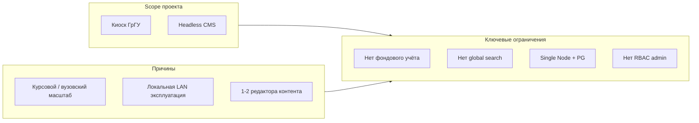

# Ограничения системы

## Интерактивный музейный стенд ГрГУ

**Объект:** программный комплекс `museum`  
**Версия документа:** 1.0  
**Назначение:** раздел анализа проектных ограничений курсовой работы  
**Основание:** исходный код репозитория, функциональные и нефункциональные требования, архитектурная документация

---

## 1. Введение

Любая программная система имеет ограничения — объективные границы, обусловленные scope проекта, выбранной архитектурой, ресурсами разработки и контекстом эксплуатации. Анализ ограничений не умаляет ценность разрабатываемого продукта, а фиксирует **осознанные компромиссы** и направления возможного развития.

Настоящий документ систематизирует ограничения программного комплекса `museum` по четырём категориям:

| Категория | Содержание |
|-----------|------------|
| **Технические** | Архитектура, функциональность, производительность, безопасность, качество кода |
| **Организационные** | Процессы управления контентом, роли пользователей, зависимость от персонала |
| **Инфраструктурные** | Развёртывание, отказоустойчивость, хранение данных, масштабирование |
| **Пользовательские** | Ограничения для посетителей стенда и администраторов |

Для каждого ограничения указаны: **описание**, **причина возникновения** и **возможные пути устранения** в будущем.

---

## 2. Технические ограничения

### ОГР-Т-01. Отсутствие глобального поиска на публичном стенде

| | |
|---|---|
| **Описание** | Посетитель не может выполнить сквозной поиск по CMS-страницам, персоналиям, фото- и видеогалереям с главного экрана. Доступны только навигация по меню, фильтрация видео по тегам и переход по заранее известным разделам. |
| **Причина** | Scope проекта ориентирован на иерархическую навигацию киоска, а не на web-портал с полнотекстовым индексом. Поиск реализован частично: в админке (`GET /api/people?q=…`), в `ImagePathInput` (медиа), фильтр тегов в видеогалерее. Индексация JSONB-документов CMS и cross-entity search не закладывались в модель данных. |
| **Пути устранения** | Внедрение PostgreSQL full-text search или Elasticsearch/OpenSearch; единый search API; UI поисковой строки на `MainLayout`; индексация `published_document`, `people`, `media_assets.metadata` при публикации. |

### ОГР-Т-02. Отсутствие offline/PWA-режима

| | |
|---|---|
| **Описание** | При недоступности сервера или обрыве сети киоск теряет доступ к API, CMS-контенту и динамическим данным. Кэш IndexedDB используется только для PDF-flipbook, не для всего приложения. |
| **Причина** | Архитектура SPA с runtime-загрузкой данных через REST; Service Worker и стратегия cache-first не реализованы. Для локального стенда в сети университета риск считается приемлемым (NFT-О-11). |
| **Пути устранения** | PWA с Service Worker; precache статики и критичных API-ответов; fallback-страница «нет связи»; локальный snapshot опубликованных страниц при старте киоска. |

### ОГР-Т-03. Отсутствие SSR и SEO-оптимизации

| | |
|---|---|
| **Описание** | Контент рендерится на клиенте (CSR); поисковые системы и социальные превью не получают готовый HTML. Система не предназначена для публичного интернет-индексирования. |
| **Причина** | Стенд эксплуатируется как локальный киоск, а не как публичный сайт. Выбран Vite + React SPA без Next.js/SSR — упрощение стека (см. «Описание технологий»). |
| **Пути устранения** | При необходимости публичного web-представления — SSR/SSG (Next.js, Remix) или prerender ключевых маршрутов; Open Graph meta через headless CMS. |

### ОГР-Т-04. Ограничение размера загружаемых файлов

| | |
|---|---|
| **Описание** | Загрузка медиа в админке ограничена **50 МБ на файл** и **20 файлами за один запрос** (multer в `media.router.ts`). Крупные видео и PDF могут потребовать обходного пути (загрузка по URL, ручное размещение в `public/`). |
| **Причина** | Защита Express-процесса от исчерпания памяти и дискового I/O при единичном редакторе контента. Профиль нагрузки — музейный стенд, а не медиа-хостинг. |
| **Пути устранения** | Chunked upload; повышение лимитов через конфигурацию; object storage (S3/MinIO) с presigned URLs; отдельный pipeline для крупных видео. |

### ОГР-Т-05. Отсутствие полноценного музейного фондового учёта

| | |
|---|---|
| **Описание** | Система не поддерживает инвентарные номера, движение экспонатов, акты приёма/передачи, учёт мест хранения, стандарты описания предметов (CDWA, LIDO, Dublin Core). Модель `people` и `media_assets` описывает **цифровой контент экспозиции**, а не физические музейные предметы. |
| **Причина** | Целевая задача — интерактивный стенд и CMS, а не замена CollectionSpace или PastPerfect. Scope курсового/вузовского проекта сознательно сужен. |
| **Пути устранения** | Интеграция с внешней CRM; расширение схемы БД сущностями `exhibit`, `accession`, `location`; импорт/экспорт LIDO-XML. |

### ОГР-Т-06. Расширение CMS-блока требует изменений в коде

| | |
|---|---|
| **Описание** | Добавление нового типа блочного контента требует правок минимум в трёх местах: `cms-block-registry.ts`, `CmsBlockViews.tsx`, `BlockEditor` — без plugin API «из коробки» для администратора. |
| **Причина** | Headless CMS с типизированным реестром блоков (TypeScript); JSONB хранит произвольный payload, но рендер и редактор жёстко привязаны к коду. Паттерн документирован (NFT-С-05), но не автоматизирован. |
| **Пути устранения** | Plugin-система с динамической регистрацией блоков; JSON Schema для payload с auto-generated editor; marketplace внутренних блоков для разработчиков музея. |

### ОГР-Т-07. Hardcoded параметры отдельных сценариев

| | |
|---|---|
| **Описание** | Ряд параметров зафиксирован в коде, а не в конфигурации: таймаут ScreenSaver **5 минут** (`App.tsx`); пути PDF **`/book_vov.pdf`**, **`/book_afgan.pdf`** (prop `pdfPath` в `MemoryWarPage`). |
| **Причина** | Приоритет быстрой реализации предметных экранов для текущей экспозиции ГрГУ; часть разделов наполняется через CMS + catch-all вместо спецстраниц. |
| **Пути устранения** | Вынос параметров в `.env` или таблицу настроек; admin UI для привязки PDF к разделу памяти; раскомментирование/реализация маршрутов или полный переход на CMS для этих секций. |

### ОГР-Т-08. Отсутствие автоматизированных тестов

| | |
|---|---|
| **Описание** | В репозитории не обнаружены unit-, integration- или e2e-тесты (`*.test.ts`, `*.spec.ts`). Регрессии выявляются ручной проверкой и статическим анализом (`npm run lint`, `npm run type-check`). |
| **Причина** | Ограниченные ресурсы курсовой разработки; приоритет функциональности и документации над test coverage. |
| **Пути устранения** | Vitest для services и hooks; Playwright для сценариев киоска и admin; CI pipeline с обязательным `npm run test` перед deploy. |

### ОГР-Т-09. API reorder без пользовательского интерфейса

| | |
|---|---|
| **Описание** | Эндпоинты `PATCH /api/people/reorder`, `…/gallery/photos/reorder`, `…/gallery/videos/reorder` и клиентские функции `reorderPeople`, `reorderGalleryPhotos/Videos` существуют, но **UI для drag-and-drop сортировки** в админ-панели не реализован. Порядок задаётся полем `sort_order` / `metadata.position` косвенно. |
| **Причина** | Backend и API подготовлены на опережение; frontend-панели для reorder не завершены в текущей версии (зафиксировано в «Функциональные требования»). |
| **Пути устранения** | DnD-списки в `PeoplePanel` и галерейных настройках; вызов reorder API после перетаскивания (паттерн уже используется в `DocumentEditor` и `FileManager`). |

### ОГР-Т-10. Риск XSS в HTML-блоках CMS

| | |
|---|---|
| **Описание** | Блок `richText` может содержать HTML в JSONB. React экранирует JSX по умолчанию, но при рендере raw HTML (если используется `dangerouslySetInnerHTML`) или при расширении редактора риск XSS сохраняется для контента, созданного скомпрометированным аккаунтом администратора. |
| **Причина** | Доверенная модель: админы — сотрудники музея. Санитизация HTML (DOMPurify) не внедрена на всех путях (NFT-Б-10). |
| **Пути устранения** | Обязательная санитизация при save и render; ограничение допустимых тегов; markdown вместо raw HTML; CSP headers через helmet. |

---

## 3. Организационные ограничения

### ОГР-О-01. Единый уровень доступа администраторов

| | |
|---|---|
| **Описание** | Все авторизованные пользователи имеют одинаковые права: редактирование меню, CMS, людей, справочников, медиа, публикация и удаление. Роли editor / moderator / super_admin **не реализованы**. |
| **Причина** | Музей ГрГУ на текущем этапе предполагает 1–2 доверенных редактора; RBAC увеличил бы сложность Better Auth и admin UI без немедленной потребности. |
| **Пути устранения** | Модель ролей в Better Auth; middleware `requireRole`; разделение прав «редактор черновика» / «публикующий» / «только медиа»; audit log действий. |

### ОГР-О-02. Создание учётных записей только через CLI

| | |
|---|---|
| **Описание** | Публичная регистрация отключена (`disableSignUp: true`). Новый администратор создаётся командой `npm run db:seed-admin` с `ADMIN_EMAIL` / `ADMIN_PASSWORD` из `.env`, а не через UI. |
| **Причина** | Безопасность: исключение несанкционированных аккаунтов на стенде, доступном в локальной сети. Минимальное число администраторов на этапе внедрения. |
| **Пути устранения** | Admin UI «Пригласить пользователя» для super_admin; интеграция с LDAP/Active Directory университета; одноразовые invite-ссылки Better Auth. |

### ОГР-О-03. Зависимость от разработчика при расширении функциональности

| | |
|---|---|
| **Описание** | Типовой контент (CMS, меню, люди, медиа) редактируется без программиста. Новые **специализированные экраны** (аналог timeline ректоров, flipbook), **типы CMS-блоков** и **React-маршруты** требуют участия разработчика. |
| **Причина** | Архитектурный компромисс «headless CMS + код для уникального UX»; не no-code платформа уровня Intuiface. |
| **Пути устранения** | Расширение набора CMS-блоков покрывающих 90% сценариев; low-code конфигуратор спецстраниц; документированные шаблоны для новых React-pages. |

### ОГР-О-04. Отсутствие формализованного workflow публикации

| | |
|---|---|
| **Описание** | Нет многоступенчатого процесса «черновик → рецензия → утверждение → публикация». Любой администратор может опубликовать CMS-страницу напрямую. |
| **Причина** | Малая команда контент-редакторов; draft/publish и версии уже снижают риск ошибок. Workflow approval избыточен для текущего масштаба. |
| **Пути устранения** | Статусы страницы (`draft`, `review`, `published`); назначение рецензента; уведомления; diff между версиями в admin UI. |

### ОГР-О-05. Single-tenant: только музей ГрГУ

| | |
|---|---|
| **Описание** | Система не рассчитана на обслуживание нескольких музеев, филиалов или tenant-изоляцию данных в одном инстансе. |
| **Причина** | Проект создаётся под конкретного заказчика — университетский музей ГрГУ; multi-tenancy не входил в требования. |
| **Пути устранения** | Поле `tenant_id` в ключевых таблицах; subdomain routing; SaaS-модель для других вузов Беларуси (если коммерциализация). |

### ОГР-О-06. Отсутствие регламентированного резервного копирования контента

| | |
|---|---|
| **Описание** | README описывает миграции и seed, но **не включает** автоматизированные процедуры backup PostgreSQL и каталога `apps/web/public/`. Ответственность за бэкапы лежит на администраторе инфраструктуры университета. |
| **Причина** | Backup — инфраструктурная задача, выходящая за scope приложения; soft delete и `page_versions` частично страхуют от ошибок редактора, но не от сбоя диска. |
| **Пути устранения** | Cron-скрипты `pg_dump` + rsync media; документированный RTO/RPO; периодический экспорт CMS в JSON; replication PostgreSQL. |

---

## 4. Инфраструктурные ограничения

### ОГР-И-01. Отсутствие контейнеризации и оркестрации

| | |
|---|---|
| **Описание** | В репозитории нет `Dockerfile`, `docker-compose.yml`. Развёртывание — ручная установка Node.js 20, PostgreSQL, `npm run build`, `npm run start`. |
| **Причина** | Упрощение стека для курсовой разработки и пилотной эксплуатации; один сервер университета без DevOps-команды. |
| **Пути устранения** | Docker Compose (app + postgres); образы в registry вуза; Kubernetes — при росте числа инстансов. |

### ОГР-И-02. Отсутствие reverse proxy и TLS в проекте

| | |
|---|---|
| **Описание** | Express напрямую принимает HTTP-запросы. Nginx, Caddy, TLS termination, gzip на edge **не настроены** в репозитории. |
| **Причина** | Локальная сеть кампуса; HTTPS может терминироваться на уровне инфраструктуры университета вне приложения. |
| **Пути устранения** | Nginx перед Express; Let's Encrypt или внутренний CA; HTTP/2; rate limit и WAF на edge. |

### ОГР-И-03. Single point of failure (один процесс, одна БД)

| | |
|---|---|
| **Описание** | Production — один Node.js процесс + один PostgreSQL. Нет горизонтального масштабирования, load balancer, read replicas, автоматического failover. |
| **Причина** | Профиль «один киоск + 1–2 администратора» (NFT-М-06); избыточность не требуется на текущем этапе. |
| **Пути устранения** | PM2 cluster mode; несколько инстансов за Nginx; PostgreSQL streaming replication; health checks и auto-restart. |

### ОГР-И-04. Локальное хранение медиафайлов

| | |
|---|---|
| **Описание** | Медиа хранятся в `apps/web/public/` (`images`, `videos`, `files`) на диске сервера. Нет object storage, CDN, автоматического resize/оптимизации изображений. |
| **Причина** | Простота для музея с ограниченным объёмом архива; прямая раздача статики Express без дополнительных сервисов. |
| **Пути устранения** | MinIO/S3 + адаптер в `MediaStorageService`; CDN для статики; pipeline генерации thumbnails и WebP. |

### ОГР-И-05. Зависимость от непрерывной работы локальной сети

| | |
|---|---|
| **Описание** | Киоск, сервер API и PostgreSQL должны быть доступны друг другу по сети. Обрыв LAN делает стенд неработоспособным (см. ОГР-Т-02). |
| **Причина** | Client-server архитектура; киоск не автономный appliance. |
| **Пути устранения** | Kiosk + локальный cache; edge-сервер в той же комнате; резервный Wi-Fi/LAN channel. |

### ОГР-И-06. Dev/prod расхождение портов и origin

| | |
|---|---|
| **Описание** | В development frontend (Vite `:5173`) и API (Express `:3000`) на разных портах; требуется настройка `CORS_ORIGIN` и прокси Vite. Ошибки конфигурации окружения могут блокировать cookie-сессии admin. |
| **Причина** | Стандартная схема monorepo dev; в production всё обслуживается одним Express. |
| **Пути устранения** | Единый origin в dev через proxy (уже частично в `vite.config.ts`); `.env` validation при старте; docker-compose с фиксированными hostname. |

---

## 5. Пользовательские ограничения

### ОГР-П-01. Ограниченная доступность (accessibility) публичного стенда

| | |
|---|---|
| **Описание** | Киоск имеет **частичную** поддержку a11y: отсутствуют skip links; в `index.html` указан `lang="en"` вместо `lang="ru"`; мало ARIA-атрибутов на touch-кнопках; ориентация на зрячих пользователей с touch-взаимодействием. |
| **Причина** | Приоритет сенсорного UX для выставочного зала; ограниченные ресурсы на WCAG 2.1 AA для киоска (NFT-Д-05). |
| **Пути устранения** | `lang="ru"`; ARIA labels на Home и SectionMenu; screen reader mode; контрастность по WCAG; навигация с клавиатуры для всех экранов. |

### ОГР-П-02. Админ-панель не адаптирована под мобильные устройства

| | |
|---|---|
| **Описание** | `AdminPanel` использует фиксированный sidebar 256 px (`w-64`); редактирование CMS, File Manager и формы персон рассчитаны на **desktop**. Редактирование с планшета или смартфона затруднено. |
| **Причина** | Сценарий: сотрудник музея работает за ПК в офисе, а не с киоска (NFT-А-05). |
| **Пути устранения** | Responsive admin layout; collapsible sidebar; упрощённые mobile-формы для экстренных правок. |

### ОГР-П-03. Частичная адаптивность специализированных экранов

| | |
|---|---|
| **Описание** | Не все специализированные экраны и CMS-блоки одинаково оптимизированы под узкие экраны. Страница ректоров имеет два варианта timeline (`md+` / mobile rail), но flipbook и отдельные блоки могут требовать доработки на смартфонах. |
| **Причина** | Целевое устройство — большой сенсорный киоск desktop-класса (NFT-А-01); mobile web — вторичный сценарий. |
| **Пути устранения** | Доработка responsive-layout для flipbook и CMS-блоков; тестирование на планшетах. |

### ОГР-П-04. Отсутствие многоязычности интерфейса

| | |
|---|---|
| **Описание** | UI стенда и админки — на **русском языке**. Переключение языка (белорусский, английский) не реализовано. CMS-контент мультиязычен только если администратор создаст отдельные страницы. |
| **Причина** | Целевая аудитория — посетители музея ГрГУ; i18n (react-i18next и др.) не входил в scope. |
| **Пути устранения** | i18n-фреймворк; локализованные строки UI; опционально — мультиязычные поля в CMS и `people`. |

### ОГР-П-05. Нет персонализации и учёта посетителей

| | |
|---|---|
| **Описание** | Посетитель анонимен: нет профиля, избранного, истории просмотра, рекомендаций. ScreenSaver сбрасывает контекст — by design для киоска. |
| **Причина** | Музейный киоск — публичное устройство без регистрации; privacy-by-design. |
| **Пути устранения** | Опциональный QR-код «продолжить на телефоне»; анонимная analytics (без PII); temporary session в localStorage до ScreenSaver. |

### ОГР-П-06. Ограниченные возможности поиска для администратора

| | |
|---|---|
| **Описание** | Поиск людей — только в `PeoplePanel`. Нет глобального поиска по CMS-страницам, меню и медиа в одной строке. Поиск файлов — в контексте `ImagePathInput` (до 12 результатов). |
| **Причина** | Доменные API (`?q=` для people, `/media/search`) реализованы точечно; unified search UI не приоритетен при малом объёме контента. |
| **Пути устранения** | Global admin search bar; индексация всех сущностей; фильтры по типу (страница / человек / файл). |

### ОГР-П-07. Когнитивная нагрузка при пустых или не настроенных разделах

| | |
|---|---|
| **Описание** | Если CMS-страница не опубликована или меню пусто, посетитель видит empty state («страница пока не настроена») — корректно, но без подсказки «куда дальше», кроме кнопки «Назад». |
| **Причина** | Поэтапное наполнение экспозиции; catch-all CMS как fallback для незавершённых разделов. |
| **Пути устранения** | Redirect на родительское меню из empty state; заглушки-«скоро» с описанием; dashboard в admin «неопубликованные / пустые разделы». |

### ОГР-П-08. Требования к цифровой грамотности администратора

| | |
|---|---|
| **Описание** | Редактор должен понимать концепции slug, публикации, ролей, JSONB-блоков, загрузки файлов. Ошибки (конфликт версий CMS, дубликат slug) требуют понимания сообщений системы. |
| **Причина** | Headless CMS сложнее «Word как на сайте», но проще pure-code; обучение 1–2 сотрудников музея предполагается при внедрении. |
| **Пути устранения** | Встроенная справка; wizard создания первой страницы; упрощённый режим редактора; видеоинструкции для музея. |

---

## 6. Сводная таблица ограничений

| ID | Категория | Краткое описание | Критичность для эксплуатации |
|----|-----------|------------------|------------------------------|
| ОГР-Т-01 | Техническая | Нет глобального поиска на стенде | Средняя |
| ОГР-Т-02 | Техническая | Нет offline/PWA | Средняя (при стабильной LAN — низкая) |
| ОГР-Т-03 | Техническая | Нет SSR/SEO | Низкая (киоск не для web) |
| ОГР-Т-04 | Техническая | Лимит upload 50 МБ | Низкая–средняя |
| ОГР-Т-05 | Техническая | Нет фондового учёта | Низкая (вне scope) |
| ОГР-Т-06 | Техническая | Новый CMS-блок = код | Средняя |
| ОГР-Т-07 | Техническая | Hardcoded параметры | Низкая |
| ОГР-Т-08 | Техническая | Нет автотестов | Средняя (для сопровождения) |
| ОГР-Т-09 | Техническая | Reorder API без UI | Низкая |
| ОГР-Т-10 | Техническая | Риск XSS в richText | Низкая (доверенные админы) |
| ОГР-О-01 | Организационная | Один уровень admin | Средняя (при росте команды) |
| ОГР-О-02 | Организационная | Seed-only регистрация | Низкая |
| ОГР-О-03 | Организационная | Зависимость от разработчика | Средняя |
| ОГР-О-04 | Организационная | Нет workflow approval | Низкая |
| ОГР-О-05 | Организационная | Single-tenant | Низкая (by design) |
| ОГР-О-06 | Организационная | Нет backup в проекте | **Высокая** (инфраструктура) |
| ОГР-И-01 | Инфраструктурная | Нет Docker | Средняя |
| ОГР-И-02 | Инфраструктурная | Нет Nginx/TLS в repo | Средняя |
| ОГР-И-03 | Инфраструктурная | Single point of failure | Средняя |
| ОГР-И-04 | Инфраструктурная | Локальный диск для медиа | Средняя (при росте архива) |
| ОГР-И-05 | Инфраструктурная | Зависимость от LAN | Средняя |
| ОГР-И-06 | Инфраструктурная | Dev/prod конфигурация | Низкая (для dev) |
| ОГР-П-01 | Пользовательская | Ограниченная a11y | Средняя |
| ОГР-П-02 | Пользовательская | Admin не mobile-friendly | Низкая |
| ОГР-П-03 | Пользовательская | Частичная mobile-адаптация отдельных экранов | Низкая |
| ОГР-П-04 | Пользовательская | Нет i18n | Низкая–средняя |
| ОГР-П-05 | Пользовательская | Нет персонализации | Низкая (by design) |
| ОГР-П-06 | Пользовательская | Ограниченный admin search | Низкая |
| ОГР-П-07 | Пользовательская | Empty states без навигации | Низкая |
| ОГР-П-08 | Пользовательская | Нужна цифровая грамотность | Средняя |

---

## 7. Взаимосвязь ограничений и архитектурных решений

Большинство ограничений **согласованы друг с другом**: отказ от multi-tenancy, horizontal scaling и enterprise CRM следует из профиля «один университетский музейный киоск»; отказ от SSR и SEO — из локальной эксплуатации; единый admin-доступ — из малой команды редакторов.

---

## 8. Выводы

1. Ограничения системы `museum` в значительной степени **осознанны** и следуют из scope курсового проекта и контекста эксплуатации в ГрГУ, а не из технических провалов.

2. Наиболее значимые для долгосрочной эксплуатации области: **резервное копирование** (ОГР-О-06), **отказоустойчивость инфраструктуры** (ОГР-И-03), **рост медиархива** (ОГР-И-04), при расширении команды — **RBAC** (ОГР-О-01).

3. Ограничения, критичные для **посетительского UX** (поиск, offline, a11y), частично компенсируются иерархическим меню, ScreenSaver и явными empty states; их устранение повысит удобство, но не блокирует текущую эксплуатацию стенда.

4. Документирование ограничений создаёт основу для **дорожной карты развития** системы после сдачи курсовой работы и передачи проекта музею ГрГУ.

---

*Документ составлен на основании анализа исходного кода и проектной документации репозитория `museum`. Ограничения указаны явно и не маскируются под нереализованные требования.*
