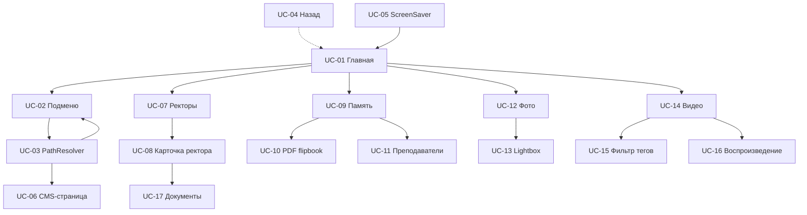
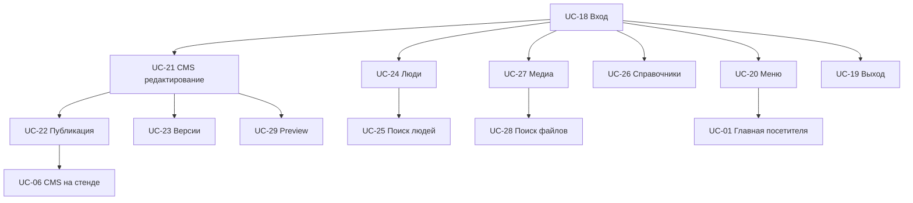

# Описание пользовательских сценариев

## Документация вариантов использования (UML Use Case)

**Система:** интерактивный музейный стенд ГрГУ (`museum`)  
**Версия документа:** 1.0  
**Основание:** маршруты приложения, API, компоненты UI, функциональные требования проекта

---

## 1. Действующие лица (Actors)

| ID | Действующее лицо | Описание |
|----|------------------|----------|
| **ACT-01** | Посетитель | Пользователь публичного стенда без аутентификации (экскурсант, студент, гость) |
| **ACT-02** | Администратор | Авторизованный сотрудник музея с доступом к `/admin` |
| **ACT-03** | Система | Программный комплекс `museum` (автоматические действия: ScreenSaver, редиректы, валидация) |

**Примечание.** В проекте единица «экспонат» представлена **единицей контента**: CMS-страница, персоналия, фотография, видео, PDF-документ — а не физическим объектом витрины.

---

## 2. Карта сценариев

| ID | Сценарий | Действующее лицо | Группа |
|----|----------|------------------|--------|
| UC-01 | Выбор раздела на главном экране | Посетитель | Навигация |
| UC-02 | Навигация по подменю секции | Посетитель | Навигация |
| UC-03 | Динамическое разрешение URL (PathResolver) | Посетитель, Система | Навигация |
| UC-04 | Возврат к предыдущему экрану | Посетитель | Навигация |
| UC-05 | Сброс сеанса через ScreenSaver | Посетитель, Система | Навигация |
| UC-06 | Просмотр CMS-страницы (экспозиция) | Посетитель | Просмотр экспонатов |
| UC-07 | Просмотр хронологии ректоров | Посетитель | Просмотр экспонатов |
| UC-08 | Просмотр карточки ректора | Посетитель | Просмотр экспонатов |
| UC-09 | Просмотр раздела «Купаловцы помнят» | Посетитель | Просмотр экспонатов |
| UC-10 | Чтение архивной PDF-книги (flipbook) | Посетитель | Просмотр экспонатов |
| UC-11 | Просмотр каталога преподавателей (память) | Посетитель | Просмотр экспонатов |
| UC-12 | Просмотр фотогалереи | Посетитель | Просмотр коллекций |
| UC-13 | Просмотр фото в lightbox | Посетитель | Просмотр коллекций |
| UC-14 | Просмотр видеогалереи | Посетитель | Просмотр коллекций |
| UC-15 | Фильтрация видео по тегам | Посетитель | Поиск информации |
| UC-16 | Воспроизведение видео | Посетитель | Просмотр коллекций |
| UC-17 | Скачивание документов персоны | Посетитель | Просмотр экспонатов |
| UC-18 | Вход администратора | Администратор | Авторизация |
| UC-19 | Выход администратора | Администратор | Авторизация |
| UC-20 | Управление пунктами меню | Администратор | Управление контентом |
| UC-21 | Создание и редактирование CMS-страницы | Администратор | Управление контентом |
| UC-22 | Публикация CMS-страницы на стенд | Администратор | Управление контентом |
| UC-23 | Работа с версиями CMS-страницы | Администратор | Управление контентом |
| UC-24 | Управление персоналиями | Администратор | Редактирование данных |
| UC-25 | Поиск и фильтрация людей (админка) | Администратор | Поиск информации |
| UC-26 | Управление справочниками (роли, теги, категории) | Администратор | Редактирование данных |
| UC-27 | Управление медиафайлами | Администратор | Управление контентом |
| UC-28 | Поиск файлов в медиатеке (админка) | Администратор | Поиск информации |
| UC-29 | Предпросмотр контента на стенде из админки | Администратор | Прочие |
| UC-30 | Обработка ошибок и пустых состояний | Посетитель, Администратор, Система | Прочие |

---

## 3. Сценарии навигации по экспозициям

### UC-01. Выбор раздела на главном экране

| Поле | Описание |
|------|----------|
| **Действующее лицо** | Посетитель |
| **Предусловия** | Стенд запущен; открыта главная страница `/`; API `/api/menu/home` доступен; в БД есть активные пункты меню секции `home` |
| **Основной поток** | 1. Посетитель видит заголовок «Выберите раздел для ознакомления» и кнопки разделов (320×144 px). 2. Система загружает пункты через `useMenuSection('home')`. 3. Посетитель нажимает кнопку раздела. 4. Система выполняет переход по `path` пункта меню (React Router). |
| **Альтернативные ветви** | **3a.** Список меню пуст — отображается пустой экран без кнопок (ошибка конфигурации). **4a.** Ошибка API — кнопки не загружаются; поведение зависит от состояния hook (пустой список). |
| **Результат** | Посетитель переходит в выбранный раздел экспозиции |

---

### UC-02. Навигация по подменю секции

| Поле | Описание |
|------|----------|
| **Действующее лицо** | Посетитель |
| **Предусловия** | Посетитель перешёл по URL, для которого в `menu_items` существуют дочерние пункты с ключом секции, равным текущему пути |
| **Основной поток** | 1. `PathResolverPage` запрашивает `GET /api/menu/:section`. 2. Система находит пункты подменю. 3. Отображается `SectionMenuPage` — вертикальный список крупных кнопок с заголовком секции. 4. Посетитель выбирает подраздел. 5. Система переходит по `path` выбранного пункта. |
| **Альтернативные ветви** | **1a.** Пунктов подменю нет — переход к UC-06 (CMS-страница). **2a.** Ошибка API меню — fallback на UC-06 без блокировки. **4a.** Посетитель нажимает «← Назад» — возврат UC-04. |
| **Результат** | Посетитель переходит в подраздел или на CMS-страницу |

---

### UC-03. Динамическое разрешение URL (PathResolver)

| Поле | Описание |
|------|----------|
| **Действующие лица** | Посетитель, Система |
| **Предусловия** | URL не совпадает с фиксированным маршрутом (`/gallery`, `/history/rectors`, …); срабатывает catch-all `*` |
| **Основной поток** | 1. `PathResolverPage` извлекает ключ секции из pathname. 2. Система запрашивает меню секции. 3. Если есть пункты — UC-02. 4. Если пунктов нет — `CmsDynamicPage` загружает опубликованную страницу UC-06. |
| **Альтернативные ветви** | **2a.** Загрузка — `LoadingState`. **4a.** CMS-страница не найдена — empty state «Для этого пути страница пока не настроена в CMS». |
| **Результат** | Посетитель видит подменю или контент CMS по произвольному настроенному URL |

---

### UC-04. Возврат к предыдущему экрану

| Поле | Описание |
|------|----------|
| **Действующее лицо** | Посетитель |
| **Предусловия** | Посетитель находится не на главной странице |
| **Основной поток** | **Способ A (кнопка):** 1. Посетитель нажимает «Назад» в `MainLayout` или `SectionMenuPage`. 2. Система вызывает `navigate(-1)` или переход на `/`, если истории нет. **Способ B (жест):** 1. Посетитель выполняет свайп вправо ≥ 80 px. 2. `App.tsx` вызывает `navigate(-1)`. |
| **Альтернативные ветви** | **2a (кнопка).** `window.history.length ≤ 1` — переход на `/`. |
| **Результат** | Посетитель возвращается на предыдущий экран или на главную |

---

### UC-05. Сброс сеанса через ScreenSaver

| Поле | Описание |
|------|----------|
| **Действующие лица** | Посетитель, Система |
| **Предусловия** | Посетитель на публичном маршруте (не `/admin*`); прошло 5 минут без `mousedown`, `touchstart`, `keydown`, `mousemove` |
| **Основной поток** | 1. Система активирует полноэкранный `ScreenSaver` с логотипом ГрГУ. 2. Посетитель касается экрана. 3. Система скрывает заставку и выполняет `navigate('/')`. |
| **Альтернативные ветви** | **1a.** Любая активность до истечения 5 мин — таймер сбрасывается. **1b.** Маршрут `/admin*` — ScreenSaver не активируется. |
| **Результат** | Сеанс предыдущего посетителя сброшен; отображается главный экран |

---

## 4. Сценарии просмотра экспонатов

### UC-06. Просмотр CMS-страницы (экспозиция)

| Поле | Описание |
|------|----------|
| **Действующее лицо** | Посетитель |
| **Предусловия** | Для текущего URL существует опубликованная CMS-страница (`publishedDocument IS NOT NULL`); slug разрешается через `page_redirects` при необходимости |
| **Основной поток** | 1. `CmsDynamicPage` запрашивает `GET /api/pages/by-path?path=…`. 2. Система возвращает title и JSONB-документ. 3. `CmsPageContent` передаёт документ в `BlockRenderer`. 4. Посетитель просматривает блоки: текст, hero, галереи, видео, вкладки, хронологию, картотеку людей и др. (22 типа). 5. При наличии интерактивных блоков (`buttonRow`, `accordion`, `tabs`, `peopleCatalog`) посетитель взаимодействует с ними. |
| **Альтернативные ветви** | **1a.** Загрузка — `LoadingState`. **2a.** Страница не найдена — `EmptyState`. **2b.** Ошибка API — `ErrorState`. |
| **Результат** | Посетитель ознакомился с содержимым CMS-экспозиции |

---

### UC-07. Просмотр хронологии ректоров

| Поле | Описание |
|------|----------|
| **Действующее лицо** | Посетитель |
| **Предусловия** | Маршрут `/history/rectors`; в БД есть персоналии с ролью `rector` |
| **Основной поток** | 1. Система загружает `GET /api/people?role=rector`. 2. Отображается timeline с фото, ФИО, годами: на `md+` — чередование вокруг центральной линии; на узких экранах — линия слева, карточки справа. 3. Посетитель прокручивает хронологию; подсказка «листайте» исчезает у конца списка. 4. Посетитель нажимает карточку ректора. 5. Переход к UC-08. |
| **Альтернативные ветви** | **1a.** Загрузка — `LoadingState`. **1b.** Ошибка API — `ErrorState`. **2a.** Список пуст — `EmptyState` («Ректоры не добавлены»). |
| **Результат** | Посетитель получил обзор ректоров ГрГУ или перешёл к детальной карточке |

---

### UC-08. Просмотр карточки ректора

| Поле | Описание |
|------|----------|
| **Действующее лицо** | Посетитель |
| **Предусловия** | Маршрут `/history/rectors/:id`; персона существует и не удалена |
| **Основной поток** | 1. Система загружает `GET /api/people/:id`. 2. Отображаются фото, ФИО, годы, краткое и полное описание. 3. При наличии — дополнительные фото и блок «Документы и материалы». 4. Посетитель читает биографию; при необходимости — UC-17. |
| **Альтернативные ветви** | **1a.** Персона не найдена — «Ректор не найден». **1b.** Ошибка API — сообщение об ошибке. |
| **Результат** | Посетитель ознакомился с биографией ректора |

---

### UC-09. Просмотр раздела «Купаловцы помнят»

| Поле | Описание |
|------|----------|
| **Действующее лицо** | Посетитель |
| **Предусловия** | Маршрут `/history/memory/vov` или `/history/memory/afgan` |
| **Основной поток** | 1. Открывается `MemoryWarPage` с заголовком «Купаловцы помнят». 2. Отображаются вкладки: «Преподаватели войны» / «Великая Отечественная Война» (или «Афганистан»). 3. Посетитель переключает вкладку через `TabsBar`. 4a. Вкладка «Преподаватели» → UC-11. 4b. Вкладка «Книга» → UC-10. |
| **Альтернативные ветви** | **4a.** Нет преподавателей — «Преподаватели не добавлены». |
| **Результат** | Посетитель ознакомился с мемориальным разделом |

---

### UC-10. Чтение архивной PDF-книги (flipbook)

| Поле | Описание |
|------|----------|
| **Действующее лицо** | Посетитель |
| **Предусловия** | Активна вкладка книги на `MemoryWarPage`; файл `/book_vov.pdf` доступен |
| **Основной поток** | 1. Система загружает PDF через `pdfjs-dist` (с проверкой IndexedDB-кэша). 2. Отображается flipbook (`react-pageflip`) с обложкой. 3. Посетитель листает страницы жестом или кнопками ‹ ›. 4. Система показывает индикатор «Стр. N из M». |
| **Альтернативные ветви** | **1a.** Повторное открытие — страницы из IndexedDB (`book-cache`). **1b.** PDF недоступен — экран ошибки «Не удалось загрузить PDF». **1c.** Загрузка — progress «N / M стр. · X%». |
| **Результат** | Посетитель просмотрел архивный документ в формате электронной книги |

---

### UC-11. Просмотр каталога преподавателей (память)

| Поле | Описание |
|------|----------|
| **Действующее лицо** | Посетитель |
| **Предусловия** | Вкладка «Преподаватели» на `MemoryWarPage`; роль `teacher-vov` или `teacher-afgan` |
| **Основной поток** | 1. Система загружает людей по роли. 2. `EntityListDetail` показывает список слева и карточку справа. 3. Посетитель выбирает преподавателя в списке. 4. Отображаются фото, ФИО, описание выбранной персоны. |
| **Альтернативные ветви** | **1a.** Список пуст — empty state. **3a.** По умолчанию выбран первый элемент списка. |
| **Результат** | Посетитель ознакомился с преподавателями — участниками тематики памяти |

---

### UC-17. Скачивание документов персоны

| Поле | Описание |
|------|----------|
| **Действующее лицо** | Посетитель |
| **Предусловия** | Открыта карточка персоны (UC-08); у персоны есть записи `PersonDocument` |
| **Основной поток** | 1. Посетитель видит список документов с заголовками. 2. Посетитель нажимает ссылку документа. 3. Система открывает файл в новой вкладке браузера (`target="_blank"`). |
| **Альтернативные ветви** | — |
| **Результат** | Посетитель получил доступ к прикреплённому файлу (PDF и др.) |

---

## 5. Сценарии просмотра коллекций

### UC-12. Просмотр фотогалереи

| Поле | Описание |
|------|----------|
| **Действующее лицо** | Посетитель |
| **Предусловия** | Маршрут `/gallery`; в БД есть `media_assets` с `showInPhotoGallery = true` |
| **Основной поток** | 1. Система загружает `GET /api/media/gallery/photos`. 2. Фотографии группируются по годам. 3. Отображается сетка карточек (sepia-оформление). 4. Посетитель прокручивает галерею по годам. |
| **Альтернативные ветви** | **1a.** Загрузка — `LoadingState`. **2a.** Коллекция пуста — empty/error state. |
| **Результат** | Посетитель просмотрел фотоархив музея |

---

### UC-13. Просмотр фото в lightbox

| Поле | Описание |
|------|----------|
| **Действующее лицо** | Посетитель |
| **Предусловия** | UC-12 выполнен; галерея отображена |
| **Основной поток** | 1. Посетитель нажимает на фото в сетке. 2. Система открывает `BaseModal` (lightbox) с увеличенным изображением, заголовком, годом, аннотацией. 3. Посетитель закрывает modal (клик по backdrop или кнопка закрытия). |
| **Альтернативные ветви** | **2a.** Ошибка загрузки изображения — placeholder или скрытие элемента. |
| **Результат** | Посетитель детально рассмотрел фотографию |

---

### UC-14. Просмотр видеогалереи

| Поле | Описание |
|------|----------|
| **Действующее лицо** | Посетитель |
| **Предусловия** | Маршрут `/video-gallery`; есть видео с `showInVideoGallery = true` |
| **Основной поток** | 1. Система загружает `GET /api/media/gallery/videos`. 2. Отображается каталог с превью, заголовками, описаниями. 3. Посетитель просматривает список; при необходимости — UC-15, UC-16. |
| **Альтернативные ветви** | **1a.** Пустая коллекция — empty state. |
| **Результат** | Посетитель ознакомился с видеоколлекцией |

---

### UC-16. Воспроизведение видео

| Поле | Описание |
|------|----------|
| **Действующее лицо** | Посетитель |
| **Предусловия** | UC-14; посетитель выбрал видео из списка |
| **Основной поток** | 1. Система открывает модальное окно `VideoModal`. 2. Для YouTube/Vimeo — iframe-embed; для локального файла — `<video controls>`. 3. Посетитель просматривает видео. 4. Посетитель закрывает modal (клик, Escape). |
| **Альтернативные ветви** | **2a.** Неподдерживаемый URL — fallback на `<video>` или ошибка воспроизведения. |
| **Результат** | Посетитель просмотрел видеоматериал |

---

## 6. Сценарии поиска информации

> **Ограничение проекта:** глобальный поиск по контенту стенда для посетителей **не реализован**. Ниже описаны фактически существующие сценарии фильтрации и поиска.

### UC-15. Фильтрация видео по тегам (посетитель)

| Поле | Описание |
|------|----------|
| **Действующее лицо** | Посетитель |
| **Предусловия** | UC-14; у видео заданы теги в метаданных |
| **Основной поток** | 1. Система формирует список тегов из метаданных + пункт «Все». 2. Посетитель нажимает тег. 3. Система фильтрует список видео на клиенте. 4. Отображается отфильтрованная коллекция. |
| **Альтернативные ветви** | **2a.** Выбран «Все» — показываются все видео. **3a.** Нет видео с тегом — пустой список. |
| **Результат** | Посетитель просмотрел подмножество видеоколлекции по тематике |

---

### UC-25. Поиск и фильтрация людей (админка)

| Поле | Описание |
|------|----------|
| **Действующее лицо** | Администратор |
| **Предусловия** | UC-18; открыта панель «Люди» |
| **Основной поток** | 1. Администратор вводит текст в поле поиска. 2. Система через 300 ms debounce отправляет `GET /api/people?q=…`. 3. Система отображает отфильтрованный список (поиск по ФИО, subtitle, описаниям). 4. Опционально: администратор включает фильтры по роли, тегу, категории. 5. Система перезапрашивает API с параметрами `role`, `tag`, `category`. |
| **Альтернативные ветви** | **3a.** Нет результатов — пустой список. **4a.** Сброс фильтров — кнопка очистки. |
| **Результат** | Администратор нашёл нужные персоналии для редактирования |

---

### UC-28. Поиск файлов в медиатеке (админка)

| Поле | Описание |
|------|----------|
| **Действующее лицо** | Администратор |
| **Предусловия** | UC-18; администратор редактирует поле пути к изображению (`ImagePathInput`) или использует API поиска |
| **Основной поток** | 1. Администратор вводит имя файла в поле пути. 2. Система вызывает `GET /api/media/search?q=…` (через `fetchImagesIndex`). 3. Отображается выпадающий список до 12 совпадений с превью. 4. Администратор выбирает файл — путь подставляется в форму. |
| **Альтернативные ветви** | **3a.** Ничего не найдено — «Ничего не найдено». **4a.** Администратор открывает `FileManagerModal` для ручного выбора (UC-27). |
| **Результат** | Администратор нашёл и привязал медиафайл |

---

## 7. Сценарии авторизации администратора

### UC-18. Вход администратора

| Поле | Описание |
|------|----------|
| **Действующее лицо** | Администратор |
| **Предусловия** | Учётная запись создана (`npm run db:seed-admin`); стенд доступен по `/admin/login` |
| **Основной поток** | 1. Администратор открывает `/admin/login`. 2. Вводит email и пароль (≥ 12 символов). 3. Система отправляет запрос Better Auth (`signIn.email`). 4. При успехе — session cookie, redirect на `/admin` (или сохранённый `from`). 5. `ProtectedRoute` подтверждает сессию через `useSession()`. |
| **Альтернативные ветви** | **3a.** Неверные credentials — «Неверный email или пароль». **3b.** Rate limit (>20 req/min) — «Слишком много попыток». **4a.** Сессия уже активна — автоматический redirect с login. **5a.** Сессия истекла при доступе к `/admin` — redirect на login с сохранением URL. |
| **Результат** | Администратор авторизован; открыта админ-панель |

---

### UC-19. Выход администратора

| Поле | Описание |
|------|----------|
| **Действующее лицо** | Администратор |
| **Предусловия** | UC-18 выполнен; открыта `AdminPanel` |
| **Основной поток** | 1. Администратор нажимает «Выйти» в sidebar. 2. Система вызывает `signOut()`. 3. Session cookie инвалидируется. 4. Redirect на `/admin/login`. |
| **Альтернативные ветви** | — |
| **Результат** | Сессия завершена; доступ к admin API закрыт |

---

## 8. Сценарии управления контентом

### UC-20. Управление пунктами меню

| Поле | Описание |
|------|----------|
| **Действующее лицо** | Администратор |
| **Предусловия** | UC-18; панель «Меню разделов» |
| **Основной поток** | **Создание:** 1. Администратор задаёт section, label, path. 2. `POST /api/menu/`. 3. Toast «Пункт меню добавлен». **Редактирование:** 4. Изменяет label, path, position, is_active. 5. `PUT /api/menu/:id`. **Удаление:** 6. `DELETE /api/menu/:id`. |
| **Альтернативные ветви** | **2a.** Пустая section — ошибка валидации. **5a.** Ошибка API — toast с текстом ошибки. |
| **Результат** | Структура навигации стенда обновлена; изменения видны посетителю без redeploy |

---

### UC-21. Создание и редактирование CMS-страницы

| Поле | Описание |
|------|----------|
| **Действующее лицо** | Администратор |
| **Предусловия** | UC-18; панель «CMS страницы» |
| **Основной поток** | **Создание:** 1. Администратор указывает slug и title. 2. `POST /api/pages/`. **Редактирование:** 3. Выбирает страницу из списка. 4. В `DocumentEditor` добавляет/удаляет/перетаскивает блоки (22 типа, включая `peopleCatalog`). 5. Редактирует payload блоков. 6. Включает preview (`BlockRenderer` в режиме `preview`). 7. Нажимает «Сохранить черновик» → `PATCH /api/pages/:slug/draft` с `documentVersion`. **Удаление:** 8. При удалении страницы система запрашивает подтверждение (title, slug) → `DELETE /api/pages/by-id/:id`. |
| **Альтернативные ветви** | **7a.** Несохранённые правки — индикатор isDirty. **7b.** Конфликт версий (409) — toast об ошибке. **7c.** «Отменить правки» — восстановление последнего сохранённого снимка. **4a.** Редактирование метаданных (title, slug, theme) — `PUT /api/pages/by-id/:id`; при смене slug создаётся redirect. |
| **Результат** | Черновик CMS-страницы сохранён в БД; не опубликован на стенде до UC-22 |

---

### UC-22. Публикация CMS-страницы на стенд

| Поле | Описание |
|------|----------|
| **Действующее лицо** | Администратор |
| **Предусловия** | UC-21; выбрана CMS-страница с сохранённым черновиком |
| **Основной поток** | 1. Администратор нажимает «Опубликовать». 2. При isDirty — система предлагает сохранить черновик. 3. `POST /api/pages/:slug/publish`. 4. Система копирует `draftDocument` → `publishedDocument`, создаёт `page_version`. 5. Toast «Страница опубликована». |
| **Альтернативные ветви** | **2a.** Администратор отказывается сохранить — confirm публикации без сохранения текущих правок. **3a.** Ошибка API — toast. |
| **Результат** | Контент доступен посетителю через UC-06 |

---

### UC-23. Работа с версиями CMS-страницы

| Поле | Описание |
|------|----------|
| **Действующее лицо** | Администратор |
| **Предусловия** | UC-21; у страницы есть история публикаций |
| **Основной поток** | **Просмотр версий:** 1. `PageVersionsPanel` загружает `GET /api/pages/:slug/versions`. 2. Администратор открывает preview версии. **Восстановление:** 3. Администратор выбирает «Восстановить». 4. `POST …/versions/:id/restore`. 5. Черновик заменён содержимым версии. **Откат к опубликованной:** 6. Кнопка подставляет `publishedDocument` в редактор локально. |
| **Альтернативные ветви** | **4a.** Ошибка — toast. |
| **Результат** | Черновик восстановлен из истории; для отображения на стенде требуется UC-22 |

---

### UC-27. Управление медиафайлами

| Поле | Описание |
|------|----------|
| **Действующее лицо** | Администратор |
| **Предусловия** | UC-18; панель «Медиа» → `FileManager` |
| **Основной поток** | 1. Администратор выбирает root (`images`, `videos`, `files`) и папку. 2. **Upload:** drag-and-drop или выбор файлов → `POST /api/media/upload`. 3. **По URL:** ввод ссылки → `POST /api/media/upload-url`. 4. **Организация:** mkdir, rename, move (DnD), delete. 5. **Метаданные:** редактирование title, alt, year, gallery flags, tags → `PATCH /api/media/assets/:id`. |
| **Альтернативные ветви** | **2a.** Файл > 50 МБ — ошибка multer. **5a.** Включение `showInPhotoGallery` / `showInVideoGallery` — материал появляется в UC-12 / UC-14. |
| **Результат** | Медиатека обновлена; файлы доступны в CMS, галереях и карточках персон |

---

## 9. Сценарии редактирования данных

### UC-24. Управление персоналиями

| Поле | Описание |
|------|----------|
| **Действующее лицо** | Администратор |
| **Предусловия** | UC-18; панель «Люди» |
| **Основной поток** | **Создание:** 1. «Добавить» → `PersonForm`. 2. Заполнение ФИО, годов, описаний, фото, ролей, тегов, категорий, доп. изображений, файлов. 3. `POST /api/people/`. **Редактирование:** 4. Выбор `PersonCard` → изменение полей → `PUT /api/people/:id`. **Удаление:** 5. Soft delete → `DELETE /api/people/:id`. |
| **Альтернативные ветви** | **2a.** Не указана фамиля/имя — ошибка формы. **3a.** Фото через `ImagePathInput` / `FileManagerModal` — UC-28. |
| **Результат** | Персоналия создана/обновлена; отображается на стенде согласно роли (UC-07, UC-08, UC-11) |

---

### UC-26. Управление справочниками

| Поле | Описание |
|------|----------|
| **Действующее лицо** | Администратор |
| **Предусловия** | UC-18; панель «Справочники» |
| **Основной поток** | 1. Администратор выбирает вкладку: роли / теги / категории. 2. **Создание:** slug + label → POST. 3. **Редактирование:** inline edit → PUT. 4. **Удаление:** confirm → DELETE. |
| **Альтернативные ветви** | **4a.** Роль используется персонами — ошибка удаления (если enforced на server). |
| **Результат** | Справочники актуализированы; доступны в `PersonForm` и фильтрах UC-25 |

---

## 10. Прочие сценарии

### UC-29. Предпросмотр контента на стенде из админки

| Поле | Описание |
|------|----------|
| **Действующее лицо** | Администратор |
| **Предусловия** | UC-18 |
| **Основной поток** | **Preview CMS:** 1. В `DocumentEditor` включён режим preview → `BlockRenderer` показывает черновик. **Просмотр на стенде:** 2. Администратор нажимает «На сайт» → `navigate(-1)`. 3. Просматривает опубликованный контент как посетитель. |
| **Альтернативные ветви** | **2a.** Нет history — остаётся на текущей странице. |
| **Результат** | Администратор верифицировал внешний вид контента |

---

### UC-30. Обработка ошибок и пустых состояний

| Поле | Описание |
|------|----------|
| **Действующие лица** | Посетитель, Администратор, Система |
| **Предусловия** | Любой сценарий загрузки данных |
| **Основной поток** | 1. При ожидании — `LoadingState` («Загрузка…»). 2. При ошибке API — `ErrorState` или toast (админка). 3. При пустых данных — `EmptyState` с контекстным текстом. 4. При HTTP 401 в admin — redirect UC-18. 5. При битом изображении — placeholder / скрытие. |
| **Альтернативные ветви** | **1a (PathResolver).** Ошибка меню → fallback UC-06. |
| **Результат** | Пользователь получает понятную обратную связь; система не «зависает» |

---

## 11. Диаграмма связей сценариев (посетитель)

---

## 12. Диаграмма связей сценариев (администратор)

---

## 13. Сводка: покрытие запрошенных групп

| Запрошенная группа | Сценарии | Примечание |
|--------------------|----------|------------|
| Просмотр экспонатов | UC-06 – UC-11, UC-17 | CMS, ректоры, память, PDF, персоналии |
| Просмотр коллекций | UC-12 – UC-14, UC-16 | Фото- и видеогалереи |
| Поиск информации | UC-15, UC-25, UC-28 | Публичный глобальный поиск **отсутствует** |
| Навигация по экспозициям | UC-01 – UC-05 | Меню, PathResolver, назад, ScreenSaver |
| Авторизация администратора | UC-18, UC-19 | Better Auth |
| Управление контентом | UC-20 – UC-23, UC-27 | Меню, CMS, медиа |
| Редактирование данных | UC-24, UC-26 | Люди, справочники |
| Прочие | UC-29, UC-30 | Preview, error handling |

---

*Документ составлен на основании анализа маршрутов (`routes.tsx`), компонентов UI и API репозитория `museum`. Описаны только реализованные сценарии.*
