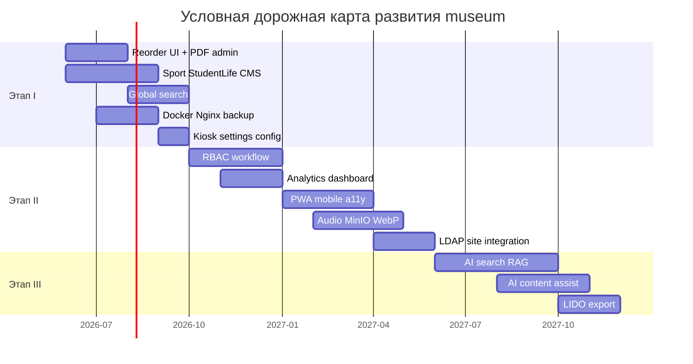

# Перспективы развития

## Интерактивный музейный стенд ГрГУ

**Объект:** программный комплекс `museum`  
**Версия документа:** 1.0  
**Назначение:** обоснованные направления дальнейшего развития системы  
**Основание:** архитектура monorepo, REST API, headless CMS, документ «Ограничения системы», catch-all маршрутизация и сервисный слой backend

---

## 1. Введение

Программный комплекс `museum` спроектирован как **расширяемая платформа**: headless CMS на JSONB, stateless REST API, динамическое меню, модульный backend (`people`, `pages`, `menu`, `media`) и стратегия «специализированный React-экран **или** CMS-страница через `PathResolverPage`». Эти решения не исчерпывают функциональность, но создают **естественные точки роста** без переписывания архитектуры.

Настоящий документ предлагает реалистичные направления развития, логически вытекающие из текущей реализации. Предложения сгруппированы по семи темам и сопровождаются указанием **архитектурной опоры** — существующих компонентов, API или паттернов, на которых можно опираться.

### 1.1. Принципы отбора направлений

| Принцип | Содержание |
|---------|------------|
| **Совместимость** | Расширение существующих модулей, а не замена стека |
| **Постепенность** | Каждое направление может внедряться независимо |
| **Связь с ограничениями** | Приоритет — закрытие зафиксированных ограничений (см. «Ограничения системы») |
| **Контекст ГрГУ** | Университетский музей, киоск + админка, on-premise |

### 1.2. Условные этапы внедрения

| Этап | Горизонт | Фокус |
|------|----------|-------|
| **I** | Ближайший | Завершение начатого (reorder UI), поиск, инфраструктура |
| **II** | Средний | Мобильный доступ, аналитика, мультимедиа, RBAC |
| **III** | Долгосрочный | AI-assist, интеграции с внешними системами, расширенный контент |

---

## 2. Новые функции

### 2.1. Глобальный поиск на публичном стенде

**Описание.** Поисковая строка на `MainLayout` с единым индексом по опубликованным CMS-страницам, персоналиям, фото- и видеогалерее.

**Архитектурная опора.** REST API уже поддерживает `GET /api/people?q=…`; метаданные медиа — в JSONB `media_assets.metadata`; CMS — в `published_document`. Новый модуль `search` (router → service) и hook `useSearch` на клиенте.

**Связь с ограничениями.** ОГР-Т-01, ОГР-П-06.

**Этап.** I.

---

### 2.2. UI сортировки (reorder) в админке

**Описание.** Drag-and-drop упорядочивание людей, фото по годам и видео в галереях.

**Архитектурная опора.** API уже реализован: `PATCH /api/people/reorder`, `…/gallery/photos/reorder`, `…/gallery/videos/reorder`; клиентские функции в `api/people.ts`, `api/gallery.ts`. Паттерн DnD — `@dnd-kit` в `DocumentEditor` и `FileManager`.

**Связь с ограничениями.** ОГР-Т-09.

**Этап.** I (минимальные трудозатраты — backend готов).

---

### 2.3. Ролевая модель администраторов (RBAC)

**Описание.** Разграничение прав: редактор черновиков, публикующий, медиа-менеджер, super_admin.

**Архитектурная опора.** Better Auth поддерживает расширение модели пользователя; middleware `requireAuth` дополняется `requireRole`; mutating routes в `admin*Router` защищаются по роли.

**Связь с ограничениями.** ОГР-О-01.

**Этап.** II.

---

### 2.4. Workflow публикации CMS

**Описание.** Статусы страницы: `draft` → `review` → `published`; назначение рецензента; diff версий в admin UI.

**Архитектурная опора.** Поля `draft_document` / `published_document`, таблица `page_versions`, optimistic locking через `documentVersion` — фундамент уже есть; добавляется поле `status` и опциональный `reviewedBy`.

**Связь с ограничениями.** ОГР-О-04.

**Этап.** II.

---

### 2.5. PWA и offline-кэш критичного контента

**Описание.** Service Worker для precache статики и последних опубликованных страниц; fallback при обрыве LAN.

**Архитектурная опора.** Паттерн IndexedDB-кэша уже реализован для PDF (`MemoryWarPage`, `pdf-cache.ts`); Vite PWA plugin; public GET API идempotent.

**Связь с ограничениями.** ОГР-Т-02, ОГР-И-05.

**Этап.** II.

---

### 2.6. Многоязычность интерфейса и контента

**Описание.** Переключение UI (русский / белорусский / английский); опционально — локализованные поля в CMS и `people`.

**Архитектурная опора.** JSONB `payload` блоков допускает `{ "ru": "…", "be": "…" }` без миграции; `BlockRenderer` выбирает locale; i18n для строк UI через `react-i18next`.

**Связь с ограничениями.** ОГР-П-04, NFT-Д-05 (`lang="ru"`).

**Этап.** II.

---

### 2.7. Улучшение доступности (a11y)

**Описание.** `lang="ru"`, ARIA на киоск-кнопках, skip links, клавиатурная навигация, озвучка через screen reader.

**Архитектурная опора.** Частичная a11y в admin (`aria-live`, `aria-label`); `MediaAsset.alt`; модальные окна с Escape — расширение на публичный стенд.

**Связь с ограничениями.** ОГР-П-01.

**Этап.** II.

---

### 2.8. Настраиваемые параметры киоска

**Описание.** Таймаут ScreenSaver, путь PDF-книги, тексты заставки — через admin settings или `.env`, а не hardcode.

**Архитектурная опора.** Таблица `settings` (key-value JSONB) или расширение `menu`; `App.tsx` и `pdf-cache.ts` читают конфиг через API.

**Связь с ограничениями.** ОГР-Т-07.

**Этап.** I.

---

## 3. Интеграции

### 3.1. LDAP / Active Directory университета

**Описание.** Вход администраторов через корпоративную учётную запись ГрГУ вместо локального пароля.

**Архитектурная опора.** Better Auth поддерживает OAuth/OIDC и custom providers; `Account.providerId` уже моделирует провайдеров; session cookie-модель сохраняется.

**Этап.** II.

---

### 3.2. Сайт университета и портал GrSU

**Описание.** Встраивание виджетов («Ректоры», «Новости музея») или deep links на CMS-страницы; единый брендинг.

**Архитектурная опора.** Headless CMS + public REST (`GET /api/pages/by-path`, `/api/people?role=…`); CORS расширяется для origin сайта университета.

**Этап.** II.

---

### 3.3. QR-коды для продолжения на мобильном

**Описание.** На карточке ректора или CMS-странице — QR со ссылкой на ту же страницу в mobile-friendly view (публичный URL).

**Архитектурная опора.** React Router paths стабильны; slug в `pages` и id в `people` — постоянные идентификаторы; генерация QR на клиенте (библиотека `qrcode`).

**Этап.** II.

---

### 3.4. Экспорт и импорт контента

**Описание.** Backup/restore CMS-страниц, персоналий, меню в JSON; миграция между стендами.

**Архитектурная опора.** JSONB-документы и DTO сервисов сериализуются напрямую; Prisma transactions для атомарного import.

**Связь с ограничениями.** ОГР-О-06 (дополнение к pg_dump).

**Этап.** I–II.

---

### 3.5. Object storage (MinIO / S3)

**Описание.** Перенос медиа из `apps/web/public/` в object storage при росте архива.

**Архитектурная опора.** `MediaStorageService` абстрагирует пути; `media_assets.src` хранит URL; Express static — fallback или CDN.

**Связь с ограничениями.** ОГР-И-04.

**Этап.** II (при >100 ГБ медиа).

---

### 3.6. Стандарты музейных метаданных (LIDO / Dublin Core)

**Описание.** Экспорт описаний персон и медиа в interchange-форматах для обмена с архивами и библиотекой ГрГУ.

**Архитектурная опора.** REST API + mapping layer в новом `export.service.ts`; без изменения UI киоска.

**Этап.** III.

---

## 4. Мобильные решения

### 4.1. Адаптивный публичный стенд (mobile web)

**Описание.** Дальнейшее улучшение responsive-layout для смартфонов: touch-friendly галереи, отдельные CMS-блоки, flipbook.

**Архитектурная опора.** Tailwind breakpoints в `CmsBlockViews`, `RectorDetails`; страница ректоров уже имеет mobile rail (`< md`) и desktop timeline (`≥ md`).

**Связь с ограничениями.** ОГР-П-03 (остальные экраны).

**Этап.** I–II.

---

### 4.2. Mobile-friendly админка (ограниченный режим)

**Описание.** Collapsible sidebar, упрощённые формы для экстренных правок (публикация, правка текста, загрузка фото).

**Архитектурная опора.** Тот же REST API; responsive refactor `AdminPanel` без нового backend.

**Связь с ограничениями.** ОГР-П-02.

**Этап.** II.

---

### 4.3. Progressive Web App для посетителей

**Описание.** Установка «Музей ГрГУ» на домашний экран смартфона; offline-просмотр ранее открытых материалов.

**Архитектурная опора.** Совмещается с PWA (п. 2.5); manifest + icons в `apps/web/public/`.

**Этап.** II.

---

### 4.4. Нативное приложение (опционально, долгосрочно)

**Описание.** React Native / Expo клиент, потребляющий тот же REST API.

**Архитектурная опора.** Headless architecture: `@museum/document` типы переиспользуются; `@museum/server` без изменений; дублирование UI — основная стоимость.

**Этап.** III (только при явном запросе университета).

---

## 5. Аналитические инструменты

### 5.1. Сбор анонимной статистики посещений киоска

**Описание.** Счётчики просмотров разделов, CMS-страниц, карточек ректоров, видео; heatmap популярности без персональных данных.

**Архитектурная опора.** Новая таблица `analytics_events` (event_type, path, entity_id, timestamp); POST beacon с киоска (batch); dashboard в admin.

**Связь с ограничениями.** ОГР-П-05 (анонимность сохраняется).

**Этап.** II.

---

### 5.2. Отчёты для сотрудников музея

**Описание.** Ежемесячный отчёт: топ разделов, новые публикации, объём медиатеки, активность администраторов.

**Архитектурная опора.** Агрегация SQL по `page_versions.created_at`, `media_assets`, `pages.updated_by`; export CSV/PDF.

**Этап.** II.

---

### 5.3. Мониторинг здоровья системы

**Описание.** Health check endpoint, метрики uptime, алерты при недоступности PostgreSQL или переполнении диска.

**Архитектурная опора.** `prisma.$connect()` при старте уже есть; расширение `/api/health` (db, disk, version); интеграция с Prometheus/Grafana on-premise.

**Связь с ограничениями.** ОГР-И-03.

**Этап.** I–II.

---

### 5.4. A/B-тестирование экспозиций (экспериментально)

**Описание.** Две версии CMS-страницы; ротация на киоске; сравнение времени просмотра.

**Архитектурная опора.** `page_versions` + флаг experiment; клиент случайно выбирает variant; analytics (п. 5.1).

**Этап.** III.

---

## 6. Мультимедийные возможности

### 6.1. Аудиогид и озвучка экспозиций

**Описание.** Привязка аудиофайлов к CMS-блокам, карточкам ректоров, пунктам timeline; кнопка «слушать» на киоске.

**Архитектурная опора.** `media_assets` с `mime_type` audio/*; новый CMS-блок `audio` или поле в `hero`/`richText`; воспроизведение через `<audio>`.

**Этап.** II.

---

### 6.2. 360° панорамы и виртуальные туры

**Описание.** CMS-блок `embed` или специализированный блок `panorama` для панорам зданий кампуса.

**Архитектурная опора.** Блок `embed` уже существует; расширение registry + view для Photo Sphere / Matterport iframe.

**Этап.** II–III.

---

### 6.3. Автоматическая генерация превью и WebP

**Описание.** Pipeline при upload: thumbnail, WebP-версия, извлечение width/height (поля уже в `media_assets`).

**Архитектурная опора.** Hook в `MediaStorageService` после multer; `sharp` на server; `src` variants в `metadata`.

**Этап.** II.

---

### 6.4. Расширение flipbook: несколько PDF, admin-managed

**Описание.** Привязка PDF к разделам памяти через admin, а не hardcoded `/book_vov.pdf`.

**Архитектурная опора.** `MemoryWarPage` + `pdf-cache.ts`; `media_assets` или CMS-блок с полем `pdfSrc`; IndexedDB-кэш обобщается по URL.

**Связь с ограничениями.** ОГР-Т-07.

**Этап.** I.

---

### 6.5. Субтитры и транскрипты для видео

**Описание.** Поля `subtitles`, `transcript` в `metadata` видео; отображение в `VideoModal`.

**Архитектурная опора.** `VideoGallery` + `VideoModal`; metadata JSONB расширяется без миграции DDL.

**Этап.** II.

---

### 6.6. Chunked upload для крупных файлов

**Описание.** Загрузка видео >50 МБ частями; снятие ограничения multer для trusted admin.

**Архитектурная опора.** Новый endpoint `POST /api/media/upload-chunk`; сборка на server; конфигурируемый лимит.

**Связь с ограничениями.** ОГР-Т-04.

**Этап.** II.

---

## 7. Искусственный интеллект

> Предложения в этой секции — **assistive AI** (помощь редакторам и посетителям), а не замена curatorial decisions. Внедрение on-premise или через API с учётом политики данных университета.

### 7.1. AI-поиск и ответы на вопросы посетителей

**Описание.** Чат или поиск «Спросите музей»: ответы на основе опубликованного CMS, биографий, метаданных галерей (RAG).

**Архитектурная опора.** Индекс из `published_document`, `people`, `media_assets.metadata`; embedding + vector search (pgvector в PostgreSQL); UI — modal на `MainLayout`.

**Связь с ограничениями.** ОГР-Т-01 (эволюция поиска).

**Этап.** III.

---

### 7.2. Автогенерация черновиков CMS-блоков

**Описание.** Администратор задаёт тему («История факультета физики»); AI предлагает структуру блоков `hero`, `richText`, `timeline` для редактирования.

**Архитектурная опора.** `DocumentEditor` принимает JSON `PageDocument`; LLM API → draft JSON → ручная правка → publish.

**Этап.** III.

---

### 7.3. OCR и распознавание архивных документов

**Описание.** Извлечение текста из PDF/сканов в разделе памяти; полнотекстовый поиск по архиву.

**Архитектурная опора.** PDF уже через `pdfjs-dist`; server-side OCR (Tesseract) при upload; текст в `metadata` или отдельная таблица `document_texts`.

**Этап.** III.

---

### 7.4. Автоподписи и alt-тексты для изображений

**Описание.** Предложение `title`, `alt`, `annotation` при загрузке фото в File Manager.

**Архитектурная опора.** Hook после upload в `MediaStorageService`; vision API; поля уже в `MediaAsset`.

**Связь с ограничениями.** NFT-Д-07.

**Этап.** III.

---

### 7.5. Перевод контента (AI-assisted i18n)

**Описание.** Черновик белорусской/английской версии CMS-блока или биографии по русскому оригиналу.

**Архитектурная опора.** Совмещается с п. 2.6; LLM batch translate → редактор проверяет → publish.

**Этап.** III.

---

## 8. Расширение музейного контента

### 8.1. Разделы Sport и Student Life (CMS)

**Описание.** Разделы «Спорт» и «Студенческая жизнь» полностью оформляются через **меню** (`menu_items`) и **CMS-страницы** по slug. Отдельные файлы `pages/sport/`, `pages/studentlife/` и фиксированные маршруты в `routes.tsx` **не используются**.

**Архитектурная опора.** Catch-all `PathResolverPage`: для `/sport` — `GET /api/menu/sport` или CMS; подстраницы — CMS по path (`hall-of-fame`, `trainers` и т.д.).

**Этап.** Наполнение контентом (роли, страницы, меню).

---

### 8.2. Новые CMS-блоки под музейные форматы

**Описание.** Блоки: `exhibitCard` (карточка экспоната), `map` (карта кампуса), `audio`, `quotePerson`, `comparison` (до/после).

**Архитектурная опора.** Паттерн registry → `CmsBlockViews` → `BlockEditor`; JSONB без ALTER TABLE.

**Этап.** I–II.

---

### 8.3. Хронологии и интерактивные карты университета

**Описание.** Обобщение блоков `timeline` и `peopleCatalog` для других событий и персон (спорт, наука, кампус).

**Архитектурная опора.** CMS-блоки `timeline` / `peopleCatalog` + опционально React-page с данными из `people` или JSON в CMS.

**Этап.** II.

---

### 8.4. Временные выставки и события

**Описание.** CMS-страницы или menu-секции с `validFrom` / `validTo`; автоматическое скрытие после даты.

**Архитектурная опора.** Поля в `pages` или `menu_items`; фильтр в public API; без удаления контента.

**Этап.** II.

---

### 8.5. Каталог «выпускников / известных alumni»

**Описание.** Расширение `people` ролью `alumni`; список + карточки по паттерну ректоров.

**Архитектурная опора.** CRUD people + taxonomy; новый React-page или CMS + `EntityListDetail`.

**Этап.** II.

---

### 8.6. Интеграция физических экспонатов (QR на витрине)

**Описание.** QR-код у витрины ведёт на CMS-страницу или карточку экспоната на стенде/телефоне.

**Архитектурная опора.** Стабильные URL slug; новый CMS-блок `exhibitCard` с инвентарным номером (опционально).

**Этап.** II–III.

---

## 9. Инфраструктурное развитие (сквозное)

Направления из «Архитектурные решения», §9.4, дополняющие функциональные перспективы:

| Направление | Назначение | Этап |
|-------------|------------|------|
| **Docker Compose** | Воспроизводимый deploy app + PostgreSQL | I |
| **Nginx + TLS** | HTTPS, gzip, edge rate limit | I |
| **Redis cache** | Кэш `GET /api/menu/:section`, public pages | II |
| **React.lazy** | Code splitting admin, pdf.js — меньший bundle киоска | I |
| **Automated tests** | Vitest + Playwright, CI | I |
| **Backup runbook** | pg_dump + rsync media, документированный RTO/RPO | I |

---

## 10. Дорожная карта (сводная)

*Даты условны и ориентированы на поэтапное финансирование и ресурсы музея ГрГУ.*

---

## 11. Приоритизация по impact / effort

| Приоритет | Направление | Impact | Effort | Опора в коде |
|-----------|-------------|--------|--------|--------------|
| 🔴 Высокий | Reorder UI | Средний | **Низкий** | API готов |
| 🔴 Высокий | Backup + Docker | Высокий | Средний | README, paths |
| 🟡 Средний | Global search | Высокий | Средний | people ?q=, JSONB |
| 🟡 Средний | PDF через admin | Средний | Низкий | pdf-cache pattern |
| 🟡 Средний | Analytics | Средний | Средний | REST + новая таблица |
| 🟢 Долгосрочный | AI RAG search | Высокий | Высокий | published content |
| 🟢 Долгосрочный | React Native app | Средний | **Высокий** | headless API |

---

## 12. Выводы

1. Архитектура `museum` **не требует смены платформы** для перечисленных перспектив: headless CMS, REST API, JSONB, monorepo и модульный backend создают устойчивый фундамент.

2. **Ближайшие выигрыши** — завершение начатого (reorder UI, конфигурируемый PDF через admin), инфраструктура (Docker, backup) и global search — закрывают зафиксированные ограничения при умеренных трудозатратах.

3. **Мобильные и аналитические** направления естественно опираются на существующий API без дублирования бизнес-логики.

4. **AI** целесообразен как assistive layer (поиск, черновики, OCR, alt-тексты), а не как автономный «куратор» — с учётом политики данных университета и обязательной проверки контента редактором музея.

5. **Расширение контента** ГрГУ — через CMS, menu и блок `peopleCatalog`; отдельные React-файлы для sport/studentlife не требуются.

---

*Документ согласован с «Архитектурные решения», «Ограничения системы», «Функциональные требования». Все предложения относятся к развитию существующего репозитория `museum`, а не к отдельному greenfield-проекту.*
