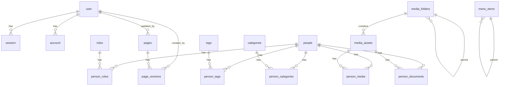

# Структура базы данных

## Интерактивный музейный стенд ГрГУ

**Проект:** `museum` (monorepo full-stack TypeScript)  
**СУБД:** PostgreSQL  
**ORM:** Prisma (`apps/server/prisma/schema.prisma`)  
**Версия документа:** 1.0  
**Основание:** схема Prisma, миграции, сервисный слой backend

---

## 1. Общая структура базы данных

База данных проекта `museum` — **центральное хранилище** всего контента интерактивного музейного стенда и административной панели. Физически данные размещаются в PostgreSQL; доступ к ним осуществляется через Prisma Client на сервере Express (`@museum/server`).

Схема состоит из **19 таблиц**, сгруппированных по пяти функциональным областям:

| Область | Таблицы | Назначение |
|---------|---------|------------|
| **Аутентификация** | `user`, `session`, `account`, `verification` | Учётные записи администраторов и сессии Better Auth |
| **CMS-страницы** | `pages`, `page_versions`, `page_redirects` | Блочный контент экспозиций, черновики, публикация, история |
| **Персоналии** | `people`, `roles`, `tags`, `categories`, `person_roles`, `person_tags`, `person_categories`, `person_media`, `person_documents` | Каталог людей и их классификация |
| **Медиатека** | `media_folders`, `media_assets` | Каталог файлов и метаданные галерей |
| **Навигация** | `menu_items` | Динамическое меню стенда |

### 1.1. Архитектурные принципы

**Реляционная модель с JSONB-документами.** Структурированные сущности (люди, меню, файлы) хранятся в классических таблицах с внешними ключами. Гибкий блочный контент CMS и расширяемые метаданные медиафайлов — в полях типа **JSONB**, что позволяет менять состав блоков и атрибутов без миграций схемы при каждом новом типе контента.

**Разделение черновика и публикации.** Таблица `pages` содержит два независимых JSONB-документа: `draft_document` (рабочая версия в админке) и `published_document` (версия, видимая посетителю). Публикация — атомарное копирование черновика в опубликованное поле с одновременной записью снимка в `page_versions`.

**Мягкое удаление.** Для `pages`, `people` и `media_assets` используется поле `deleted_at`: запись не удаляется физически, а исключается из выборок сервисного слоя. Это сохраняет целостность связей и позволяет при необходимости восстановить данные.

**Связи «многие ко многим» через junction-таблицы.** Роли, теги и категории персон, а также дополнительные фото персон — через промежуточные таблицы с составным первичным ключом.

**Древовидные структуры через self-reference.** Иерархия пунктов меню (`menu_items.parent_id`) и папок медиатеки (`media_folders.parent_id`) реализована ссылкой записи на родителя в той же таблице.

**Файлы на диске, метаданные в БД.** Бинарное содержимое изображений, видео и документов хранится в каталоге `apps/web/public/` (или в подкаталогах `images/`, `videos/`, `files/`). В `media_assets` сохраняются URL-путь (`src`), MIME-тип и JSONB-метаданные (год, аннотация, теги, флаги галерей).

### 1.2. Диаграмма связей (ER, упрощённая)

---

## 2. Основные сущности предметной области

В терминах предметной области музейного стенда ГрГУ схема БД отражает следующие ключевые понятия.

### 2.1. Экспозиционная страница (CMS-страница)

**Таблица:** `pages`

Единица цифровой экспозиции, доступная посетителю по URL. Страница имеет человекочитаемый **slug** (совпадает с путём в приложении, например `history/development`), заголовок и JSONB-документ из блоков (текст, галерея, видео, хронология и др.). Администратор редактирует черновик; после публикации содержимое отображается на стенде через `CmsDynamicPage` и `BlockRenderer`.

Связанные сущности: история версий (`page_versions`), редиректы при смене slug (`page_redirects`).

### 2.2. Персоналия

**Таблица:** `people`

Человек, представленный на стенде: ректор, преподаватель, спортсмен, тренер. Содержит ФИО, годы жизни/деятельности, описания, основное фото. Классифицируется **ролями** (`rector`, `teacher-vov`, `teacher-afgan`, `olympic-coach` и др.), **тегами** и **категориями** через справочники и junction-таблицы. Дополнительные изображения и прикреплённые документы связаны с записями `media_assets`.

### 2.3. Медиаресурс

**Таблица:** `media_assets`

Файл мультимедийной коллекции: фотография, видео, PDF. Путь к файлу хранится в `src`; расширенные атрибуты (год съёмки, аннотация, теги видео, флаги «показывать в фото-/видеогалерее») — в JSONB-поле `metadata`. Организация по папкам — через `media_folders`.

### 2.4. Пункт навигации

**Таблица:** `menu_items`

Элемент меню стенда: подпись, URL-путь, принадлежность к **секции** (`home`, `/history`, …), порядок отображения, признак активности. Формирует главный экран и подменю разделов без изменения кода frontend.

### 2.5. Администратор

**Таблицы:** `user`, `session`, `account`

Учётная запись сотрудника музея. Аутентификация через Better Auth (email + пароль в `account.password`). Сессия хранится в `session` с токеном и сроком действия. Связь с CMS: поля `pages.updated_by` и `page_versions.created_by` фиксируют автора изменений.

---

## 3. Логика хранения данных

### 3.1. Жизненный цикл CMS-страницы

1. **Создание.** Администратор задаёт `slug` и `title`. В `draft_document` записывается пустой документ `{ "blocks": [] }`; `published_document` остаётся `NULL`.
2. **Редактирование.** Изменения сохраняются только в `draft_document`. Поле `document_version` инкрементируется при каждом сохранении и используется для оптимистичной блокировки (конфликт версий → HTTP 409).
3. **Публикация.** Содержимое `draft_document` копируется в `published_document`; создаётся запись в `page_versions` с полным снимком документа.
4. **Отображение на стенде.** Публичный API возвращает только `published_document`. Если поле пусто — страница для посетителя не существует.
5. **Смена slug.** При переименовании создаётся запись в `page_redirects` (`from_slug` → `to_slug`), чтобы старые ссылки продолжали работать.
6. **Удаление.** Soft delete: устанавливается `deleted_at`; страница исключается из всех выборок.

Структура JSONB-документа определена пакетом `@museum/document`: корневой объект `PageDocument` содержит массив `blocks`; каждый блок имеет `id`, `type`, `schemaVersion`, `payload` и вложенные `children` (древовидная композиция, например вкладки → содержимое вкладки).

### 3.2. Каталог персоналий

- Персона создаётся с обязательными полями `last_name`, `first_name`, `year_from`.
- Роли, теги и категории назначаются заменой набора связей в junction-таблицах (полная перезапись при обновлении).
- Основное фото — строка `img` (URL/path); галерея дополнительных фото — связи `person_media`.
- Документы (PDF и др.) — записи `person_documents` с пользовательским `title` и ссылкой на `media_assets`.
- Публичные запросы фильтруют `deleted_at IS NULL`; поиск в админке — полнотекстовый по ФИО, subtitle и описаниям на уровне сервиса.
- Сортировка — по `sort_order`, затем по фамилии.

Предустановленные роли (`rector`, `teacher-vov`, `teacher-afgan`, `olympic-coach`, `olympic-student`, `trainer`) загружаются миграцией и определяют, в каких экранах стенда отображается персона.

### 3.3. Медиатека и галереи

- При загрузке файла создаётся запись `media_assets` и файл на диске; в `metadata` сохраняются `root` (`images` / `videos` / `files`), позиция в галерее, флаги видимости.
- **Фото- и видеогалереи** на стенде формируются выборкой активных (`deleted_at IS NULL`) ресурсов, у которых в `metadata` установлены `showInPhotoGallery` или `showInVideoGallery`. По умолчанию флаг выставляется автоматически в зависимости от корневой папки и MIME-типа.
- Дополнительные поля `metadata`: `year`, `annotation`, `description`, `tags` (массив строк для фильтрации видео), `duration`, `position`.
- Папки `media_folders` используются для организации в файловом менеджере админки; удаление родительской папки обнуляет `parent_id` у дочерних (ON DELETE SET NULL).

### 3.4. Навигационное меню

- Пункты группируются по полю `section`. Секция `home` — главный экран; для вложенной навигации ключ секции совпадает с pathname родительского раздела (например `/history`).
- Уникальность `path` гарантирует отсутствие дублирующих URL в меню.
- Поле `position` определяет порядок; при вставке и удалении позиции пересчитываются в транзакции.
- `is_active = false` скрывает пункт на публичном API, но сохраняет запись для админки.
- Иерархия `parent_id` поддерживается схемой, но в текущей реализации меню преимущественно **плоское** внутри секции (корневые пункты с `parent_id = NULL`).

### 3.5. Аутентификация

Таблицы `user`, `session`, `account`, `verification` соответствуют контракту **Better Auth**; имена полей и таблиц не изменяются произвольно. Пароль хранится в `account.password` (хеш). Сессионный токен — в `session.token` (уникальный). При удалении пользователя каскадно удаляются его сессии и аккаунты.

---

## 4. Описание таблиц

### 4.1. Аутентификация (Better Auth)

#### Таблица `user`

| Аспект | Описание |
|--------|----------|
| **Назначение** | Учётная запись администратора музейного стенда |
| **Основные поля** | `id` (строковый PK), `name`, `email`, `email_verified`, `image`, `created_at`, `updated_at` |
| **Ключевые ограничения** | Уникальный индекс на `email` |
| **Связи** | Один ко многим: `session`, `account`; необязательная связь с `pages` (updated_by) и `page_versions` (created_by) |
| **Роль в системе** | Идентификация администратора; аудит изменений CMS-страниц |

#### Таблица `session`

| Аспект | Описание |
|--------|----------|
| **Назначение** | Активная сессия авторизованного администратора |
| **Основные поля** | `id`, `token`, `expires_at`, `user_id`, `ip_address`, `user_agent`, `created_at`, `updated_at` |
| **Ключевые ограничения** | Уникальный `token`; FK `user_id` → `user.id` ON DELETE CASCADE |
| **Связи** | Многие к одному: `user` |
| **Роль в системе** | Поддержка cookie-сессий Better Auth; защита маршрутов `/admin` и admin API |

#### Таблица `account`

| Аспект | Описание |
|--------|----------|
| **Назначение** | Учётные данные провайдера аутентификации (локальный email/пароль) |
| **Основные поля** | `id`, `account_id`, `provider_id`, `user_id`, `password`, токены OAuth (`access_token`, `refresh_token`, …), `created_at`, `updated_at` |
| **Ключевые ограничения** | FK `user_id` → `user.id` ON DELETE CASCADE |
| **Связи** | Многие к одному: `user` |
| **Роль в системе** | Хранение хеша пароля для входа через email; задел под OAuth-провайдеры |

#### Таблица `verification`

| Аспект | Описание |
|--------|----------|
| **Назначение** | Одноразовые коды подтверждения (верификация email, сброс пароля) |
| **Основные поля** | `id`, `identifier`, `value`, `expires_at`, `created_at`, `updated_at` |
| **Ключевые ограничения** | PK на `id` |
| **Связи** | Нет внешних ключей |
| **Роль в системе** | Служебная таблица Better Auth; в текущей конфигурации используется фреймворком при необходимости |

---

### 4.2. CMS-страницы

#### Таблица `pages`

| Аспект | Описание |
|--------|----------|
| **Назначение** | CMS-страница экспозиции с поддержкой черновика и публикации |
| **Основные поля** | `id` (serial PK), `slug` (уникальный URL-путь), `title`, `theme_key`, `sidebar_enabled`, `draft_document` (JSONB), `published_document` (JSONB, nullable), `document_version`, `deleted_at`, `updated_by`, `created_at`, `updated_at` |
| **Ключевые ограничения** | Уникальный `slug`; FK `updated_by` → `user.id` ON DELETE SET NULL; значение по умолчанию для `draft_document` — пустой документ с массивом blocks |
| **Связи** | Один ко многим: `page_versions`; необязательно: `user` (автор последнего обновления) |
| **Роль в системе** | Центральное хранилище блочного контента стенда; источник данных для `GET /api/pages/by-path` и админ-редактора |

#### Таблица `page_versions`

| Аспект | Описание |
|--------|----------|
| **Назначение** | История опубликованных снимков CMS-страницы |
| **Основные поля** | `id`, `page_id`, `document` (JSONB), `created_by`, `created_at` |
| **Ключевые ограничения** | FK `page_id` → `pages.id` ON DELETE CASCADE; FK `created_by` → `user.id` ON DELETE SET NULL |
| **Связи** | Многие к одному: `pages`, `user` |
| **Роль в системе** | Версионирование; восстановление черновика из предыдущей публикации через admin API |

#### Таблица `page_redirects`

| Аспект | Описание |
|--------|----------|
| **Назначение** | Перенаправление старых slug на актуальные при переименовании страницы |
| **Основные поля** | `id`, `from_slug` (уникальный), `to_slug`, `created_at` |
| **Ключевые ограничения** | Уникальный `from_slug` |
| **Связи** | Логическая связь с `pages` по значению slug (без FK) |
| **Роль в системе** | Сохранение работоспособности закладок и пунктов меню после смены URL страницы |

---

### 4.3. Персоналии и классификация

#### Таблица `people`

| Аспект | Описание |
|--------|----------|
| **Назначение** | Каталог персоналий музея (ректоры, преподаватели, спортсмены и др.) |
| **Основные поля** | `id`, `last_name`, `first_name`, `patronymic`, `subtitle`, `year_from`, `year_to`, `short_description`, `full_description`, `img`, `sort_order`, `deleted_at`, `created_at`, `updated_at` |
| **Ключевые ограничения** | Обязательны `last_name`, `first_name`, `year_from`; soft delete через `deleted_at` |
| **Связи** | Один ко многим (через junction): `person_roles`, `person_tags`, `person_categories`, `person_media`, `person_documents` |
| **Роль в системе** | Данные для экранов ректоров, раздела «Купаловцы помнят», зала славы; API `GET /api/people` |

#### Таблица `roles`

| Аспект | Описание |
|--------|----------|
| **Назначение** | Справочник ролей персон (тип участия в экспозиции) |
| **Основные поля** | `id`, `slug` (уникальный), `label`, `sort_order`, `created_at`, `updated_at` |
| **Ключевые ограничения** | Уникальный `slug` |
| **Связи** | Многие ко многим с `people` через `person_roles` |
| **Роль в системе** | Фильтрация персон на стенде (`?role=rector`) и в админке |

#### Таблица `person_roles`

| Аспект | Описание |
|--------|----------|
| **Назначение** | Связь персоны с одной или несколькими ролями |
| **Основные поля** | `person_id`, `role_id` |
| **Ключевые ограничения** | Составной PK (`person_id`, `role_id`); CASCADE при удалении персоны или роли |
| **Связи** | FK → `people`, `roles` |
| **Роль в системе** | Реализация отношения M:N «персона — роль» |

#### Таблица `tags`

| Аспект | Описание |
|--------|----------|
| **Назначение** | Справочник произвольных тегов для классификации персон |
| **Основные поля** | `id`, `slug`, `label`, `created_at`, `updated_at` |
| **Ключевые ограничения** | Уникальный `slug` |
| **Связи** | M:N с `people` через `person_tags` |
| **Роль в системе** | Дополнительная группировка в админке и фильтрация `?tag=…` |

#### Таблица `person_tags`

| Аспект | Описание |
|--------|----------|
| **Назначение** | Связь персоны с тегами |
| **Основные поля** | `person_id`, `tag_id` |
| **Ключевые ограничения** | Составной PK; CASCADE FK |
| **Связи** | FK → `people`, `tags` |
| **Роль в системе** | Junction-таблица M:N |

#### Таблица `categories`

| Аспект | Описание |
|--------|----------|
| **Назначение** | Справочник категорий персон |
| **Основные поля** | `id`, `slug`, `label`, `created_at`, `updated_at` |
| **Ключевые ограничения** | Уникальный `slug` |
| **Связи** | M:N с `people` через `person_categories` |
| **Роль в системе** | Тематическая классификация; фильтр `?category=…` в API |

#### Таблица `person_categories`

| Аспект | Описание |
|--------|----------|
| **Назначение** | Связь персоны с категориями |
| **Основные поля** | `person_id`, `category_id` |
| **Ключевые ограничения** | Составной PK; CASCADE FK |
| **Связи** | FK → `people`, `categories` |
| **Роль в системе** | Junction-таблица M:N |

#### Таблица `person_media`

| Аспект | Описание |
|--------|----------|
| **Назначение** | Дополнительные фотографии персоны |
| **Основные поля** | `person_id`, `media_asset_id` |
| **Ключевые ограничения** | Составной PK; CASCADE FK |
| **Связи** | FK → `people`, `media_assets` |
| **Роль в системе** | Галерея изображений на карточке персоны (помимо основного `img`) |

#### Таблица `person_documents`

| Аспект | Описание |
|--------|----------|
| **Назначение** | Прикреплённые документы персоны (PDF, архивные материалы) |
| **Основные поля** | `id`, `person_id`, `media_asset_id`, `title`, `created_at`, `updated_at` |
| **Ключевые ограничения** | FK → `people`, `media_assets` ON DELETE CASCADE |
| **Связи** | Многие к одному: персона и медиаресурс |
| **Роль в системе** | Блок «Документы и материалы» на карточке ректора; ссылки на скачивание |

---

### 4.4. Медиатека

#### Таблица `media_folders`

| Аспект | Описание |
|--------|----------|
| **Назначение** | Иерархия папок для организации файлов в админке |
| **Основные поля** | `id`, `name`, `parent_id`, `created_at`, `updated_at` |
| **Ключевые ограничения** | FK `parent_id` → `media_folders.id` ON DELETE SET NULL (дерево папок) |
| **Связи** | Self-reference (родитель/дети); один ко многим: `media_assets` |
| **Роль в системе** | Структурирование медиатеки в File Manager; необязательна для публичных галерей |

#### Таблица `media_assets`

| Аспект | Описание |
|--------|----------|
| **Назначение** | Каталог загруженных медиафайлов с метаданными |
| **Основные поля** | `id`, `src`, `mime_type`, `title`, `alt`, `width`, `height`, `folder_id`, `metadata` (JSONB), `deleted_at`, `created_at`, `updated_at` |
| **Ключевые ограничения** | Обязательны `src`, `mime_type`; FK `folder_id` ON DELETE SET NULL; soft delete |
| **Связи** | M:N с `people` (фото); один ко многим: `person_documents`; необязательно: `media_folders` |
| **Роль в системе** | Единый реестр файлов; источник фото-/видеогалерей; вставка изображений в CMS-блоки и карточки персон |

**Содержимое `metadata` (прикладной уровень):**

| Ключ | Назначение |
|------|------------|
| `root` | Корневая зона хранения: `images`, `videos`, `files` |
| `showInPhotoGallery` | Показывать в публичной фотогалерее |
| `showInVideoGallery` | Показывать в публичной видеогалерее |
| `year` | Год для группировки фото |
| `annotation`, `description` | Подписи в галереях |
| `tags` | Теги видео для фильтрации на стенде |
| `duration` | Длительность видео |
| `position` | Порядок сортировки в галерее |

---

### 4.5. Навигация

#### Таблица `menu_items`

| Аспект | Описание |
|--------|----------|
| **Назначение** | Пункты меню интерактивного стенда |
| **Основные поля** | `id`, `parent_id`, `section`, `position`, `label`, `path` (уникальный URL), `is_active`, `created_at`, `updated_at` |
| **Ключевые ограничения** | Уникальный `path`; FK `parent_id` → `menu_items.id` ON DELETE CASCADE |
| **Связи** | Self-reference (иерархия); логическая связь с CMS-страницами и React-маршрутами по полю `path` |
| **Роль в системе** | Динамическая навигация главного экрана и подменю; API `GET /api/menu/:section` |

---

## 5. Соответствие таблиц подсистемам приложения

| Подсистема | Таблицы | Публичный API | Admin API |
|------------|---------|---------------|-----------|
| Главная и подменю | `menu_items` | `GET /api/menu/:section` | CRUD `/api/menu` |
| CMS-экспозиции | `pages`, `page_versions`, `page_redirects` | `GET /api/pages/by-path` | CRUD, draft, publish, versions |
| Ректоры, память, зал славы | `people`, `roles`, `tags`, `categories`, junction-таблицы | `GET /api/people` | CRUD people, taxonomy |
| Фото-/видеогалереи | `media_assets` | `GET /api/media/gallery/photos`, `…/videos` | File Manager, PATCH metadata |
| Медиафайлы в CMS и карточках | `media_assets`, `person_media`, `person_documents` | — | upload, search, bind |
| Админ-доступ | `user`, `session`, `account` | — | Better Auth `/api/auth/*` |

---

## 6. Эволюция схемы

Текущая схема сформирована миграцией **canonical schema** (май 2026), которая заменила устаревшие таблицы (`rectors`, `teachers`, `gallery_photos`, `gallery_videos`, нормализованные `page_blocks`, `page_tabs` и др.) на **унифицированную модель**:

- персоналии всех типов → `people` + `roles`;
- галереи → `media_assets` с JSONB-метаданными;
- контент страниц → единый JSONB-документ в `pages`.

Такой переход отражает архитектурный принцип **headless CMS**: структура блоков описывается в JSON, а не в отдельных строках реляционных таблиц, что упрощает добавление новых типов блоков без изменения DDL.

---

## 7. Сводная таблица всех таблиц

| № | Таблица | Тип | Записей (ожид.) | Soft delete |
|---|---------|-----|-----------------|-------------|
| 1 | `user` | Auth | Единицы | — |
| 2 | `session` | Auth | По числу сессий | — |
| 3 | `account` | Auth | = users | — |
| 4 | `verification` | Auth | Служебные | — |
| 5 | `pages` | CMS | Десятки–сотни | Да |
| 6 | `page_versions` | CMS | Растёт при публикациях | — |
| 7 | `page_redirects` | CMS | По числу переименований | — |
| 8 | `people` | Контент | Сотни | Да |
| 9 | `roles` | Справочник | ~6 предустановленных | — |
| 10 | `tags` | Справочник | По необходимости | — |
| 11 | `categories` | Справочник | По необходимости | — |
| 12 | `person_roles` | Junction | — | — |
| 13 | `person_tags` | Junction | — | — |
| 14 | `person_categories` | Junction | — | — |
| 15 | `person_media` | Junction | — | — |
| 16 | `person_documents` | Связь | — | — |
| 17 | `media_folders` | Медиа | По структуре папок | — |
| 18 | `media_assets` | Медиа | Тысячи | Да |
| 19 | `menu_items` | Навигация | Десятки | — |

---

*Документ составлен на основании `apps/server/prisma/schema.prisma`, миграций PostgreSQL и сервисного слоя `@museum/server`. Описывает фактическую схему данных проекта `museum`.*
