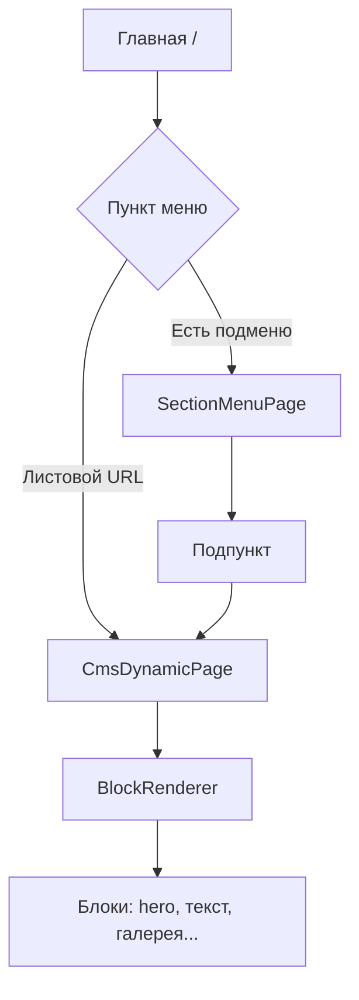
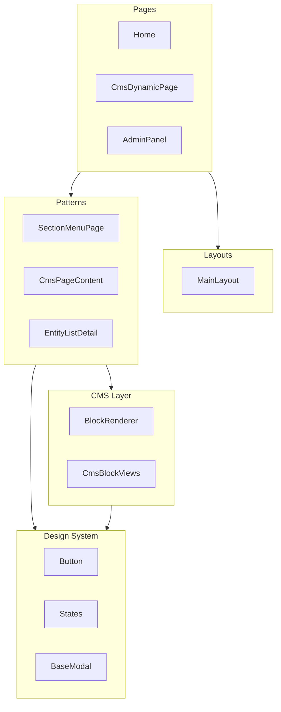
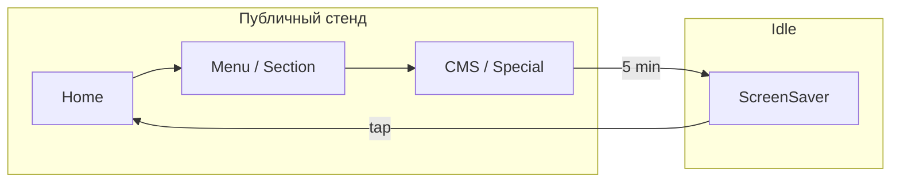
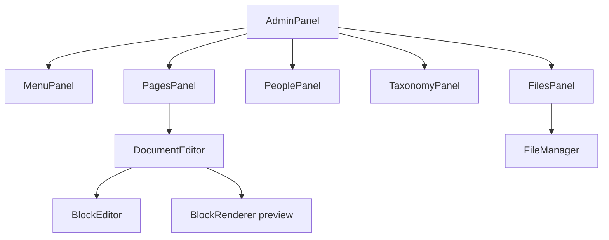
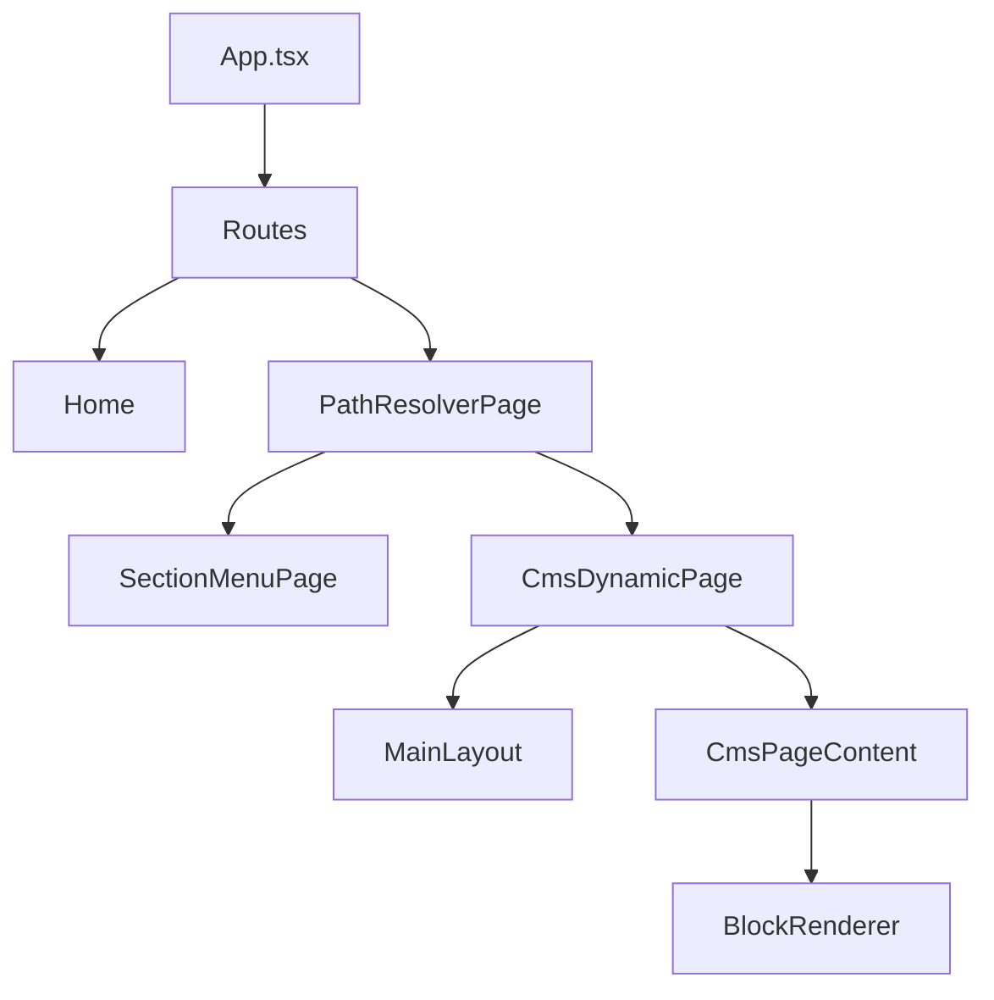

# Техническая основа курсовой работы

## Тема: «Разработка интерфейса пользователя музейного стенда»

**Проект:** веб-платформа / интерактивный музейный стенд для музея ГрГУ (Гродненского государственного университета имени Янки Купалы).

**Пакет frontend:** `@museum/web` — одностраничное приложение (SPA) на React 19 + Vite 8.

**Дата анализа:** 26 мая 2026 г.

**Источник:** исходный код `apps/web/src`, `apps/web/package.json`, `apps/web/index.css`, `apps/web/vite.config.ts`, общие типы `@museum/document`.

**Важно:** в документе описываются только технологии и паттерны, **реально присутствующие в репозитории**. Технологии, которых нет (Next.js, shadcn/ui, Redux, TanStack Query и др.), явно помечены как «не используется» или «рекомендация».

---

# 1. Введение

## 1.1. Актуальность разработки пользовательских интерфейсов

Пользовательский интерфейс (UI) — это видимая часть программной системы, через которую человек воспринимает информацию и управляет приложением. В современных веб-системах интерфейс перестал быть «оболочкой вокруг данных»: он определяет, насколько быстро посетитель найдёт нужный раздел, поймёт ли смысл экспозиции и захочет ли продолжить взаимодействие.

Для музейных и образовательных систем это особенно критично: посетитель часто не знаком с терминологией, ограничен по времени и взаимодействует в шумной среде выставочного зала. Поэтому проектирование UI музейного стенда — это не только «красивая вёрстка», а инженерная задача по снижению когнитивной нагрузки, обеспечению предсказуемой навигации и адаптации под сенсорный ввод.

## 1.2. Роль UI/UX в современных веб-системах

| Аспект | Значение для веб-приложения |
|--------|----------------------------|
| **UX (User Experience)** | Логика сценариев: сколько шагов до цели, где пользователь «теряется» |
| **UI (User Interface)** | Визуальное воплощение: кнопки, карточки, типографика, анимации |
| **Информационная архитектура** | Иерархия разделов, меню, связь URL ↔ контент |
| **Обратная связь** | Loading, ошибки, подтверждения действий |
| **Доступность (a11y)** | Работа с клавиатурой, контраст, семантика для assistive technologies |

В проекте `museum` UX и UI тесно связаны с предметной областью: стенд должен работать как **киоск** (полноэкранный режим, крупные цели нажатия, жест «назад», режим ожидания), а админка — как **рабочее место редактора** (формы, таблицы, drag-and-drop CMS).

## 1.3. Значение интерфейса для музейных систем

Музейный стенд ГрГУ — это не каталог товаров и не личный кабинет. Его интерфейс должен:

1. **Ориентировать** — показать разделы университета (история, спорт, студенческая жизнь и т.д.).
2. **Рассказывать** — текст, фото, видео, PDF-книги, биографии.
3. **Вовлекать** — анимации, flipbook, галереи с lightbox.
4. **Не утомлять** — крупные кнопки, минимум мелкого текста на первом экране.
5. **Возвращать в начало** — ScreenSaver после бездействия (реализовано в `App.tsx`).

Без продуманного UI даже богатая база контента остаётся «недоступной» для посетителя.

## 1.4. Проблемы неудобных интерфейсов

| Проблема | Последствие на стенде |
|----------|----------------------|
| Мелкие элементы управления | Промахи пальцем на touch-экране |
| Глубокая вложенность меню | Потеря контекста, сложность вернуться |
| Отсутствие состояния загрузки | Ощущение «зависания» |
| Непонятные иконки без подписей | Ошибки навигации |
| Перегруженный первый экран | Отказ от взаимодействия |
| Нет режима ожидания | Выгорание экрана, «застрявший» контент |
| Админка без защиты | Риск порчи контента (в проекте решено через Better Auth) |

Проект `museum` целенаправленно избегает части этих проблем за счёт fullscreen-layout, явной кнопки «Назад», ScreenSaver и разделения публичного стенда и `/admin`.

## 1.5. Цель разработки интерфейса музейного стенда

**Цель:** создать единый, понятный и эстетически цельный интерфейс интерактивного музейного стенда ГрГУ, обеспечивающий навигацию по разделам музея, просмотр мультимедийного контента и управление материалами через административную панель.

## 1.6. Задачи проекта (с точки зрения UI)

| № | Задача | Реализация в `@museum/web` |
|---|--------|---------------------------|
| 1 | Главный экран с разделами музея | `Home.tsx` + меню секции `home` из API |
| 2 | Иерархическая навигация | `PathResolverPage`, `SectionMenuPage`, React Router |
| 3 | Динамические CMS-страницы | `CmsDynamicPage`, `BlockRenderer`, 21 тип блока |
| 4 | Специализированные экраны | Ректоры, память (PDF flipbook), фото/видео галереи |
| 5 | Touch-ориентированный UX | Swipe back, `active:scale-95`, крупные кнопки |
| 6 | Режим киоска (idle) | `ScreenSaver` через 5 минут бездействия |
| 7 | Админ-панель CMS | `AdminPanel` + 5 панелей управления |
| 8 | Визуальный редактор блоков | `DocumentEditor`, `@dnd-kit` |
| 9 | Единый визуальный стиль | Tailwind + `design-system/` |
| 10 | Защищённый вход в админку | `AdminLogin`, `ProtectedRoute`, Better Auth |

## 1.7. Объект и предмет исследования

- **Объект исследования:** пользовательский интерфейс программного обеспечения интерактивного музейного стенда в образовательном учреждении.
- **Предмет исследования:** архитектура frontend, компонентная структура, дизайн-система, паттерны UX, адаптивность и способы организации взаимодействия пользователя с системой `museum`.

## 1.8. Практическая значимость

Результаты анализа применимы:

- при эксплуатации стенда в музее ГрГУ;
- при написании курсовой/дипломной работы по UI/UX и веб-разработке;
- как образец построения **block-based CMS** с визуальным редактором;
- как база для дальнейшей модернизации (доступность, i18n, PWA).

---

# 2. Общая информация о системе

## 2.1. Что представляет собой музейный стенд (с точки зрения UI)

С точки зрения пользователя система — это **полноэкранное веб-приложение в браузере** (киоск или ПК), которое:

- занимает весь экран (`w-screen h-screen`);
- показывает разделы музея крупными кнопками;
- открывает страницы с контентом (статические React-страницы или CMS);
- поддерживает жесты и таймер бездействия;
- имеет отдельный URL `/admin` для сотрудников музея.

Технически это **SPA (Single Page Application)**: сервер отдаёт `index.html` и JSON API, весь рендеринг — на клиенте (React). **Next.js не используется.**

## 2.2. Для кого предназначен интерфейс

| Тип пользователя | Интерфейс | Основные действия |
|------------------|----------|-------------------|
| **Посетитель музея** | Публичный стенд (`/`, `/gallery`, CMS-пути…) | Выбор раздела, чтение, просмотр медиа |
| **Школьная группа / экскурсия** | Тот же стенд | Быстрый просмотр разделов, возврат на главную |
| **Сотрудник музея** | `/admin/login` → `/admin` | Редактирование меню, страниц, людей, файлов |
| **Разработчик** | Исходный код `apps/web` | Расширение блоков CMS, новых страниц |

## 2.3. Какие задачи решает пользователь

### Посетитель

1. Понять, «куда нажать» на главном экране.
2. Дойти до интересующего раздела за 1–3 перехода.
3. Прочитать текст, посмотреть фото/видео, открыть PDF-книгу.
4. Вернуться назад без путаницы.
5. После паузы увидеть заставку и начать сначала (ScreenSaver).

### Администратор

1. Войти по email и паролю.
2. Изменить пункт меню или CMS-страницу.
3. Загрузить фото/видео в файловый менеджер.
4. Опубликовать черновик на стенд.
5. Получить уведомление об успехе/ошибке (toast).

## 2.4. Основные пользовательские сценарии

### Сценарий A: «От главной до CMS-страницы»



1. Пользователь на `/` видит кнопки из `useMenuSection('home')`.
2. Переход по `path` → либо фиксированный маршрут (`/history/rectors`), либо catch-all `*`.
3. `PathResolverPage` проверяет, есть ли дочерние пункты меню для текущего пути.
4. Если есть — `SectionMenuPage` (вертикальный список крупных кнопок).
5. Если нет — `CmsDynamicPage` загружает опубликованный документ по URL.

### Сценарий B: «Ректоры — timeline и карточка»

1. Маршрут `/history/rectors` → `Rectors.tsx`.
2. Загрузка людей с ролью `rector` через `usePeopleByRole`.
3. Отображение timeline (desktop, `hidden md:block`) с карточками.
4. Клик → `/history/rectors/:id` → `RectorDetails.tsx`.

### Сценарий C: «Память — книга и преподаватели»

1. `/history/memory/vov` или `/afgan` → `MemoryWarPage`.
2. Вкладки: PDF flipbook (`react-pageflip` + `pdfjs-dist`) и список преподавателей (`EntityListDetail`).

### Сценарий D: «Админ — правка CMS»

1. `/admin` без сессии → редирект `/admin/login`.
2. После входа — sidebar с разделами, панель «CMS страницы».
3. Выбор страницы → `DocumentEditor` (блоки, DnD, превью).
4. Сохранение черновика → toast «Черновик сохранён».
5. Публикация → контент доступен на стенде через public API.

### Сценарий E: «Бездействие на стенде»

1. На любом публичном маршруте (не `/admin*`) запускается таймер 5 минут (`App.tsx`).
2. События `mousedown`, `touchstart`, `keydown`, `mousemove` сбрасывают таймер.
3. По истечении — полноэкранный `ScreenSaver`.
4. Клик → возврат на `/`.

## 2.5. Типы пользователей системы

| Роль | Аутентификация | UI-доступ |
|------|----------------|-----------|
| Visitor | Нет | Весь публичный стенд |
| Admin | Better Auth (session cookie) | `/admin` + protected API через `credentials: 'include'` |

Разделение ролей editor/moderator в UI **не реализовано** — один уровень доступа для всех админов.

---

# 3. Анализ frontend-архитектуры

## 3.1. React и отсутствие Next.js

Проект использует **React 19** в режиме клиентского SPA. Фреймворк **Next.js не применяется**: нет файловой маршрутизации App Router, нет Server Components, нет `getServerSideProps`.

**Почему SPA уместен для стенда:**

- приложение работает локально на киоске;
- SEO не является приоритетом;
- нужны богатые клиентские эффекты (Framer Motion, PDF flipbook, DnD);
- один backend раздаёт `index.html` и API.

| Парадигма | Используется? |
|-----------|---------------|
| CSR (Client-Side Rendering) | ✅ Да — весь UI в браузере |
| SSR (Server-Side Rendering) | ❌ Нет |
| SSG / ISR | ❌ Нет |
| SPA | ✅ Да |

## 3.2. Структура frontend

Корень UI-кода: `apps/web/src/` (~102 файла `.ts`/`.tsx`/`.css`).

```
apps/web/src/
├── main.tsx              # Точка входа, BrowserRouter
├── App.tsx               # Routes, idle, swipe
├── index.css             # Tailwind v4 import
├── app/routes.tsx        # Декларация маршрутов
├── pages/                # Экраны (route components)
├── layouts/              # MainLayout
├── components/
│   ├── design-system/    # Button, Card, Modal, States, TabsBar
│   ├── patterns/         # SectionMenu, CmsPageContent, EntityListDetail...
│   ├── cms/              # BlockRenderer + CmsBlockViews
│   ├── features/         # admin/*, memory/*
│   ├── ui/               # AnimatedBlobsBackground
│   ├── auth/             # ProtectedRoute
│   └── ScreenSaver.tsx
├── hooks/                # useMenuSection, usePageByPath, usePeople
├── api/                  # fetch-обёртки REST
├── lib/                  # cms-block-registry, auth-client...
├── shared/api/client.ts  # apiRequest + 401 redirect
└── types/                # media.ts
```

## 3.3. Component-based architecture

Интерфейс построен по **компонентной модели React**:

| Уровень | Примеры | Назначение |
|---------|---------|------------|
| **Страницы** | `Home`, `PhotoGallery`, `AdminPanel` | Связка маршрута, данных и layout |
| **Layouts** | `MainLayout` | Общий каркас: фон, navbar, scroll area |
| **Паттерны** | `SectionMenuPage`, `CmsPageContent` | Повторяемые сценарии UI |
| **CMS** | `BlockRenderer`, `CmsBlockViews` | Рендер JSON-документа |
| **Design system** | `Button`, `States` | Базовые примитивы стенда |
| **Admin UI** | `AdminButton`, `FileManager` | Отдельный визуальный слой админки |
| **Features** | `MemoryWarPage`, `PeoplePanel` | Предметные модули |

**Принцип:** страница не должна содержать низкоуровневую вёрстку блоков CMS — она делегирует это `BlockRenderer`.

## 3.4. Routing (React Router DOM 7)

Файл: `apps/web/src/app/routes.tsx`.

| Маршрут | Компонент | Назначение UI |
|---------|-----------|---------------|
| `/` | `Home` | Главное меню |
| `/admin/login` | `AdminLogin` | Форма входа |
| `/admin` | `ProtectedRoute` → `AdminPanel` | Админка |
| `/history/rectors` | `Rectors` | Timeline ректоров |
| `/history/rectors/:id` | `RectorDetails` | Детальная карточка |
| `/history/memory/vov`, `/afgan` | Memory pages | PDF + люди |
| `/gallery`, `/video-gallery` | Галереи | Медиа-экспозиция |
| `*` | `PathResolverPage` | Меню секции или CMS |

**Закомментированные маршруты** (файлы страниц существуют, но не подключены в `routes.tsx`): `History`, `Sport`, `StudentLife` и др. — контент может обслуживаться через **динамическое меню + CMS** без отдельного React-файла на каждый URL.

`App.tsx` рендерит:

```tsx
<Routes>
  {appRoutes.map((route) => (
    <Route key={route.path} path={route.path} element={route.element} />
  ))}
</Routes>
```

## 3.5. Layout-система

### MainLayout (`layouts/MainLayout.tsx`)

**Назначение:** единый каркас внутренних страниц стенда.

| Элемент | Описание | Зачем нужен |
|---------|----------|-------------|
| Fullscreen container | `w-screen h-screen`, gradient фон | Режим киоска |
| `AnimatedBlobsBackground` | Декоративные «пятна» | Визуальная идентичность, «живой» фон |
| Navbar (опционально) | Кнопка «Назад» + `title` | Ориентация в глубине разделов |
| `<main>` scrollable | `overflow-y-auto` | Длинный контент CMS |

Кнопка «Назад» вызывает `navigate(-1)` или переход на `/`, если истории нет — защита от «тупика» на глубоком URL.

### Home (без MainLayout)

Главная страница **не использует** MainLayout: свой центрированный grid кнопок 320×144px — акцент на выборе раздела, а не на текстовом заголовке.

### AdminPanel layout

Отдельная схема: **sidebar 264px** + header секции + scrollable content. Не наследует `MainLayout` — админка визуально и структурно отделена от стенда.

## 3.6. State management

| Подход | Использование в проекте |
|--------|-------------------------|
| **Redux / Zustand** | ❌ Не используется |
| **TanStack Query** | ❌ Не используется |
| **React useState + useEffect** | ✅ Основной способ загрузки данных |
| **useCallback / useMemo** | ✅ В хуках и тяжёлых панелях |
| **Context** | ✅ `AdminToastProvider` (уведомления) |
| **Better Auth `useSession`** | ✅ Сессия администратора |
| **URL state** | ✅ React Router (`location`, params) |
| **Локальный UI state** | ✅ modals, tabs, active gallery item |

**Почему нет глобального store:** объём клиентского состояния умеренный; данные приходят с REST API по запросу; админка изолирована в `/admin`.

## 3.7. Client / Server components

Понятие **React Server Components** (Next.js App Router) **не применимо** — все компоненты клиентские. Единственная «серверная» часть — Express API и статика; UI всегда гидратируется в браузере через `createRoot`.

## 3.8. Структура UI-компонентов (слои)



## 3.9. Hooks

| Hook | Файл | Назначение |
|------|------|------------|
| `useMenuSection(section)` | `hooks/cms/useMenuSection.ts` | Пункты меню для секции |
| `usePageByPath(path)` | `hooks/cms/usePageBySlug.ts` | Опубликованная CMS-страница по URL |
| `usePeople(filters)` | `hooks/usePeople.ts` | Список персоналий |
| `usePeopleByRole(slug)` | `hooks/usePeople.ts` | Фильтр по роли |
| `usePerson(id)` | `hooks/usePeople.ts` | Одна персона |
| `usePersonMutations()` | `hooks/usePeople.ts` | create/update/delete |
| `useSession()` | `lib/auth-client.ts` | Сессия Better Auth |
| `useAdminToast()` | `AdminToastContext.tsx` | Toast в админке |

Паттерн хука: `loading` + `error` + данные + опционально `reload`.

## 3.10. Reusable components

**Переиспользуемые без привязки к домену:**

- `Button`, `SurfaceCard`, `PlainCard`, `BaseModal`, `TabsBar`, `States`
- `AnimatedBlobsBackground`
- `apiRequest` — единый HTTP-клиент

**Переиспользуемые предметные:**

- `BlockRenderer` — любая CMS-страница
- `EntityListDetail` — список + деталь (память, преподаватели)
- `SectionMenuPage` — подменю раздела
- `MemoryWarPage` — конфигурируется props (роль, заголовок книги)

## 3.11. Архитектурный подход интерфейса

Интерфейс следует стратегии **«киоск + headless CMS»**:

1. **Навигация из БД** (`menu_items`) — можно менять структуру без деплоя.
2. **Контент в JSONB** — страницы собираются из блоков.
3. **Спецстраницы** — там, где нужен уникальный UX (timeline, sepia gallery, flipbook).
4. **Админка зеркалит домен** — те же сущности (menu, pages, people, media).

---

# 4. Используемые frontend-технологии

## 4.1. Сводная таблица

| Технология | Где используется | Для чего нужна | Преимущества |
|------------|------------------|----------------|--------------|
| **React 19** | Весь `apps/web` | UI-компоненты, хуки | Экосистема, декларативность |
| **TypeScript ~6.0** | Весь monorepo | Типобезопасность props и API | Меньше ошибок в CMS-редакторе |
| **Vite 8** | `apps/web` | Dev server, HMR, production build | Быстрая разработка |
| **React Router DOM 7** | `main.tsx`, `routes.tsx` | Клиентская маршрутизация | Catch-all, protected routes |
| **Tailwind CSS 4** | `index.css`, className в компонентах | Utility-first стили | Быстрая вёрстка, консистентные отступы |
| **@tailwindcss/vite** | `vite.config.ts` | Интеграция Tailwind с Vite | Без отдельного PostCSS-конфига |
| **Framer Motion 12** | 14 файлов | Анимации, modal, toast, gallery | Плавный UX стенда |
| **@dnd-kit** | DocumentEditor, FileManager, TabBlockEditor | Drag-and-drop | Доступный DnD в CMS |
| **better-auth (react)** | `auth-client.ts`, AdminLogin | Сессия администратора | Готовая auth без Redux |
| **lucide-react** | Admin UI (иконки) | SVG-иконки | Лёгкие иконки в админке |
| **pdfjs-dist** | `MemoryWarPage` | Рендер PDF в canvas/изображения | Клиентская книга |
| **react-pageflip** | `MemoryWarPage` | Эффект перелистывания | Имитация архивной книги |
| **@museum/document** | web + server | Типы `PageDocument`, `BlockNode` | Единый контракт CMS |

## 4.2. Технологии из типового стека — фактический статус

| Технология | В проекте? | Комментарий |
|------------|------------|-------------|
| **Next.js** | ❌ Нет | Vite SPA |
| **shadcn/ui** | ❌ Нет | Своя `design-system/` |
| **Redux Toolkit** | ❌ Нет | Удалён из зависимостей |
| **Zustand** | ❌ Нет | — |
| **TanStack Query** | ❌ Нет | Кастомные hooks + fetch |
| **MUI / Chakra** | ❌ Нет | — |
| **styled-components** | ❌ Нет | Tailwind utility classes |
| **React Hook Form + Zod** | ❌ Нет | Нативные `<form>` + `required` / confirm |

## 4.3. Стилизация и конфигурация Tailwind

- Файл `tailwind.config.js` **отсутствует** — Tailwind v4 подключается через `@import 'tailwindcss'` в `index.css`.
- Кастомные CSS: только `@keyframes fadeIn` и класс `.fade-in` для ScreenSaver.
- **Дизайн-токены** (цвета кнопок) заданы в `Button.tsx` как объекты `variantClasses`, а не как CSS variables.

## 4.4. Формы и валидация

| Место | Подход |
|-------|--------|
| `AdminLogin` | HTML5: `type="email"`, `required`, `minLength={12}` на пароле |
| Админ-формы | `adminInputClass`, labels, ручные проверки перед API |
| CMS editor | Изменение JSON payload блоков; типы в `cms-block-registry` |

**Рекомендация:** внедрить Zod-схемы для форм админки и согласовать с API-валидацией на backend.

## 4.5. Иконки и графика

- **Inline SVG** — стрелка «Назад» в `MainLayout`, логотип книги в `ScreenSaver`.
- **Emoji** — иконки разделов в sidebar админки (🧭, 🧩, 👥).
- **lucide-react** — в компонентах админки (поиск, действия).
- **placehold.co** — fallback при ошибке загрузки изображения в галерее.

---

# 5. Структура пользовательского интерфейса

## 5.1. Структура страниц

### Типы экранов

| Тип | Примеры | Структура |
|-----|---------|-----------|
| **Hub** | `Home`, `SectionMenuPage` | Заголовок + сетка/столбец кнопок |
| **Content + layout** | `CmsDynamicPage`, `Rectors` | `MainLayout` + контент |
| **Media** | `PhotoGallery`, `VideoGallery` | `MainLayout` + сетка + modal |
| **Detail** | `RectorDetails` | `MainLayout` + карточка персоны |
| **Special** | `MemoryWarPage` | Tabs + flipbook / list-detail |
| **Auth** | `AdminLogin` | Центрированная карточка формы |
| **App shell** | `AdminPanel` | Sidebar + header + panel |

### Footer

Отдельного глобального **footer** в стенде **нет** — киоск-интерфейс использует полноэкранный контент. Подпись «Нажмите, чтобы продолжить» есть только на `ScreenSaver`.

## 5.2. Навигация

| Механизм | Реализация | UX-эффект |
|----------|------------|-----------|
| Главное меню | API `menu` section `home` | Актуальные разделы без правки кода |
| Подменю секции | `PathResolverPage` → `SectionMenuPage` | Иерархия «раздел → подразделы» |
| Navbar «Назад» | `MainLayout` | Явный выход |
| История браузера | `navigate(-1)` | Привычное поведение |
| Swipe вправо | `App.tsx`, ≥80px | Touch «назад» для киоска |
| ScreenSaver → `/` | Сброс контекста | Чистый старт для следующего посетителя |

## 5.3. Меню

**Источник данных:** `GET /api/menu/:section` (публично, без `includeInactive`).

**UI-представление:**

- **Home:** горизонтальный flex-wrap кнопок `w-80 h-36`.
- **SectionMenuPage:** вертикальный столбец кнопок на всю ширину (`max-w-3xl`), размер `lg`.

**Админка (`MenuPanel`):** таблица/форма CRUD — label, path, position, is_active.

## 5.4. Header (navbar)

В `MainLayout` header появляется только при переданном `title`:

- кнопка «Назад» (secondary Button);
- вертикальный разделитель;
- заголовок `h1` синего цвета.

На `Home` header отсутствует — фокус на выборе раздела.

## 5.5. Sidebar

**Только в админке:** фиксированная колонка 264px, полупрозрачный белый фон, blur. Содержит:

- «Выйти» (красный текст);
- «На сайт» (`navigate(-1)`);
- заголовок «Админ-панель»;
- список секций с emoji и подписью.

## 5.6. Карточки

| Компонент | Внешний вид | Назначение |
|-----------|-------------|------------|
| `SurfaceCard` | `bg-white/70 backdrop-blur`, border blue-100 | Контент на «стеклянном» фоне |
| `PlainCard` | Непрозрачный белый | Чёткие границы |
| Карточки ректоров | Фото 128×128, ФИО, годы | Быстрый обзор timeline |
| `PhotoCard` | Sepia-стиль, stone palette | Архивная эстетика галереи |
| `PersonCard` (admin) | Компактная карточка с действиями | Редактирование людей |

## 5.7. Модальные окна

**`BaseModal`** — универсальная обёртка:

- затемнённый backdrop с blur;
- анимация появления (Framer Motion);
- клик по backdrop закрывает;
- `stopPropagation` на контенте.

**Использование:** lightbox в `PhotoGallery`, `FileManagerModal`, `MediaBrowserModal`.

## 5.8. Формы

| Форма | Поля | Особенности UI |
|-------|------|----------------|
| AdminLogin | email, password | Центрированная карточка, focus ring |
| PersonForm | ФИО, роли, медиа… | Admin styles, вложенные pickers |
| Page meta | slug, title, theme | SlugPathSelect, select темы |
| File upload | multipart | Drag zone в FileManager |

## 5.9. Кнопки

**Публичный стенд — `Button`:**

| Variant | Визуал | Когда использовать |
|---------|--------|-------------------|
| `primary` | Синий залив, белый текст | Главное действие |
| `secondary` | Белый фон, синяя обводка | «Назад», вторичные действия |
| `danger` | Красный | Удаление (реже на стенде) |
| `ghost` | Прозрачный | Третичные действия |

Общие черты: `active:scale-95`, `transition-all duration-200`, скругление `rounded-xl` / `2xl`.

**Home NavButton** — отдельная реализация на `<button>` (не компонент `Button`), но визуально согласована.

**Admin — `AdminButton`:** отдельный набор стилей в admin UI.

## 5.10. Таблицы

Явных HTML-`<table>` на стенде мало. В админке списки чаще реализованы как:

- grid карточек (`PeoplePanel`);
- список строк меню (`MenuPanel`);
- дерево файлов (`FileManager`).

**Рекомендация:** для больших справочников — виртуализированная таблица (TanStack Table).

## 5.11. Галереи

### PhotoGallery

- Группировка по годам;
- сетка карточек с sepia-фильтром;
- lightbox `BaseModal` с grain overlay;
- Framer Motion stagger при появлении.

### VideoGallery

- Список/сетка видео;
- поддержка external URL (YouTube и др. через metadata).

### imageGallery (CMS block)

- Настраиваемое число колонок (`columns` в payload);
- responsive grid в `CmsBlockViews`.

## 5.12. Интерактивные элементы

| Элемент | Поведение |
|---------|-----------|
| PDF flipbook | Перелистывание, прогресс загрузки страниц |
| Accordion (CMS) | Раскрытие секций FAQ |
| Tabs (CMS + Memory) | `TabsBar` переключение контента |
| DnD блоков | Перетаскивание порядка в CMS |
| Lightbox | Увеличение фото |
| ScreenSaver | Клик → главная |

---

# 6. Дизайн-система проекта

## 6.1. Наличие и границы

В проекте есть **начальная дизайн-система** в `components/design-system/`, re-export в `shared/ui/index.ts`. Она покрывает **публичный стенд**, но **не полностью** охватывает админку — там параллельно используется слой `features/admin/ui/` (`adminInputClass`, `AdminButton`).

Это типичный этап эволюции: сначала стенд, затем админка со своими формами.

## 6.2. Цвета

### Основная палитра стенда (Tailwind)

| Токен | Применение |
|-------|------------|
| `blue-50` … `blue-900` | Фон, акценты, текст заголовков — «университетский» синий |
| `white` / `white/70` | Карточки, glassmorphism |
| `gray-400` … `gray-500` | Вторичный текст, empty states |
| `red-*` | Ошибки, logout, danger |

### Специальные палитры

| Контекст | Палитра |
|----------|---------|
| PhotoGallery | `stone-*`, `amber-*` — архив/винтаж |
| Admin toast success | `emerald-*` |
| Admin toast error | `red-*` |

**CSS variables для темизации не используются** — смена темы потребует рефакторинга class maps.

## 6.3. Typography

- Явные **web-font** (@font-face, Google Fonts) **не подключены** — системный шрифт браузера.
- Заголовки: `font-bold`, размеры `text-xl` … `text-2xl` на hub-страницах.
- PhotoGallery lightbox: `Georgia, serif` для заголовка снимка — локальный акцент «архивности».
- Админка: `text-sm` для полей, `text-xs` для labels (`adminLabelClass`).

**Рекомендация:** подключить пару шрифтов (например, PT Serif для заголовков музея + Inter для UI) через `@fontsource` или self-hosted.

## 6.4. Spacing

- Tailwind scale: `gap-4`, `gap-6`, `gap-8`, `px-8 py-4` в layout.
- Кнопки Home: фиксированные `w-80 h-36`.
- Admin sidebar: `px-3 py-2.5` на пунктах меню.

## 6.5. Grid system

- Tailwind CSS Grid и Flexbox **без отдельной grid-библиотеки**.
- CMS `imageGallery`: `grid-cols-1 md:grid-cols-2 lg:grid-cols-3`.
- FileManager: `md:grid-cols-3 lg:grid-cols-4`.

## 6.6. Визуальная иерархия

1. **Фон** — gradient + animated blobs (низкий контраст).
2. **Навигация** — крупные кнопки с border и shadow.
3. **Контент** — карточки `SurfaceCard` / белые панели.
4. **Акценты** — `blue-700` для active tab и primary CTA.

## 6.7. Glassmorphism

Повторяющийся приём:

```css
bg-white/70 backdrop-blur-md border border-blue-100
```

Используется в navbar, карточках, Home-кнопках — создаёт «слои» поверх анимированного фона.

## 6.8. Reusable UI — каталог компонентов

| Компонент | Файл | Props / варианты |
|-----------|------|------------------|
| Button | `design-system/Button.tsx` | variant, size, ...HTML button |
| SurfaceCard, PlainCard | `Card.tsx` | className |
| BaseModal | `BaseModal.tsx` | onClose, classNames |
| TabsBar | `TabsBar.tsx` | generic tab id |
| Loading/Error/Empty | `States.tsx` | text |
| AnimatedBlobsBackground | `ui/AnimatedBlobsBackground.tsx` | blobs preset |

## 6.9. Рекомендация: развитие дизайн-системы

1. Вынести цвета и радиусы в `@theme` (Tailwind v4).
2. Документировать компоненты (Storybook).
3. Унифицировать `AdminButton` и `Button` или явно разделить `KioskButton` / `AdminButton`.
4. Добавить токены для touch target minimum 44×44px.

---

# 7. Адаптивность интерфейса

## 7.1. Целевое устройство

Интерфейс **спроектирован прежде всего под большой сенсорный экран** (музейный киоск), а не под смартфон. Многие страницы используют фиксированный `w-screen h-screen` без mobile-first перестройки.

## 7.2. Mobile-first

Подход **mobile-first не является доминирующим**: breakpoints `md:` и `lg:` используются точечно (~29 вхождений в 9 файлах), часто для **улучшения desktop**, а не наоборот.

## 7.3. Breakpoints (Tailwind)

| Breakpoint | Пример использования |
|------------|------------------------|
| `sm:` | `PeoplePanel` grid 3 колонки |
| `md:` | CMS two-column, RectorDetails layout, Rectors timeline `hidden md:block` |
| `lg:` | imageGallery 3 колонки |

## 7.4. Адаптация под телефоны

| Аспект | Текущее состояние |
|--------|-------------------|
| Viewport meta | ✅ `width=device-width` в `index.html` |
| Touch targets | ✅ Крупные кнопки на Home |
| Rectors mobile | ⚠️ Timeline скрыт на `< md` — мобильный сценарий слабый |
| Admin на телефоне | ⚠️ Sidebar 264px + формы — тесно |

## 7.5. Планшеты

На планшете стенд, вероятно, работает хорошо — размеры кнопок и layout близки к целевому киоску.

## 7.6. Desktop

Основной целевой режим: широкий экран, hover-эффекты на кнопках (`hover:bg-blue-700`), timeline ректоров.

## 7.7. Responsive components

- **CMS blocks** — наиболее продуманная адаптивность (`CmsBlockViews.tsx`).
- **FileManager** — адаптивная сетка превью.
- **Home** — `flex-wrap` с `max-w` на контейнере кнопок.

**Рекомендация:** добавить упрощённый mobile layout для `Rectors` (вертикальный список вместо скрытого timeline).

---

# 8. Пользовательский опыт (UX)

## 8.1. User flow (сводная диаграмма)



## 8.2. Удобство использования (usability)

**Сильные стороны:**

- Крупные touch targets на главной.
- Дублирование «назад»: navbar + swipe.
- Динамическое меню — не нужно пересобирать SPA для нового раздела.
- Превью CMS в редакторе — WYSIWYG-подобный опыт.

**Слабые стороны:**

- Нет глобального поиска для посетителя.
- `Rectors` на узком экране — деградация UX.
- `index.html` lang=`en` при русском контенте.

## 8.3. Навигация и глубина

Средняя глубина до контента: **2–4 клика** от Home. Catch-all `*` снижает необходимость жёстких маршрутов.

## 8.4. Доступность информации

- Заголовки страниц в navbar.
- CMS: блоки `heading`, `hero` для структуры.
- Люди: subtitle, shortDescription на карточках.

## 8.5. Минимизация действий

- ScreenSaver возвращает на главную одним касанием.
- Section menu — один столбец кнопок без лишних уровней.
- Autosave в CMS (ручное + подтверждение перед publish).

## 8.6. Визуальная обратная связь

| Событие | Обратная связь |
|---------|---------------|
| Нажатие кнопки | `active:scale-95` |
| Hover (desktop) | Смена фона/тени |
| Загрузка | `LoadingState`, текст «Загрузка...» |
| Ошибка API | `ErrorState`, `InlineError`, toast в админке |
| Успех в админке | Зелёный toast |
| DnD | Визуальное перетаскивание (@dnd-kit) |
| PDF loading | Progress loaded/total |

## 8.7. Loading states

`LoadingState` — центрированный синий текст. Используется в:

- `PathResolverPage`, `CmsPageContent`, `ProtectedRoute`, `EntityListDetail`, галереях.

**Skeleton screens не реализованы** — рекомендация для тяжёлых CMS-страниц.

## 8.8. Empty states

`EmptyState` — серый текст по центру. Примеры:

- «Для этого пути страница пока не настроена в CMS»
- «Преподаватели не добавлены»

## 8.9. Notifications

**Только в админке:** `AdminToastProvider` — стек toast справа снизу, auto-dismiss, `aria-live="polite"`.

На публичном стенде toast **нет** — ошибки inline или fullscreen ErrorState.

## 8.10. Обработка ошибок

- API: `ApiError` с текстом из `{ error: string }`.
- Изображения: `onError` → placeholder URL.
- Меню: при ошибке API `PathResolverPage` fallback на CMS (`CmsDynamicPage`).
- Auth: 401 на admin routes → redirect `/admin/login` (`shared/api/client.ts`).

---

# 9. Интерфейс музейного стенда

## 9.1. Просмотр «экспонатов» (контента)

В системе экспонат — это **единица контента**: CMS-страница, персона, фото, видео, PDF.

| Тип | UI-компонент |
|-----|--------------|
| Текстовая экспозиция | CMS blocks |
| Персона | Rectors, RectorDetails, EntityListDetail |
| Фотоархив | PhotoGallery |
| Видеоархив | VideoGallery |
| Документ | MemoryWarPage flipbook |

## 9.2. Карточки экспонатов

**Ректор (timeline):** фото, ФИО, годы, краткое описание, клик → детали.

**Фотоархив:** год, title, annotation, sepia styling.

**EntityListDetail:** компактный список слева, крупная карточка справа.

## 9.3. Страницы экспонатов

`RectorDetails` — полное описание, медиа, связанные файлы (из API person).

CMS-страницы — произвольная композиция блоков.

## 9.4. Поиск и фильтрация

| Область | UI |
|---------|-----|
| Люди (публично) | API `?q=` — **UI поисковой строки на стенде не выделен** |
| Люди (admin) | Поле поиска в `PeoplePanel` |
| Медиа (admin) | Search в FileManager |
| Глобальный поиск посетителя | ❌ Не реализован |

## 9.5. Категории

- **Menu sections** — навигационные категории (`home`, `history`, …).
- **Roles/Tags/Categories** — классификация людей (константы `people-roles.ts`).

## 9.6. Мультимедиа

| Тип | Отображение |
|-----|-------------|
| Локальные изображения | `/images/...` через `resolvePublicAssetUrl` |
| Видео | `<video>` или embed |
| YouTube/Vimeo | `is_external`, превью в admin |
| PDF | pdf.js → растр → flipbook |

## 9.7. Интерактивные элементы стенда

- Swipe back (`App.tsx`)
- Idle ScreenSaver
- Lightbox zoom
- Page flip
- CMS accordion, tabs, buttonRow (внешние ссылки)

---

# 10. Интерфейс административной панели

## 10.1. Dashboard

Классического dashboard с виджетами **нет**. `AdminPanel` — это **application shell**: sidebar + смена панелей без смены URL.

## 10.2. Разделы админки

| ID | Панель | UI-функции |
|----|--------|------------|
| `menu-cms` | MenuPanel | CRUD пунктов меню |
| `pages-cms` | PagesPanel | Список страниц, редактор, версии, publish |
| `people` | PeoplePanel | CRUD, поиск, reorder |
| `taxonomy` | TaxonomyPanel | Роли, теги, категории |
| `media` | FilesPanel → FileManager | Browse, upload, mkdir, preview |

## 10.3. CMS-редактор (DocumentEditor)

| Элемент UI | Назначение |
|------------|------------|
| Select типа блока | Добавление нового блока по группам |
| SortableBlockShell | Drag handle, удаление, label типа |
| BlockEditor | Поля payload по типу блока |
| Preview toggle | Показать/скрыть `BlockRenderer` |
| TabsBlockEditor | Вложенные блоки во вкладках |

## 10.4. Загрузка файлов

- `ImagePathInput` / `FilePathInput` — выбор пути из медиатеки.
- `MediaBrowserModal` — модальный браузер.
- `FileManager` — полноценный UI файловой системы с DnD reorder для галерей.

## 10.5. Версии и публикация

`PageVersionsPanel` — список версий, восстановление.

Кнопки: «Сохранить черновик», «Опубликовать», «Отменить изменения» с `confirm()`.

## 10.6. Интерфейс входа

`AdminLogin` — минималистичная карточка, без AnimatedBlobs (в отличие от стенда), фокус на форме.

`ProtectedRoute` — при загрузке сессии показывает `LoadingState` на весь экран.

---

# 11. Работа с состоянием интерфейса

## 11.1. Local state

- `useState` для форм, active tab, modal open, selected person.
- `useRef` для dirty snapshot документа (`savedSnapshotRef` в PagesPanel).

## 11.2. Global state

Глобального клиентского store **нет**. Исключения:

- React Router location;
- Better Auth session (внешняя библиотека);
- AdminToast context.

## 11.3. Server state

Данные с API загружаются в hooks:

```typescript
// Паттерн usePageByPath
useEffect(() => {
  let cancelled = false;
  fetchPublicPageByPath(path).then(...).finally(...);
  return () => { cancelled = true; };
}, [path]);
```

Отмена через flag `cancelled` предотвращает race condition при быстрой смене URL.

## 11.4. Формы

Controlled inputs (`value` + `onChange`). Submit через `async` handler.

## 11.5. Optimistic updates

**Полноценный optimistic UI не используется.** Autosave CMS отправляет `documentVersion` на сервер — **optimistic locking** на backend: при конфликте версий API вернёт ошибку, UI покажет toast.

Локально `isDirty` сравнивает JSON-снимок документа до/после правок.

## 11.6. Синхронизация данных

После publish/restore — повторный `fetchPageById` и обновление `versions`.

---

# 12. Производительность интерфейса

## 12.1. Lazy loading

| Механизм | Статус |
|----------|--------|
| `React.lazy()` для routes | ❌ Не используется |
| `loading="lazy"` на img | ✅ PhotoGallery |
| Dynamic import API в hook | ✅ `usePublishedPageBySlug` (legacy) |

**Рекомендация:** `React.lazy` для `/admin` и тяжёлых страниц (pdf.js, pageflip).

## 12.2. Code splitting

Vite автоматически разбивает vendor chunks при build. Ручного разделения по routes **нет**.

## 12.3. Оптимизация рендеринга

- `useMemo` / `useCallback` — в PathResolverPage, PagesPanel, MediaStrip.
- `React.memo` — **практически не используется**.
- Framer `viewport={{ once: true }}` на Rectors — анимация один раз.

## 12.4. Оптимизация изображений

- Нет WebP pipeline, srcset.
- Fallback placehold.co при ошибке.

## 12.5. Next.js optimization

**Не применимо** — проект не на Next.js.

## 12.6. Caching

| Тип | Реализация |
|-----|------------|
| PDF страницы | IndexedDB (`pdf-cache.ts`) |
| API responses | ❌ Нет HTTP cache на клиенте |
| Turbo build | ✅ Кэш сборки monorepo |

## 12.7. Prefetching

Prefetch маршрутов/данных **не реализован**. Рекомендация: prefetch menu `home` items on idle.

---

# 13. Анимации и интерактивность

## 13.1. Framer Motion — карта использования

| Файл | Эффект |
|------|--------|
| `AnimatedBlobsBackground` | Бесконечное движение blob |
| `BaseModal` | Fade + scale |
| `AdminPanel` | Slide panel content |
| `AdminToastContext` | Spring toast |
| `PhotoGallery` | Stagger cards |
| `Rectors` | Scroll-triggered slide in |
| `EntityListDetail` | Crossfade detail |
| `TextImagePanel`, `MediaStrip` | Entrance animation |
| `MemoryWarPage` | Tab/content transitions |

## 13.2. CSS transitions

- Кнопки: `transition-all duration-200`
- Hover shadows на карточках

## 13.3. Microinteractions

- `active:scale-95` — тактильная отдача на press
- Ping animation на ScreenSaver
- Pulse «Нажмите, чтобы продолжить»

## 13.4. Motion design principles в проекте

- Длительности короткие (0.18–0.5s) — не задерживают посетителя.
- Easing cubic-bezier в modal — «material-like» вход.
- Декоративный фон не блокирует клики (`pointer-events` на overlay modal отделён).

---

# 14. Доступность интерфейса (Accessibility)

## 14.1. Semantic HTML

- Используются `<main>`, `<nav>`, `<header>`, `<form>`, `<label>`.
- Не везде: некоторые кликабельные `div`/`motion.div` без `role="button"`.

## 14.2. ARIA

**Ограниченное использование (~17 атрибутов в 8 файлах):**

| Атрибут | Где |
|---------|-----|
| `aria-label` | Admin actions, close toast, drag handle |
| `aria-live="polite"` | Toast container |
| `role="status"` | Toast items |
| `aria-hidden` | Декоративные иконки |
| `role="presentation"` | Modal backdrop |

Публичный стенд **почти без ARIA**.

## 14.3. Keyboard navigation

- Tab по форме логина — работает.
- Swipe только touch — **нет keyboard shortcut «назад»**.
- DnD — PointerSensor (мышь/тач), не keyboard DnD.

## 14.4. Контрастность

Синий текст на белом/голубом фоне в целом читаем. Stone gallery — светлый текст на тёмном в modal — приемлемо.

**Рекомендация:** проверить WCAG AA для `text-blue-400` на `blue-50`.

## 14.5. Screen readers

Без landmark regions на Home, без skip link. CMS rich text — plain rendering, без live regions при смене tab.

## 14.6. Focus states

- Admin inputs: `focus:ring-2 focus:ring-blue-500`
- Кнопки Home: нет явного `focus-visible` outline

**Рекомендация:** единый `focus-visible:ring` для всех интерактивных элементов стенда.

## 14.7. lang

`index.html`: `lang="en"` при русскоязычном UI — **исправить на `ru`**.

---

# 15. Безопасность интерфейса

## 15.1. Защита админ-маршрутов

`ProtectedRoute` — без сессии редирект на login, не рендерит `AdminPanel`.

## 15.2. API client

`credentials: 'include'` — session cookie.

При 401 на путях `/admin*` (кроме login) — `window.location.replace('/admin/login')`.

## 15.3. Формы

- Пароль min 12 символов в UI (согласовано с Better Auth).
- Нет отображения пароля в DOM после submit (стандартное поведение).

## 15.4. XSS

- React экранирует текст по умолчанию.
- CMS `richText` — **риск**, если backend/store допускает HTML; нужна sanitization на render (рекомендация: DOMPurify для HTML-блоков).

## 15.5. Загрузка файлов

UI только в админке после auth. Ограничения размера — на backend (multer 50MB).

## 15.6. Client-side secrets

Секреты в frontend **не хранятся**. `VITE_*` только для публичных URL.

---

# 16. Анализ структуры frontend-кода

## 16.1. Назначение папок

| Папка | Зачем |
|-------|-------|
| `pages/` | Route-level components — точка входа экрана |
| `layouts/` | Общие оболочки |
| `components/design-system/` | Примитивы стенда |
| `components/patterns/` | Составные UX-паттерны |
| `components/cms/` | Рендеринг CMS JSON |
| `components/features/` | Крупные фичи (admin, memory) |
| `components/ui/` | Декоративные/фоновые UI |
| `hooks/` | Data fetching abstractions |
| `api/` | HTTP functions |
| `lib/` | Чистые утилиты и registry |
| `shared/api/` | Базовый client |
| `types/` | Локальные TS types |

## 16.2. Масштабируемость

**Сильные стороны:**

- Новый CMS block = registry + view + editor.
- Новый раздел музея = menu + CMS path (без route).
- Admin панели изолированы.

**Риски:**

- `features/admin` разрастается — нужны подмодули.
- Дублирование стилей Button vs AdminButton.
- Catch-all `*` маскирует 404 — сложнее отлаживать «битые» URL.

## 16.3. Providers

| Provider | Область |
|----------|---------|
| `BrowserRouter` | Всё приложение |
| `AdminToastProvider` | Только AdminPanel |
| `StrictMode` | Dev double-render |

## 16.4. Middleware

Next.js middleware **нет**. «Middleware» на клиенте — `ProtectedRoute` и redirect в `apiRequest`.

---

# 17. UX/UI-проблемы и улучшения

## 17.1. Слабые места

| Проблема | Влияние |
|----------|---------|
| Нет поиска на стенде | Посетитель не найдёт персону/страницу быстро |
| Rectors скрыт на mobile | Потеря контента на маленьких экранах |
| Нет skeleton loading | «Пустой» экран при медленной сети |
| Слабая a11y на стенде | Барьер для части пользователей |
| lang="en" | Некорректная семантика для SR |
| Нет focus-visible на kiosk buttons | Проблемы с клавиатурой/а11y |
| Admin и kiosk UI расходятся | Дороже поддерживать стиль |
| confirm() для деструктивных действий | Устаревший UX vs modal |
| Нет offline/PWA | Киоск при обрыве сети |

## 17.2. Рекомендуемые улучшения

### UI

- Единая design system для admin + kiosk.
- Тёмная тема для PhotoGallery-only vs light theme — осознанная тема «архив».

### UX

- Глобальный поиск на Home.
- Breadcrumbs в MainLayout для глубоких CMS-путей.
- Kiosk onboarding overlay при первом касании.

### Анимации

- Сократить motion для `prefers-reduced-motion`.

### Accessibility

- `lang="ru"`, skip link, focus rings, aria-current на active menu.

### AI (рекомендация)

- Семантический поиск по контенту музея.
- Автогенерация alt-текстов для фото в admin.

### Персонализация (рекомендация)

- «Избранное» или «Недавно просмотренное» на стенде (localStorage).

---

# 18. Сравнение с современными интерфейсами

## 18.1. Музейные сайты (веб)

| Критерий | Типичный музейный сайт | Стенд `museum` |
|----------|------------------------|----------------|
| Навигация | Многоуровневое меню | Крупные hub-кнопки + CMS |
| Touch | Адаптация под мобильный | Оптимизация под киоск |
| Контент | Статические страницы | Block CMS + API |
| Админка | Отдельный CMS (WordPress…) | Встроенная `/admin` |

## 18.2. Интерактивные стенды

| Критерий | Классический киоск | `museum` |
|----------|-------------------|----------|
| Idle reset | Часто есть | ✅ ScreenSaver 5 min |
| Жесты | Редко | ✅ Swipe back |
| PDF книги | Редко | ✅ flipbook + cache |
| Обновление контента | Часто через IT | ✅ Admin CMS |

## 18.3. Информационные порталы вузов

Порталы часто перегружены ссылками. Стенд **упрощает** выбор: 4–8 крупных разделов на Home, визуально спокойный фон.

## 18.4. Современные web-app UI

| Паттерн | В индустрии | В проекте |
|---------|-------------|-----------|
| Design tokens | CSS variables | Tailwind classes |
| Server state library | React Query | Custom hooks |
| Component docs | Storybook | ❌ |
| Route-based code split | Да | ❌ |
| shadcn/Radix | Популярно | Своя DS |

---

# 19. Заключение

В рамках проекта `@museum/web` разработан **клиентский интерфейс интерактивного музейного стенда** ГрГУ на базе React 19 и Vite 8. Интерфейс реализован как одностраничное приложение с компонентной архитектурой, выделенной дизайн-системой для публичной части и отдельным слоем UI для административной панели.

Ключевые достижения с точки зрения UI/UX:

1. **Киоск-ориентированный UX** — полноэкранные layout, крупные кнопки, жест «назад», режим ожидания ScreenSaver.
2. **Гибкий контент** — блочная CMS с 21 типом блоков и визуальным редактором (drag-and-drop, preview).
3. **Предметные экраны** — timeline ректоров, архивная фотогалерея, PDF flipbook, списки преподавателей.
4. **Визуальная целостность** — синяя палитра ГрГУ, glassmorphism, анимированный фон.
5. **Защищённая админка** — отдельный shell, toast-уведомления, формы управления всем контентом стенда.

Ограничения связаны с отсутствием mobile-first для всех экранов, слабой доступностью на публичной части, отсутствием глобального поиска и современных паттернов server-state/cache на клиенте. Для курсовой работы по теме «Разработка интерфейса пользователя музейного стенда» проект предоставляет богатый материал: от анализа компонентов до конкретных рекомендаций по развитию UI/UX.

---

# 20. Дополнительно

## 20.1. Анализ `apps/web/package.json`

См. раздел 4. Скрипты: `dev`, `build`, `preview`, `lint`, `type-check`.

## 20.2. Tailwind

Конфигурация через Vite plugin, стили в `index.css`. Отдельного `tailwind.config` нет.

## 20.3. Карта маршрутов и файлов страниц

| Маршрут | Файл |
|---------|------|
| `/` | `pages/Home.tsx` |
| `*` | `pages/PathResolverPage.tsx` |
| `/gallery` | `pages/PhotoGallery.tsx` |
| `/admin` | `pages/AdminPanel.tsx` |

## 20.4. CMS — типы блоков (21)

`tabs`, `tab`, `textImage`, `alternating`, `mediaStrip`, `hero`, `heading`, `richText`, `quote`, `callout`, `stats`, `features`, `accordion`, `timeline`, `buttonRow`, `divider`, `embed`, `imageGallery`, `twoColumns`, `video`, `list`.

Источник: `lib/cms-block-registry.ts`.

## 20.5. Схема компонентов админки



## 20.6. Схема публичного UI



---

# Итоговый раздел

## 1. Общий вывод по frontend-архитектуре

Frontend `museum` — **зрелое SPA** с чётким разделением pages / patterns / cms / design-system. Архитектура соответствует задаче музейного стенда: максимум гибкости контента через CMS, отдельные экраны для уникального UX, минимальная связность с backend через typed API hooks. Отсутствие Next.js, Redux и React Query — осознанное упрощение стека.

## 2. Сильные стороны интерфейса

1. Киоск-UX: fullscreen, idle, swipe, крупные CTA.
2. Блочная CMS с визуальным редактором и preview.
3. Качественные спецэкраны (flipbook, sepia gallery, timeline).
4. Framer Motion для плавности без перегруза.
5. Единый MainLayout и design-system primitives.
6. Админка покрывает весь жизненный цикл контента.
7. TypeScript + shared `@museum/document` — контракт editor/renderer.

## 3. Слабые стороны интерфейса

1. Ограниченная адаптивность (Rectors mobile).
2. Слабая accessibility на публичном стенде.
3. Нет глобального поиска для посетителя.
4. Нет route-level code splitting и skeleton UI.
5. Два параллельных UI-стиля (kiosk vs admin).
6. `lang="en"` в HTML.
7. Нет Storybook/документации компонентов.

## 4. План развития UI/UX системы

### Фаза 1 (1–2 месяца)

- [ ] `lang="ru"`, focus-visible, базовые aria на Home/MainLayout.
- [ ] Mobile layout для Rectors.
- [ ] `React.lazy` для admin и PDF-страниц.
- [ ] Skeleton для CMS и галерей.

### Фаза 2 (2–4 месяца)

- [ ] Единые design tokens (Tailwind @theme).
- [ ] Storybook для design-system.
- [ ] Поиск на Home (UI + API).
- [ ] Zod + react-hook-form в админке.

### Фаза 3 (4–6 месяцев)

- [ ] TanStack Query для server state.
- [ ] `prefers-reduced-motion`.
- [ ] PWA offline для стенда.
- [ ] i18n BY/RU/EN.

### Фаза 4 (6+ месяцев)

- [ ] AI search и auto-alt.
- [ ] Персонализация «недавно просмотрено».
- [ ] 3D/интерактивные экспонаты (WebGL) — опционально.

## 5. Идеи модернизации музейного стенда

1. **Интерактивная карта кампуса** — SVG + hotspots.
2. **QR-код на Home** — продолжить экскурсию на телефоне.
3. **Режим «детский»** — упрощённые тексты и крупнее UI.
4. **Аудиогид** — кнопка play на CMS-блоках.
5. **Сенсор без касания** — опционально kinect/камера (аппаратная интеграция).
6. **Витрина «сегодня в музее»** — виджет на Home из admin.

---

*Документ подготовлен по исходному коду `apps/web` репозитория `museum`. Технологии, отсутствующие в проекте, указаны явно. Рекомендации не описывают текущую реализацию.*
